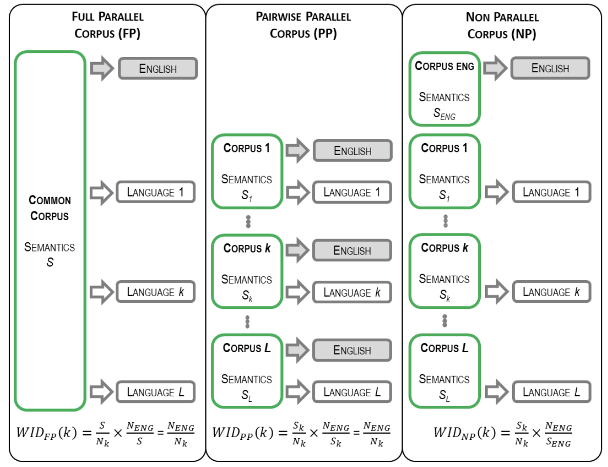

```{r setup, echo=F, message=F, warning=F}
library(ggplot2)
library(readr)
library(ggrepel)
library(dplyr)
library(magrittr)
library(tidyverse)
library(PerformanceAnalytics)
library(cowplot)
library(tibble) 
library(reshape2)
library(base)
library(GGally)
library(RColorBrewer)
library(tidytext)
library(knitr)
library(rworldmap)
library(kableExtra)
library(ggsci)
library(ggpubr)
library(lingtypology)
library(BayesFactor)
library(bayestestR)

knitr::opts_chunk$set(echo=TRUE, message=FALSE, warning=FALSE, fig.show='hold', results='hold', fig.align='center')

# For reproducible results
set.seed(2134) 
```

<style>
caption, .caption {
font-weight: normal;
font-size: 100%;
text-align: left}
a[hreflang]:before{}
</style>

```{r local function, echo=F, message=F, warning=F}
multiplot <- function(..., plotlist=NULL, file, cols=1, layout=NULL) {
  library(grid)

  # Make a list from the ... arguments and plotlist
  plots <- c(list(...), plotlist)

  numPlots = length(plots)

  # If layout is NULL, then use 'cols' to determine layout
  if (is.null(layout)) {
    # Make the panel
    # ncol: Number of columns of plots
    # nrow: Number of rows needed, calculated from # of cols
    layout <- matrix(seq(1, cols * ceiling(numPlots/cols)),
                    ncol = cols, nrow = ceiling(numPlots/cols))
  }

 if (numPlots==1) {
    print(plots[[1]])

  } else {
    # Set up the page
    grid.newpage()
    pushViewport(viewport(layout = grid.layout(nrow(layout), ncol(layout))))

    # Make each plot, in the correct location
    for (i in 1:numPlots) {
      # Get the i,j matrix positions of the regions that contain this subplot
      matchidx <- as.data.frame(which(layout == i, arr.ind = TRUE))

      print(plots[[i]], vp = viewport(layout.pos.row = matchidx$row,
                                      layout.pos.col = matchidx$col))
    }
  }
}
```

# Introduction

This R Markdown script (and the text data files and the HTML file) contains all codes used for computing complexity metrics, analysing results, plotting figures and tables.

# Linguistic complexity across languages: a short overview

No Supplementary Information is provided for Section 2.

# Corpus description and subsampling strategy

A dataset of *47 typologically and geographically diverse languages* is used in this study. The table below provides information on their morphological strategies such as *Fusion* (derived from WALS Chapter 20), *Exponence* (WALS Chapter 21B), and the amount of *Verbal Inflection* (WALS Chapter 22) and also phonological complexity estimated by the degree of *Syllable Complexity* (WALS Chapter 12) and *Tonal System* (WALS Chapter 13, except for Daga [Maddieson et al. 2013](#references) and Barasano [Gomez-Imbert & Kenstowicz 2000](#references)).

```{r Language description Table, fig.width=15, fig.height=9, echo=F, message=F, warning=F, results='asis'}
data <- read_delim("./data.txt","\t", escape_double = FALSE, trim_ws = TRUE)
dataLang <- data[,c("Language","Glottocode","Exponence","Strategy","Fusion","VerbInflection","SyllableStructure","TonalSystem","Macroarea")]
kable_styling(kable(dataLang,  align="ccccccccc", format = "html", longtable = TRUE, caption = "<center><strong>Language description</center></strong>", escape = FALSE, booktabs = TRUE), bootstrap_options = c("striped", "hover","responsive", "condensed"), position="center", font_size = 12)
```

```{r Language description Figure 1, fig.cap="Figure 1. a) Geographical distribution. b) Distribution of the languages among WALS classical typological features and symbolic codes. Marker color and shape respectively encodes the fusion strategy and the exponence category. Marker size further indicates whether verbal inflection is limited (small size for Low values) or more extended (large size for Mid and High values). In each cell, the number of languages is displayed when different from zero.", fig.width=13, fig.height=9, echo=F, message=F, warning=F}
# Code for Figure 1a 
# worldmap <- getMap(resolution = "coarse")
# ggplot() + coord_fixed() +  xlab("") + ylab("") + geom_polygon(data=worldmap, aes(x=long, y=lat, group=group), colour="light grey", fill="light grey") +theme(panel.grid.major = element_blank(), panel.grid.minor = element_blank(), panel.background = element_rect(fill = 'white', colour = 'white'), axis.line = element_line(colour = "white"), legend.position="none",axis.ticks=element_blank(), axis.text.x=element_blank(), axis.text.y=element_blank()) +  geom_point(data=data, aes(x=Longitude, y=Latitude), colour="Deep Pink", fill="Violet",pch=21, size=4, alpha=I(0.7)) + geom_text_repel(data=data, aes(x=Longitude, y=Latitude, label=Language)) + ggtitle("a) Geographic location of 47 languages in the study") + theme(plot.title = element_text(hjust = 0.5, size = 20, face = "bold")) + theme(strip.text.x = element_text(size = 14, face="bold"))

```

The languages belonging to each category of Figure 1b are displayed in the table below.

```{r Language list, fig.width=15, fig.height=9, echo=F, message=F, warning=F, results='asis'}
Figure1List <- data.frame(matrix(ncol = 6, nrow = 4))
colnames(Figure1List) <- c("Isolating-Low","Isolating-Mid/High","Concatenative-Low","Concatenative-Mid/High","Other-Low","Other-Mid/High")
rownames(Figure1List) <- c("None","MonoV","MonoVN","Poly")
Figure1List[1,3] <- dataLang[dataLang$Exponence=="None",]$Language
Figure1List[2,1] <- paste(dataLang[dataLang$Exponence=="MonoV" & dataLang$Fusion=="Isolating" & dataLang$VerbInflection=="Low",]$Language, collapse=", ")
Figure1List[2,2] <- paste(dataLang[dataLang$Exponence=="MonoV" & dataLang$Fusion=="Isolating" & dataLang$VerbInflection=="Mid High",]$Language, collapse=", ")
Figure1List[2,3] <- paste(dataLang[dataLang$Exponence=="MonoV" & dataLang$Fusion=="Concatenative" & dataLang$VerbInflection=="Low",]$Language, collapse=", ")
Figure1List[2,4] <- paste(dataLang[dataLang$Exponence=="MonoV" & dataLang$Fusion=="Concatenative" & dataLang$VerbInflection=="Mid High",]$Language, collapse=", ")
Figure1List[2,5] <- paste(dataLang[dataLang$Exponence=="MonoV" & dataLang$Fusion=="Other" & dataLang$VerbInflection=="Low",]$Language, collapse=", ")
Figure1List[3,3] <- paste(dataLang[dataLang$Exponence=="MonoVN" & dataLang$Fusion=="Concatenative" & dataLang$VerbInflection=="Low",]$Language, collapse=", ")
Figure1List[3,4] <- paste(dataLang[dataLang$Exponence=="MonoVN" & dataLang$Fusion=="Concatenative" & dataLang$VerbInflection=="Mid High",]$Language, collapse=", ")
Figure1List[3,6] <- paste(dataLang[dataLang$Exponence=="MonoVN" & dataLang$Fusion=="Other" & dataLang$VerbInflection=="Mid High",]$Language, collapse=", ")
Figure1List[4,3] <- paste(dataLang[dataLang$Exponence=="Poly" & dataLang$Fusion=="Concatenative" & dataLang$VerbInflection=="Low",]$Language, collapse=", ")
Figure1List[4,4] <- paste(dataLang[dataLang$Exponence=="Poly" & dataLang$Fusion=="Concatenative" & dataLang$VerbInflection=="Mid High",]$Language, collapse=", ")
Figure1List[4,6] <- paste(dataLang[dataLang$Exponence=="Poly" & dataLang$Fusion=="Other" & dataLang$VerbInflection=="Mid High",]$Language, collapse=", ")
kable_styling(kable(Figure1List,  align="cccccc", format = "html", longtable = TRUE, caption = "<center><strong>List of languages </center></strong>", escape = FALSE, booktabs = TRUE), bootstrap_options = c("striped", "hover","responsive", "condensed"), position="center", font_size = 12)
```

# Morphological complexity

## Grammar-based morphological complexity indices

Two metrics of Morphological Complexity are acquired and computed from a top-down typological approach by means of two linguistic databases: Grammar-based Morphological Complexity derived from WALS (GMC_W) and Grammar-based Morphological Complexity derived from AUTOTYP (GMC_A).

### Grammar-based morphological complexity derived from WALS (GMC_W)

The score of GMC_W is calculated by distinguishing between lexical and inflectional coding strategies and summing assigned values (-1 for lexical and 0 for morphological strategies) to the linguistic features which are accounted for by continuous or categorical variables. Continuous variables, such as the number of case categories (WALS feature 49A) and the number of grammatical categories expressed by the inflectional synthesis of the verb (WALS feature 22A), are normalized between 0 and -1 to better represent the degree of morphological complexity. The score is obtained by dividing the overall sum by the total number of available linguistic features in each language. The 29 morphological features derived from WALS are detailed in the code below.

```{r GMC_W, echo=T, message=F, warning=F, eval=F}
# Load a list of languages
languageList <- data[,c("Language")]

# Load information for each parameter (29 in total) obtained from WALS (Downloaded online from https://wals.info in January, 2022)

# 1) 20A: Fusion of Selected Inflectional Formatives
X20A <- read_delim("./20A.txt", "\t", escape_double = FALSE, trim_ws = TRUE)
allList <- X20A[X20A$Language %in% languageList$Language,]
allList$S20A <- 0
allList[!is.na(allList$`20A`) & allList$`20A`=="Exclusively tonal",]$S20A <- -1
allList[!is.na(allList$`20A`) & allList$`20A`=="Exclusively isolating",]$S20A <- -1
allList[!is.na(allList$`20A`) & allList$`20A`=="Isolating/concatenative",]$S20A <- -0.5
allList[!is.na(allList$`20A`) & allList$`20A`=="Tonal/isolating",]$S20A <- -0.5
allList[!is.na(allList$`20A`) & allList$`20A`=="Ablaut/concatenative",]$S20A <- 0
allList[!is.na(allList$`20A`) & allList$`20A`=="Exclusively concatenative",]$S20A <- 0
remove(X20A)

# 2) 26A: Prefixing vs. Suffixing in Inflectional Morphology
X26A <- read_delim("./26A.txt", "\t", escape_double = FALSE, trim_ws = TRUE)
allList <- merge(X26A, allList, by="Language", all=TRUE)
allList <- allList[allList$Language %in% languageList$Language,]
allList$S26A <- 0
allList[!is.na(allList$`26A`) & allList$`26A`=="Strongly suffixing",]$S26A <- 0
allList[!is.na(allList$`26A`) & allList$`26A`=="Equal prefixing and suffixing",]$S26A <- 0 
allList[!is.na(allList$`26A`) & allList$`26A`=="Weakly suffixing",]$S26A <- 0
allList[!is.na(allList$`26A`) & allList$`26A`=="Weakly prefixing",]$S26A <- 0
allList[!is.na(allList$`26A`) & allList$`26A`=="Little affixation",]$S26A <- -1
allList[!is.na(allList$`26A`) & allList$`26A`=="Strong prefixing",]$S26A <- 0
remove(X26A)
 
# 3) 49A: Number of Cases
X49A <- read_delim("./49A.txt", "\t", escape_double = FALSE, trim_ws = TRUE)
allList <- merge(X49A, allList, by="Language", all=TRUE)
allList <- allList[allList$Language %in% languageList$Language,]
allList$S49A <- 0
allList[!is.na(allList$`49A`) & allList$`49A`=="No morphological case-marking",]$S49A <- -1
allList[!is.na(allList$`49A`) & allList$`49A`=="Exclusively borderline case-marking",]$S49A <- -0.5
allList[!is.na(allList$`49A`) & allList$`49A`=="2 cases",]$S49A <- -0.85
allList[!is.na(allList$`49A`) & allList$`49A`=="3 cases",]$S49A <- -0.7
allList[!is.na(allList$`49A`) & allList$`49A`=="4 cases",]$S49A <- -0.55
allList[!is.na(allList$`49A`) & allList$`49A`=="6-7 cases",]$S49A <- -0.4
allList[!is.na(allList$`49A`) & allList$`49A`=="8-9 cases",]$S49A <- -0.25
allList[!is.na(allList$`49A`) & allList$`49A`=="10 or more cases",]$S49A <- 0
remove(X49A)

# 4) 28A: Case Syncretism
X28A <- read_delim("./28A.txt", "\t", escape_double = FALSE, trim_ws = TRUE)
allList <- merge(X28A, allList, by="Language", all=TRUE)
allList <- allList[allList$Language %in% languageList$Language,]
allList$S28A <- 0
allList[!is.na(allList$`28A`) & allList$`28A`=="No case marking",]$S28A <- -1
allList[!is.na(allList$`28A`) & allList$`28A`=="No syncretism",]$S28A <- -1
allList[!is.na(allList$`28A`) & allList$`28A`=="Core cases only",]$S28A <- -0.5
allList[!is.na(allList$`28A`) & allList$`28A`=="Core and non-core",]$S28A <- 0
remove(X28A)

# 5) 98A: Alignment of Case Marking of Full Noun Phrases
X98A <- read_delim("./98A.txt", "\t", escape_double = FALSE, trim_ws = TRUE)
allList <- merge(X98A, allList, by="Language", all=TRUE)
allList <- allList[allList$Language %in% languageList$Language,]
allList$S98A <- 0
allList[!is.na(allList$`98A`) & allList$`98A`=="Neutral",]$S98A <- -1
allList[!is.na(allList$`98A`) & allList$`98A`=="Nominative - accusative (standard)",]$S98A <- 0
allList[!is.na(allList$`98A`) & allList$`98A`=="Active-inactive",]$S98A <- 0
allList[!is.na(allList$`98A`) & allList$`98A`=="Ergative - absolutive",]$S98A <- 0
allList[!is.na(allList$`98A`) & allList$`98A`=="Nominative - accusative (marked nominative)",]$S98A <- 0
allList[!is.na(allList$`98A`) & allList$`98A`=="Tripartite",]$S98A <- 0
remove(X98A)

# 6) 22A: Inflectional Synthesis of the Verb
X22A <- read_delim("./22A.txt", "\t", escape_double = FALSE, trim_ws = TRUE)
allList <- merge(X22A, allList, by="Language", all=TRUE)
allList <- allList[allList$Language %in% languageList$Language,]
allList$S22A <- 0
allList[!is.na(allList$`22A`) & allList$`22A`=="10-11 categories per word",]$S22A <- 0
allList[!is.na(allList$`22A`) & allList$`22A`=="8-9 categories per word",]$S22A <- -0.2
allList[!is.na(allList$`22A`) & allList$`22A`=="6-7 categories per word",]$S22A <- -0.4
allList[!is.na(allList$`22A`) & allList$`22A`=="4-5 categories per word",]$S22A <- -0.6
allList[!is.na(allList$`22A`) & allList$`22A`=="2-3 categories per word",]$S22A <- -0.8
allList[!is.na(allList$`22A`) & allList$`22A`=="0-1 category per word",]$S22A <- -1
remove(X22A)

# 7) 100A: Alignment of Verbal Person Marking
X100A <- read_delim("./100A.txt", "\t", escape_double = FALSE, trim_ws = TRUE)
allList <- merge(X100A, allList, by="Language", all=TRUE)
allList <- allList[allList$Language %in% languageList$Language,]
allList$S100A <- 0
allList[!is.na(allList$`100A`) & allList$`100A`=="Neutral",]$S100A <- -1
remove(X100A)

# 8) 102A: Verbal Person Marking
X102A <- read_delim("./102A.txt", "\t", escape_double = FALSE, trim_ws = TRUE)
allList <- merge(X102A, allList, by="Language", all=TRUE)
allList <- allList[allList$Language %in% languageList$Language,]
allList$S102A <- 0
allList[!is.na(allList$`102A`) & allList$`102A`=="No person marking",]$S102A <- -1
allList[!is.na(allList$`102A`) & allList$`102A`=="Only the A argument",]$S102A <- -0.5
allList[!is.na(allList$`102A`) & allList$`102A`=="Only the P argument",]$S102A <- -0.5
allList[!is.na(allList$`102A`) & allList$`102A`=="Both the A and P arguments",]$S102A <- 0
remove(X102A)

# 9) 48A: Person Marking on Adpositions
X48A <- read_delim("./48A.txt", "\t", escape_double = FALSE, trim_ws = TRUE)
allList <- merge(X48A, allList, by="Language", all=TRUE)
allList <- allList[allList$Language %in% languageList$Language,]
allList$S48A <- 0
allList[!is.na(allList$`48A`) & allList$`48A`=="No person marking",]$S48A <- -1
allList[!is.na(allList$`48A`) & allList$`48A`=="No adpositions",]$S48A <- -1
allList[!is.na(allList$`48A`) & allList$`48A`=="Pronouns only",]$S48A <- -0.5
allList[!is.na(allList$`48A`) & allList$`48A`=="Pronouns and nouns",]$S48A <- 0
remove(X48A)

# 10) 29A: Syncretism in Verbal Person/Number Marking
X29A <- read_delim("./29A.txt", "\t", escape_double = FALSE, trim_ws = TRUE)
allList <- merge(X29A, allList, by="Language", all=TRUE)
allList <- allList[allList$Language %in% languageList$Language,]
allList$S29A <- 0
allList[!is.na(allList$`29A`) & allList$`29A`=="No subject person/number marking",]$S29A <- -1
allList[!is.na(allList$`29A`) & allList$`29A`=="Not syncretic",]$S29A <- -1
allList[!is.na(allList$`29A`) & allList$`29A`=="Syncretic",]$S29A <- 0
remove(X29A)

# 11) 74A: Situational Possibility
X74A <- read_delim("./74A.txt", "\t", escape_double = FALSE, trim_ws = TRUE)
allList <- merge(X74A, allList, by="Language", all=TRUE)
allList <- allList[allList$Language %in% languageList$Language,]
allList$S74A <- 0
allList[!is.na(allList$`74A`) & allList$`74A`=="Verbal constructions",]$S74A <- -1
allList[!is.na(allList$`74A`) & allList$`74A`=="Other kinds of markers",]$S74A <- -1
allList[!is.na(allList$`74A`) & allList$`74A`=="Affixes on verbs",]$S74A <- 0
remove(X74A)

# 12) 75A: Epistemic Possibility
X75A <- read_delim("./75A.txt", "\t", escape_double = FALSE, trim_ws = TRUE)
allList <- merge(X75A, allList, by="Language", all=TRUE)
allList <- allList[allList$Language %in% languageList$Language,]
allList$S75A <- 0
allList[!is.na(allList$`75A`) & allList$`75A`=="Verbal constructions",]$S75A <- -1
allList[!is.na(allList$`75A`) & allList$`75A`=="Other",]$S75A <- -1
allList[!is.na(allList$`75A`) & allList$`75A`=="Affixes on verbs",]$S75A <- 0
remove(X75A)

# 13) 76A: Overlap between Situational and Epistemic Modal Marking
X76A <- read_delim("./76A.txt", "\t", escape_double = FALSE, trim_ws = TRUE)
allList <- merge(X76A, allList, by="Language", all=TRUE)
allList <- allList[allList$Language %in% languageList$Language,]
allList$S76A <- 0
allList[!is.na(allList$`76A`) & allList$`76A`=="No overlap",]$S76A <- -1
allList[!is.na(allList$`76A`) & allList$`76A`=="Overlap for either possibility or necessity",]$S76A <- -0.5
allList[!is.na(allList$`76A`) & allList$`76A`=="Overlap for both possibility and necessity",]$S76A <- 0
remove(X76A)

# 14) 77A: Semantic Distinctions of Evidentiality
X77A <- read_delim("./77A.txt", "\t", escape_double = FALSE, trim_ws = TRUE)
allList <- merge(X77A, allList, by="Language", all=TRUE)
allList <- allList[allList$Language %in% languageList$Language,]
allList$S77A <- 0
allList[!is.na(allList$`77A`) & allList$`77A`=="No grammatical evidentials",]$S77A <- -1
allList[!is.na(allList$`77A`) & allList$`77A`=="Indirect only",]$S77A <- -0.5
allList[!is.na(allList$`77A`) & allList$`77A`=="Direct and indirect",]$S77A <- 0
remove(X77A)

# 15) 112A: Negative Morphemes
X112A <- read_delim("./112A.txt", "\t", escape_double = FALSE, trim_ws = TRUE)
allList <- merge(X112A, allList, by="Language", all=TRUE)
allList <- allList[allList$Language %in% languageList$Language,]
allList$S112A <- 0
allList[!is.na(allList$`112A`) & allList$`112A`=="Negative particle",]$S112A <- 0
allList[!is.na(allList$`112A`) & allList$`112A`=="Negative auxiliary verb",]$S112A <- -1
allList[!is.na(allList$`112A`) & allList$`112A`=="Negative word, unclear if verb or particle",]$S112A <- -1
allList[!is.na(allList$`112A`) & allList$`112A`=="Double negation",]$S112A <- 0
allList[!is.na(allList$`112A`) & allList$`112A`=="Negative affix",]$S112A <- 0
remove(X112A)

# 16) 34A: Occurrence of Nominal Plurality
X34A <- read_delim("./34A.txt", "\t", escape_double = FALSE, trim_ws = TRUE)
allList <- merge(X34A, allList, by="Language", all=TRUE)
allList <- allList[allList$Language %in% languageList$Language,]
allList$S34A <- 0
allList[!is.na(allList$`34A`) & allList$`34A`=="No nominal plural",]$S34A <- -1
allList[!is.na(allList$`34A`) & allList$`34A`=="All nouns, always optional",]$S34A <- -0.5
allList[!is.na(allList$`34A`) & allList$`34A`=="Only human nouns, optional",]$S34A <- -0.5
allList[!is.na(allList$`34A`) & allList$`34A`=="Only human nouns, obligatory",]$S34A <- -0.5
allList[!is.na(allList$`34A`) & allList$`34A`=="All nouns, always obligatory",]$S34A <- 0
remove(X34A)

# 17) 36A: The Associative Plural
X36A <- read_delim("./36A.txt", "\t", escape_double = FALSE, trim_ws = TRUE)
allList <- merge(X36A, allList, by="Language", all=TRUE)
allList <- allList[allList$Language %in% languageList$Language,]
allList$S36A <- 0
allList[!is.na(allList$`36A`) & allList$`36A`=="No associative plural",]$S36A <- -1
allList[!is.na(allList$`36A`) & allList$`36A`=="Unique periphrastic associative plural",]$S36A <- 0
allList[!is.na(allList$`36A`) & allList$`36A`=="Unique affixal associative plural",]$S36A <- 0
allList[!is.na(allList$`36A`) & allList$`36A`=="Associative same as additive plural",]$S36A <- 0
remove(X36A)

# 18) 92A: Position of Polar Question Particles
X92A <- read_delim("./92A.txt", "\t", escape_double = FALSE, trim_ws = TRUE)
allList <- merge(X92A, allList, by="Language", all=TRUE)
allList <- allList[allList$Language %in% languageList$Language,]
allList$S92A <- 0
allList[!is.na(allList$`92A`) & allList$`92A`=="No question particle",]$S92A <- -1
allList[!is.na(allList$`92A`) & allList$`92A`=="Final",]$S92A <- 0
allList[!is.na(allList$`92A`) & allList$`92A`=="Initial",]$S92A <- 0
allList[!is.na(allList$`92A`) & allList$`92A`=="Other position",]$S92A <- 0
allList[!is.na(allList$`92A`) & allList$`92A`=="Second position",]$S92A <- 0
allList[!is.na(allList$`92A`) & allList$`92A`=="In either of two positions",]$S92A <- 0
remove(X92A)

# 19) 67A: The Future Tense
X67A <- read_delim("./67A.txt", "\t", escape_double = FALSE, trim_ws = TRUE)
allList <- merge(X67A, allList, by="Language", all=TRUE)
allList <- allList[allList$Language %in% languageList$Language,]
allList$S67A <- 0
allList[!is.na(allList$`67A`) & allList$`67A`=="No inflectional future",]$S67A <- -1
allList[!is.na(allList$`67A`) & allList$`67A`=="Inflectional future exists",]$S67A <- 0
remove(X67A)

# 20) 66A: The Past Tense
X66A <- read_delim("./66A.txt", "\t", escape_double = FALSE, trim_ws = TRUE)
allList <- merge(X66A, allList, by="Language", all=TRUE)
allList <- allList[allList$Language %in% languageList$Language,]
allList$S66A <- 0
allList[!is.na(allList$`66A`) & allList$`66A`=="Present, 4 or more remoteness distinctions",]$S66A <- 0
allList[!is.na(allList$`66A`) & allList$`66A`=="Present, 2-3 remoteness distinctions",]$S66A <- -0.33
allList[!is.na(allList$`66A`) & allList$`66A`=="Present, no remoteness distinctions",]$S66A <- -0.67
allList[!is.na(allList$`66A`) & allList$`66A`=="No past tense",]$S66A <- -1
remove(X66A)

# 21) 65A: Perfective/Imperfective Aspect
X65A <- read_delim("./65A.txt", "\t", escape_double = FALSE, trim_ws = TRUE)
allList <- merge(X65A, allList, by="Language", all=TRUE)
allList <- allList[allList$Language %in% languageList$Language,]
allList$S65A <- 0
allList[!is.na(allList$`65A`) & allList$`65A`=="No grammatical marking",]$S65A <- -1
allList[!is.na(allList$`65A`) & allList$`65A`=="Grammatical marking",]$S65A <- 0
remove(X65A)

# 22) 70A: The Morphological Imperative
X70A <- read_delim("./70A.txt", "\t", escape_double = FALSE, trim_ws = TRUE)
allList <- merge(X70A, allList, by="Language", all=TRUE)
allList <- allList[allList$Language %in% languageList$Language,]
allList$S70A <- 0
allList[!is.na(allList$`70A`) & allList$`70A`=="No second-person imperatives",]$S70A <- -1
allList[!is.na(allList$`70A`) & allList$`70A`=="Second singular and second plural",]$S70A <- 0
allList[!is.na(allList$`70A`) & allList$`70A`=="Second plural",]$S70A <- 0
allList[!is.na(allList$`70A`) & allList$`70A`=="Second person number-neutral",]$S70A <- 0
allList[!is.na(allList$`70A`) & allList$`70A`=="Second singular",]$S70A <- 0
remove(X70A)

# 23) 57A: Position of Pronominal Possessive Affixes
X57A <- read_delim("./57A.txt", "\t", escape_double = FALSE, trim_ws = TRUE)
allList <- merge(X57A, allList, by="Language", all=TRUE)
allList <- allList[allList$Language %in% languageList$Language,]
allList$S57A <- 0
allList[!is.na(allList$`57A`) & allList$`57A`=="No possessive affixes",]$S57A <- -1
allList[!is.na(allList$`57A`) & allList$`57A`=="Possessive suffixes",]$S57A <- 0
allList[!is.na(allList$`57A`) & allList$`57A`=="Possessive prefixes",]$S57A <- 0
remove(X57A)

# 24) 59A: Possessive Classification
X59A <- read_delim("./59A.txt", "\t", escape_double = FALSE, trim_ws = TRUE)
allList <- merge(X59A, allList, by="Language", all=TRUE)
allList <- allList[allList$Language %in% languageList$Language,]
allList$S59A <- 0
allList[!is.na(allList$`59A`) & allList$`59A`=="No possessive classification",]$S59A <- -1
allList[!is.na(allList$`59A`) & allList$`59A`=="Two classes",]$S59A <- -0.67
allList[!is.na(allList$`59A`) & allList$`59A`=="Three to five classes",]$S59A <- -0.33
allList[!is.na(allList$`59A`) & allList$`59A`=="More than five classes",]$S59A <- 0
remove(X59A)

# 25) 73A: The Optative
X73A <- read_delim("./73A.txt", "\t", escape_double = FALSE, trim_ws = TRUE)
allList <- merge(X73A, allList, by="Language", all=TRUE)
allList <- allList[allList$Language %in% languageList$Language,]
allList$S73A <- 0
allList[!is.na(allList$`73A`) & allList$`73A`=="Inflectional optative absent",]$S73A <- -1
allList[!is.na(allList$`73A`) & allList$`73A`=="Inflectional optative present",]$S73A <- 0
remove(X73A)

# 26) 37A: Definite Articles
X37A <- read_delim("./37A.txt", "\t", escape_double = FALSE, trim_ws = TRUE)
allList <- merge(X37A, allList, by="Language", all=TRUE)
allList <- allList[allList$Language %in% languageList$Language,]
allList$S37A <- 0
allList[!is.na(allList$`37A`) & allList$`37A`=="No definite or indefinite article",]$S37A <- -1
allList[!is.na(allList$`37A`) & allList$`37A`=="No definite, but indefinite article",]$S37A <- -1
allList[!is.na(allList$`37A`) & allList$`37A`=="Definite affix",]$S37A <- 0
allList[!is.na(allList$`37A`) & allList$`37A`=="Definite word distinct from demonstrative",]$S37A <- -1
allList[!is.na(allList$`37A`) & allList$`37A`=="Demonstrative word used as definite article",]$S37A <- -1
remove(X37A)
   
# 27) 38A: Indefinite Articles
X38A <- read_delim("./38A.txt", "\t", escape_double = FALSE, trim_ws = TRUE)
allList <- merge(X38A, allList, by="Language", all=TRUE)
allList <- allList[allList$Language %in% languageList$Language,]
allList$S38A <- 0
allList[!is.na(allList$`38A`) & allList$`38A`=="No definite or indefinite article",]$S38A <- -1
allList[!is.na(allList$`38A`) & allList$`38A`=="No indefinite, but definite article",]$S38A <- -1
allList[!is.na(allList$`38A`) & allList$`38A`=="Indefinite affix",]$S38A <- 0
allList[!is.na(allList$`38A`) & allList$`38A`=="Indefinite word distinct from 'one'",]$S38A <- -1
allList[!is.na(allList$`38A`) & allList$`38A`=="Indefinite word same as 'one'",]$S38A <- -1
remove(X38A)

# 28) 41A: Distance Contrasts in Demonstratives
X41A <- read_delim("./41A.txt", "\t", escape_double = FALSE, trim_ws = TRUE)
allList <- merge(X41A, allList, by="Language", all=TRUE)
allList <- allList[allList$Language %in% languageList$Language,]
allList$S41A <- 0
allList[!is.na(allList$`41A`) & allList$`41A`=="No distance contrast",]$S41A <- -1
allList[!is.na(allList$`41A`) & allList$`41A`=="Two-way contrast",]$S41A <- -0.75
allList[!is.na(allList$`41A`) & allList$`41A`=="Three-way contrast",]$S41A <- -0.5
allList[!is.na(allList$`41A`) & allList$`41A`=="Four-way contrast",]$S41A <- -0.25
allList[!is.na(allList$`41A`) & allList$`41A`=="Five (or more)-way contrast",]$S41A <- 0 
remove(X41A)

# 29) 101A: Expression of Pronominal Subjects
X101A <- read_delim("./101A.txt", "\t", escape_double = FALSE, trim_ws = TRUE)
allList <- merge(X101A, allList, by="Language", all=TRUE)
allList <- allList[allList$Language %in% languageList$Language,]
allList$S101A <- 0
allList[!is.na(allList$`101A`) & allList$`101A`=="Subject pronouns in different position",]$S101A <- -1
allList[!is.na(allList$`101A`) & allList$`101A`=="Obligatory pronouns in subject position",]$S101A <- -1
allList[!is.na(allList$`101A`) & allList$`101A`=="Mixed",]$S101A <- -1
allList[!is.na(allList$`101A`) & allList$`101A`=="Subject clitics on variable host",]$S101A <- 0
allList[!is.na(allList$`101A`) & allList$`101A`=="Optional pronouns in subject position",]$S101A <- -1
allList[!is.na(allList$`101A`) & allList$`101A`=="Subject affixes on verb",]$S101A <- 0
remove(X101A)

# Sum all values
allList$sum <- apply(allList[,c("S20A","S26A","S49A","S28A","S98A","S22A","S100A","S102A","S48A","S29A","S74A","S75A","S76A","S77A","S112A","S34A","S36A","S92A","S67A","S66A","S65A","S70A","S57A","S59A","S73A","S37A","S38A","S41A","S101A")],1,sum)

# Get the number of NAs for each language and normalize the sum by the number of available features
allListFeatures <- allList[,c("Language","20A","26A","49A","28A","98A","22A","100A","102A","48A","29A","74A","75A","76A","77A","112A","34A","36A","92A","67A","66A","65A","70A","57A","59A","73A","37A","38A","41A","101A")]
allListFeatures$sumNA <- apply(is.na(allListFeatures),1,sum)
allListFeatures$totalF <- 29 - allListFeatures$sumNA
allListFeatures <- allListFeatures[,c("Language","totalF")]
allList <- merge(allList, allListFeatures, by="Language")
allList$GMC_W <- allList$sum/allList$totalF
GMC_W <- allList[,c("Language","GMC_W")]
```

```{r GMC_W Figure, fig.width=11.5, fig.height=6, fig.cap="Grammar-based Morphological Complexity based on WALS (GMC_W). On the x-axis, languages are ordered by increasing GMC_W values from left to right. GMC_W is by definition normalized between -1 and 0. Marker convention is shown in Figure 1b (also in Supplementary Information (§8.1)).", echo=F, message=F, warning=F}
dataMC_W <- data[,c("Language","GMC_W","Strategy","MarkColor","MarkSize","MarkShape")]
dataMC_W <- dataMC_W[order(dataMC_W$GMC_W, decreasing=FALSE),]
dataMC_W$Language <- as.character(dataMC_W$Language)
dataMC_W$Language <- factor(dataMC_W$Language, levels=unique(dataMC_W$Language))
dataMC_W$ID <- seq_along(dataMC_W$Language)
dataMC_W$Strategy <- factor(dataMC_W$Strategy, levels=c("Lexical","Balanced","Morph"))

ggplot(dataMC_W, aes(x=ID,y=GMC_W, color=MarkColor, size=MarkSize, shape=MarkShape)) + geom_point() + scale_shape_identity() + geom_text_repel(aes(label=Language), hjust=-0.4, size=3.4, max.overlaps=Inf) + labs(x="Language (ranked by increasing GMC_W)",y="GMC_W") +  theme(axis.text = element_text(size = 14), axis.title=element_text(size=14, face="bold"), panel.background = element_rect(fill = 'white', colour = 'black'), legend.background = element_rect(fill = "white", color = "black")) + theme(legend.position = "none") + scale_colour_identity() + scale_size_identity() + facet_wrap(vars(Strategy), scales = "free_x") + theme(strip.text.x = element_text(size = 14, face="bold"))
```

### Grammar-based morphological complexity derived from AUTOTYP (GMC_A)

Another Grammar-based Morphological Complexity metric (GMC_A) is derived from AUTOTYP [Bickel & Nichols 2013, Bickel et al. 2017](#references) by integrating the degree of inflectional synthesis of verbs. For Malagasy and Wichí, two languages with missing information, we used a score obtained from their variant language with a distinct Glottocode (Malagasy (mala1537) and Mataco (wich1263), respectively).

```{r GMC_A, echo=T, message=F, warning=F, eval=F}
# Load a list of languages and merge with autotyp dataset to get a glottocode for each language
languageList <- data[,c("Language","Glottocode")]
languageList <- merge(autotyp, languageList, by="Glottocode")

# Add LID for Malagasy (mala1537) and Mataco (wich1263)
languageList <- rbind(languageList, c("mala1537","491","Malagasy"))
languageList <- rbind(languageList, c("wich1263","180","Wichí"))

# Load information downloaded from Github (Downloaded online from https://github.com/autotyp/autotyp-data/tree/0.1.0 in April, 2022)
Synthesis <- read_csv("./Synthesis.csv")
Synthesis <- unique(Synthesis[,c("LID","VInflCatAndAgrMax.n")])
Synthesis <- merge(Synthesis, languageList, by="LID")
Synthesis <- Synthesis[,c("Language","VInflCatAndAgrMax.n")]
colnames(Synthesis) <- c("Language","GMC_A")
``` 

```{r GMC_A Figure, fig.width=11.5, fig.height=6, fig.cap="Grammar-based verbal inflectional complexity based on AUTOTYP (GMC_A). On the x-axis, languages are ordered by increasing GMC_A values from left to right. Marker convention is shown in Figure 1b (also in Supplementary Information (§8.1)).",echo=F, message=F, warning=F}
dataMC_A <- data[,c("Language","GMC_A","MarkColor","MarkSize","MarkShape")]
dataMC_A <- dataMC_A[order(dataMC_A$GMC_A, decreasing=FALSE),]
dataMC_A$Language <- as.character(dataMC_A$Language)
dataMC_A$Language <- factor(dataMC_A$Language, levels=unique(dataMC_A$Language))
dataMC_A$ID <- seq_along(dataMC_A$Language)

ggplot(dataMC_A, aes(x=ID,y=GMC_A, color=MarkColor, size=MarkSize, shape=MarkShape)) + geom_point() + scale_shape_identity() +  geom_text_repel(aes(label=Language),hjust=-0.4, size=3.4, max.overlaps=Inf) + labs(x="Language (ranked by increasing GMC_A)",y="GMC_A") +  theme(axis.text=element_text(size=14), axis.title=element_text(size = 14, face = "bold"), legend.text=element_text(size=12), legend.position = c(0.94, 0.2), panel.background = element_rect(fill = 'white', colour = 'black'), legend.background =   element_rect(fill = "white", color = "black")) + theme(legend.position = "none") + scale_colour_identity() + scale_size_identity()
```

### Grammar-based morphological complexities (GMC_W & GMC_A)

```{r GMC, fig.width=10, fig.height=7, fig.cap="Language distribution in a two-dimensional space defined by Grammar-based Morphological Complexities based on WALS (GMC_W, x-axis) and AUTOTYP (GMC_A, y-axis). Marker convention is shown in Figure 1b (also in Supplementary Information (§8.1)).", echo=F, message=F, warning=F}
dataGMC <- data[,c("Language","GMC_W","GMC_A","Strategy","MarkColor","MarkSize","MarkShape")]
dataGMC$Strategy <- factor(dataGMC$Strategy, levels=c("Lexical","Balanced","Morph"))

ggplot(dataGMC, aes(x=GMC_W,y=GMC_A, color=MarkColor, size=MarkSize, shape=MarkShape)) + geom_point() + geom_text_repel(data=dataGMC, aes(label=Language),hjust=-0.4, size=3.4, max.overlaps=Inf) + labs(x="GMC_W",y="GMC_A") + theme(axis.text=element_text(size=10), axis.title = element_text(size = 14, face="bold"), panel.background = element_rect(fill = 'white', colour = 'black'), legend.background = element_rect(fill = "white", color = "black")) + theme(legend.position = "none") + scale_shape_identity() + scale_colour_identity()+ scale_size_identity() + facet_wrap(vars(Strategy), scales="free_x") + theme(strip.text.x = element_text(size = 14, face="bold"))
```

## Towards robust indices of morphological complexity

The following four metrics estimate morphological complexity by means of the Parallel Bible Corpus: Word Information Density (WID), Type-Token Ratio (TTR), Measure of Textual Lexical Diversity (MTLD), and word-level Entropy (*H*).

### Word Information Density (WID)

Word Information Density (WID) is calculated by a pairwise comparison between the number of words in English (our reference language) and a target language *L*, in a variable number of subsets (Whole, 5, 10, 20, 40, and 60 subsets).

```{r WID, echo=T, message=F, warning=F, eval=F}
# Total number of subsets: 1 (1,150 verses per subset)
# Load a list of bible text file names and language codes and count the number of words in each subset in English (Parallel Bible Corpus can be downloaded from http://www.christianbentz.de/MLC2019_data.html)
listBible <- data[,c("Language","BibleFile")]
bibleENG <- listBible[listBible$Language=="English",]$BibleFile
bibleENG <- read_delim(bibleENG, "\t", escape_double = FALSE, col_names = FALSE, trim_ws = TRUE)
wordCount <- as.data.frame(sapply(strsplit(bibleENG$X1, " "), length))
colnames(wordCount)[1] <- "ENG"
wordCount$ID <- seq_along(wordCount$ENG)

# Function to calculate Word Information Density (WID), using English as a reference
 wordCountCal <- function(bible, Language){
  bible <- read_delim(bible,"\t", escape_double = FALSE, col_names = FALSE, trim_ws = TRUE)
  bible <- as.data.frame(sapply(strsplit(bible$X1, " "), length))
  colnames(bible)[1] <- Language
  bible$ID <- seq_along(bible[,1])
  wordCount <- merge(wordCount,bible, by="ID")
  WID <- sum(wordCount$ENG)/sum(wordCount[,ncol(wordCount)])
  langWID <- c(Language, WID)
  return(langWID)
 }

# Calculate WID by using the list of bible text file names and language codes
 listBible <- listBible[!listBible$Language=="English",]
 widList <- list()
 widLanList <- list()
 widLists1 <- list()
for(i in 1:nrow(listBible)){
 bible <- paste0("./",listBible$BibleFile[i])
 Language <- listBible$Language[i] 
 widList[[i]] <- wordCountCal(bible,Language)[2]
 widLanList[[i]] <- wordCountCal(bible,Language)[1]
 widLists1[[i]] <- cbind(unlist(widLanList[[i]]),unlist(widList[[i]]))
}
widLists1 <- as.data.frame(do.call(rbind, widLists1))
colnames(widLists1) <- c("Language","WID")
widLists1 <- widLists1[order(widLists1$WID, decreasing=TRUE),]

# Add English to the data
ENG <- data.frame("English","1")
names(ENG) <- c("Language","WID")
widLists1 <- rbind(widLists1, ENG)
 
# Get the mean of WID (whole set)
widLists1$WID <- as.numeric(as.character(widLists1$WID))
meanWID1 <- widLists1 %>% 
        group_by(Language) %>% 
        summarise(MeanWID= mean(WID))
 
# Get the standard deviation of WID (whole set)
sdWID1 <- widLists1 %>% 
        group_by(Language) %>% 
        summarise(SdWID = sd(WID))
 
meanWID1 <- merge(meanWID1, sdWID1, by="Language")
 
# Total number of subsets: 5 (230 verses per subset)
# Load a list of bible text file names and language codes and count the number of words in each subset in English
listBible <- data[,c("Language","BibleFile")]
bibleENG <- listBible[listBible$Language=="English",]$BibleFile
bibleENG <- read_delim(bibleENG, "\t", escape_double = FALSE, col_names = FALSE, trim_ws = TRUE)
wordCount <- as.data.frame(sapply(strsplit(bibleENG$X1, " "), length))
colnames(wordCount)[1] <- "ENG"
wordCount$ID <- seq_along(wordCount$ENG)

# Function to calculate Word Information Density (WID), using English as a reference
 wordCountCal <- function(bible, Language){
  bible <- read_delim(bible,"\t", escape_double = FALSE, col_names = FALSE, trim_ws = TRUE)
  bible <- as.data.frame(sapply(strsplit(bible$X1, " "), length))
  colnames(bible)[1] <- Language
  bible$ID <- seq_along(bible[,1])
  wordCount <- merge(wordCount,bible, by="ID")
  WID <- list()
  for(j in 1:5){
  k <- 230*(j-1) + 1
  l <- 230*j
  WID[[j]] <- sum(wordCount$ENG[k:l])/sum(wordCount[,ncol(wordCount)][k:l])
  }
  langWID <- c(Language, WID)
  return(langWID)
 }

# Calculate WID by using the list of bible text file names and language codes
listBible <- listBible[!listBible$Language=="English",]
widList <- list()
widLanList <- list()
widLists5 <- list()
for(i in 1:nrow(listBible)){
 bible <- paste0("./",listBible$BibleFile[i])
 Language <- listBible$Language[i] 
 widList[[i]] <- wordCountCal(bible,Language)[2:6]
 widLanList[[i]] <- wordCountCal(bible,Language)[1]
 widLists5[[i]] <- cbind(unlist(widLanList[[i]]),unlist(widList[[i]]))
}
widLists5 <- as.data.frame(do.call(rbind, widLists5))
colnames(widLists5) <- c("Language","WID")
widLists5 <- widLists5[order(widLists5$WID, decreasing=TRUE),]

# Add English to the data
ENG <- data.frame("English","1")
ENG <- ENG[rep(seq_len(nrow(ENG)), each = 5),]
names(ENG) <- c("Language","WID")
widLists5 <- rbind(widLists5, ENG)

# Get the mean of WID (5 subsets)
widLists5$WID <- as.numeric(as.character(widLists5$WID))
meanWID5 <- widLists5 %>% 
        group_by(Language) %>% 
        summarise(MeanWID= mean(WID))
 
# Get the standard deviation of WID (5 subsets)
sdWID5 <- widLists5 %>% 
        group_by(Language) %>% 
        summarise(SdWID = sd(WID)) 
 
meanWID5 <- merge(meanWID5, sdWID5, by="Language")

# Total number of subsets: 10 (115 verses per subset) 
# Load a list of bible text file names and language codes and count the number of words in each subset in English
listBible <- data[,c("Language","BibleFile")]
bibleENG <- listBible[listBible$Language=="English",]$BibleFile
bibleENG <- read_delim(bibleENG, "\t", escape_double = FALSE, col_names = FALSE, trim_ws = TRUE)
wordCount <- as.data.frame(sapply(strsplit(bibleENG$X1, " "), length))
colnames(wordCount)[1] <- "ENG"
wordCount$ID <- seq_along(wordCount$ENG)

# Function to calculate Word Information Density (WID), using English as a reference
 wordCountCal <- function(bible, Language){
  bible <- read_delim(bible,"\t", escape_double = FALSE, col_names = FALSE, trim_ws = TRUE)
  bible <- as.data.frame(sapply(strsplit(bible$X1, " "), length))
  colnames(bible)[1] <- Language
  bible$ID <- seq_along(bible[,1])
  wordCount <- merge(wordCount,bible, by="ID")
  WID <- list()
  for(j in 1:10){
  k <- 115*(j-1) + 1
  l <- 115*j
  WID[[j]] <- sum(wordCount$ENG[k:l])/sum(wordCount[,ncol(wordCount)][k:l])
  }
  langWID <- c(Language, WID)
  return(langWID)
 }
 
# Calculate WID by using the list of bible text file names and language codes
listBible <- listBible[!listBible$Language=="English",]
widList <- list()
widLanList <- list()
widLists10 <- list()
for(i in 1:nrow(listBible)){
 bible <- paste0("./",listBible$BibleFile[i])
 Language <- listBible$Language[i] 
 widList[[i]] <- wordCountCal(bible,Language)[2:11]
 widLanList[[i]] <- wordCountCal(bible,Language)[1]
 widLists10[[i]] <- cbind(unlist(widLanList[[i]]),unlist(widList[[i]]))
}
widLists10 <- as.data.frame(do.call(rbind, widLists10))
colnames(widLists10) <- c("Language","WID")
widLists10 <- widLists10[order(widLists10$WID, decreasing=TRUE),]

# Add English to the data
ENG <- data.frame("English","1")
ENG <- ENG[rep(seq_len(nrow(ENG)), each = 10),]
names(ENG) <- c("Language","WID")
widLists10 <- rbind(widLists10, ENG)

# Get the mean of WID (10 subsets)
widLists10$WID <- as.numeric(as.character(widLists10$WID))
meanWID10 <- widLists10 %>% 
        group_by(Language) %>% 
        summarise(MeanWID= mean(WID))
 
# Get the standard deviation of WID (10 subsets)
sdWID10 <- widLists10 %>% 
        group_by(Language) %>% 
        summarise(SdWID = sd(WID)) 
 
meanWID10 <- merge(meanWID10, sdWID10, by="Language")
 
# Total number of subsets: 20 (57 verses per subset) 
# Load a list of bible text file names and language codes and count the number of words in each subset in English
listBible <- data[,c("Language","BibleFile")]
bibleENG <- listBible[listBible$Language=="English",]$BibleFile
bibleENG <- read_delim(bibleENG, "\t", escape_double = FALSE, col_names = FALSE, trim_ws = TRUE)
wordCount <- as.data.frame(sapply(strsplit(bibleENG$X1, " "), length))
colnames(wordCount)[1] <- "ENG"
wordCount$ID <- seq_along(wordCount$ENG)

# Function to calculate Word Information Density (WID), using English as a reference
 wordCountCal <- function(bible, Language){
  bible <- read_delim(bible,"\t", escape_double = FALSE, col_names = FALSE, trim_ws = TRUE)
  bible <- as.data.frame(sapply(strsplit(bible$X1, " "), length))
  colnames(bible)[1] <- Language
  bible$ID <- seq_along(bible[,1])
  wordCount <- merge(wordCount,bible, by="ID")
  WID <- list()
  for(j in 1:20){
  k <- 57*(j-1) + 1
  l <- 57*j
  WID[[j]] <- sum(wordCount$ENG[k:l])/sum(wordCount[,ncol(wordCount)][k:l])
  }
  langWID <- c(Language, WID)
  return(langWID)
 }

# Calculate WID by using the list of bible text file names and language codes
listBible <- listBible[!listBible$Language=="English",]
widList <- list()
widLanList <- list()
widLists20 <- list()
for(i in 1:nrow(listBible)){
 bible <- paste0("./",listBible$BibleFile[i])
 Language <- listBible$Language[i] 
 widList[[i]] <- wordCountCal(bible,Language)[2:21]
 widLanList[[i]] <- wordCountCal(bible,Language)[1]
 widLists20[[i]] <- cbind(unlist(widLanList[[i]]),unlist(widList[[i]]))
}
widLists20 <- as.data.frame(do.call(rbind, widLists20))
colnames(widLists20) <- c("Language","WID")
widLists20 <- widLists20[order(widLists20$WID, decreasing=TRUE),]

# Add English to the data
ENG <- data.frame("English","1")
ENG <- ENG[rep(seq_len(nrow(ENG)), each = 20),]
names(ENG) <- c("Language","WID")
widLists20 <- rbind(widLists20, ENG)

# Get the mean of WID (20 subsets)
widLists20$WID <- as.numeric(as.character(widLists20$WID))
meanWID20 <- widLists20 %>% 
        group_by(Language) %>% 
        summarise(MeanWID= mean(WID))
 
# Get the standard deviation of WID (20 subsets)
sdWID20 <- widLists20 %>% 
        group_by(Language) %>% 
        summarise(SdWID = sd(WID)) 
 
meanWID20 <- merge(meanWID20, sdWID20, by="Language")
 
# Total number of subsets: 40 (28 verses per subset)
# Load a list of bible text file names and language codes and count the number of words in each subset in English
listBible <- data[,c("Language","BibleFile")]
bibleENG <- listBible[listBible$Language=="English",]$BibleFile
bibleENG <- read_delim(bibleENG, "\t", escape_double = FALSE, col_names = FALSE, trim_ws = TRUE)
wordCount <- as.data.frame(sapply(strsplit(bibleENG$X1, " "), length))
colnames(wordCount)[1] <- "ENG"
wordCount$ID <- seq_along(wordCount$ENG)

# Function to calculate Word Information Density (WID), using English as a reference
 wordCountCal <- function(bible, Language){
  bible <- read_delim(bible,"\t", escape_double = FALSE, col_names = FALSE, trim_ws = TRUE)
  bible <- as.data.frame(sapply(strsplit(bible$X1, " "), length))
  colnames(bible)[1] <- Language
  bible$ID <- seq_along(bible[,1])
  wordCount <- merge(wordCount,bible, by="ID")
  WID <- list()
  for(j in 1:40){
  k <- 28*(j-1) + 1
  l <- 28*j
  WID[[j]] <- sum(wordCount$ENG[k:l])/sum(wordCount[,ncol(wordCount)][k:l])
  }
  langWID <- c(Language, WID)
  return(langWID)
 }
 
# Calculate WID by using the list of bible text file names and language codes
listBible <- listBible[!listBible$Language=="English",]
widList <- list()
widLanList <- list()
widLists40 <- list()
for(i in 1:nrow(listBible)){
 bible <- paste0("./",listBible$BibleFile[i])
 Language <- listBible$Language[i] 
 widList[[i]] <- wordCountCal(bible,Language)[2:41]
 widLanList[[i]] <- wordCountCal(bible,Language)[1]
 widLists40[[i]] <- cbind(unlist(widLanList[[i]]),unlist(widList[[i]]))
}
widLists40 <- as.data.frame(do.call(rbind, widLists40))
colnames(widLists40) <- c("Language","WID")
widLists40 <- widLists40[order(widLists40$WID, decreasing=TRUE),]

# Add English to the data
ENG <- data.frame("English","1")
ENG <- ENG[rep(seq_len(nrow(ENG)), each = 40),]
names(ENG) <- c("Language","WID")
widLists40 <- rbind(widLists40, ENG)

# Get the mean of WID (40 subsets)
widLists40$WID <- as.numeric(as.character(widLists40$WID))
meanWID40 <- widLists40 %>% 
        group_by(Language) %>% 
        summarise(MeanWID= mean(WID))
 
# Get the standard deviation of WID (40 subsets)
sdWID40 <- widLists40 %>% 
        group_by(Language) %>% 
        summarise(SdWID = sd(WID)) 
 
 meanWID40 <- merge(meanWID40, sdWID40, by="Language")

# Total number of subsets: 60 (19 verses per subset)
# Load a list of bible text file names and language codes and count the number of words in each subset in English
listBible <- data[,c("Language","BibleFile")]
bibleENG <- listBible[listBible$Language=="English",]$BibleFile
bibleENG <- read_delim(bibleENG, "\t", escape_double = FALSE, col_names = FALSE, trim_ws = TRUE)
wordCount <- as.data.frame(sapply(strsplit(bibleENG$X1, " "), length))
colnames(wordCount)[1] <- "ENG"
wordCount$ID <- seq_along(wordCount$ENG)

# Function to calculate Word Information Density (WID), using English as a reference
 wordCountCal <- function(bible, Language){
  bible <- read_delim(bible,"\t", escape_double = FALSE, col_names = FALSE, trim_ws = TRUE)
  bible <- as.data.frame(sapply(strsplit(bible$X1, " "), length))
  colnames(bible)[1] <- Language
  bible$ID <- seq_along(bible[,1])
  wordCount <- merge(wordCount,bible, by="ID")
  WID <- list()
  for(j in 1:60){
  k <- 19*(j-1) + 1
  l <- 19*j
  WID[[j]] <- sum(wordCount$ENG[k:l])/sum(wordCount[,ncol(wordCount)][k:l])
  }
  langWID <- c(Language, WID)
  return(langWID)
 }
 
# Calculate WID by using the list of bible text file names and language codes
listBible <- listBible[!listBible$Language=="English",]
widList <- list()
widLanList <- list()
widLists60 <- list()
for(i in 1:nrow(listBible)){
 bible <- paste0("./",listBible$BibleFile[i])
 Language <- listBible$Language[i] 
 widList[[i]] <- wordCountCal(bible,Language)[2:61]
 widLanList[[i]] <- wordCountCal(bible,Language)[1]
 widLists60[[i]] <- cbind(unlist(widLanList[[i]]),unlist(widList[[i]]))
}
widLists60 <- as.data.frame(do.call(rbind, widLists60))
colnames(widLists60) <- c("Language","WID")
widLists60 <- widLists60[order(widLists60$WID, decreasing=TRUE),]

# Add English to the data
ENG <- data.frame("English","1")
ENG <- ENG[rep(seq_len(nrow(ENG)), each = 60),]
names(ENG) <- c("Language","WID")
widLists60 <- rbind(widLists60, ENG)

# Get the mean of WID (60 subsets)
widLists60$WID <- as.numeric(as.character(widLists60$WID))
meanWID60 <- widLists60 %>% 
        group_by(Language) %>% 
        summarise(MeanWID= mean(WID))
 
# Get the standard deviation of WID (60 subsets)
sdWID60 <- widLists60 %>% 
        group_by(Language) %>% 
        summarise(SdWID = sd(WID)) 
 
meanWID60 <- merge(meanWID60, sdWID60, by="Language")
 
# Save the results
meanWID1$NbS <- "1"
meanWID5$NbS <- "5"
meanWID10$NbS <- "10"
meanWID20$NbS <- "20"
meanWID40$NbS <- "40"
meanWID60$NbS <- "60" 
listMeanWID <- rbind(meanWID1, meanWID5, meanWID10, meanWID20, meanWID40, meanWID60)

widLists1$NbS <- "1"
widLists5$NbS <- "5"
widLists10$NbS <- "10"
widLists20$NbS <- "20"
widLists40$NbS <- "40"
widLists60$NbS <- "60"
listWID <- rbind(widLists1, widLists5, widLists10, widLists20, widLists40, widLists60)
listWID <- merge(listMeanWID, listWID, by=c("Language","NbS"))
```

#### WID by different corpus sampling configurations

The distribution of WID is displayed according to different corpus sampling configurations (Whole, 5, 10, 20, 40, and 60 subsets).

```{r WID distribution, fig.width=17, fig.height=11, echo=F, message=F, warning=F, eval=T}
dataMC <- read_delim("./dataMC.txt","\t", escape_double = FALSE, trim_ws = TRUE)
subsetNames <- as_labeller(c(`1` = "Whole set",`5` = "5 subsets", `10` = "10 subsets",`20` = "20 subsets", `40` = "40 subsets", `60` = "60 subsets"))
data1 <- data[,!(names(data) %in% "WID")]
listWID <- merge(dataMC, data1, by="Language")
listWID <- listWID[,c("Language","WID","NbS","MarkColor","MarkSize","MarkShape","MeanWID","SdWID")]
listWID$WID <- as.numeric(as.character(listWID$WID))
listWID <- listWID[order(listWID$WID, decreasing=FALSE),]
listWID$Language <- as.character(listWID$Language)
listWID$Language <- factor(listWID$Language, levels=unique(listWID$Language))

ggplot(listWID, aes(y=reorder_within(Language, WID, NbS), x=WID, color=MarkColor, size=MarkSize, shape=MarkShape)) + geom_point() + labs(x="WID",y="Language") +  theme(axis.text=element_text(size=8, face="bold"), axis.title=element_text(size=20, face="bold"), panel.background = element_rect(fill = 'white', colour = 'black')) + theme(legend.position = "none") + scale_colour_identity() + scale_size_identity() + scale_shape_identity() + scale_y_reordered() + facet_wrap(vars(NbS), scales = "free_y", nrow=2, labeller=subsetNames) + ggtitle("WID by different total number of subsets") + theme(plot.title = element_text(hjust = 0.5, size = 20, face = "bold")) + theme(strip.text.x = element_text(size = 14, face="bold")) + geom_errorbarh(data=na.omit(listWID), aes(xmax = MeanWID+SdWID, xmin =MeanWID-SdWID, height = 0.5),alpha = 0.5)
```

#### Rank of average WID by different corpus sampling configurations

The language ranks of the average WID are displayed according to different corpus sampling configurations (Whole, 5, 10, 20, 40, and 60 subsets).

```{r WID rank, fig.width=5, fig.height=5, fig.cap="The y-axis shows the language ranks according to the sampling configuration (whole set, 5, 10, 20, 40, and 60 subsets, on the x-axis). Languages are displayed in gray when rank is preserved throughout all configurations and in orange when changes occur, with orange edges underlying the changes.", echo=F, message=F, warning=F, eval=T}
listWID <- listWID[,c("Language","MeanWID","NbS","MarkColor","MarkSize", "MarkShape")]
meanWID <- unique(listWID)
meanWID1 <- meanWID[meanWID$NbS==1,]
meanWID1 <- meanWID1[order(meanWID1$MeanWID, decreasing=TRUE),]
meanWID1$Rank <- seq_along(meanWID1$MeanWID) 
meanWID5 <- meanWID[meanWID$NbS==5,]
meanWID5 <- meanWID5[order(meanWID5$MeanWID, decreasing=TRUE),]
meanWID5$Rank <- seq_along(meanWID5$MeanWID)
meanWID10 <- meanWID[meanWID$NbS==10,]
meanWID10 <- meanWID10[order(meanWID10$MeanWID, decreasing=TRUE),]
meanWID10$Rank <- seq_along(meanWID10$MeanWID)
meanWID20 <- meanWID[meanWID$NbS==20,]
meanWID20 <- meanWID20[order(meanWID20$MeanWID, decreasing=TRUE),]
meanWID20$Rank <- seq_along(meanWID20$MeanWID)
meanWID40 <- meanWID[meanWID$NbS==40,]
meanWID40 <- meanWID40[order(meanWID40$MeanWID, decreasing=TRUE),]
meanWID40$Rank <- seq_along(meanWID40$MeanWID)
meanWID60 <- meanWID[meanWID$NbS==60,]
meanWID60 <- meanWID60[order(meanWID60$MeanWID, decreasing=TRUE),]
meanWID60$Rank <- seq_along(meanWID60$MeanWID)
meanWIDRank <- rbind(meanWID1, meanWID5, meanWID10, meanWID20, meanWID40, meanWID60)
  
IdentWID <- meanWIDRank %>% 
        group_by(Language) %>% 
        summarise(RankLength = length(unique(unlist(Rank))))
 
languageList <-IdentWID[IdentWID$RankLength>1,]$Language
 
meanWIDRank$Color <- "grey89"
meanWIDRank[meanWIDRank$Language %in% languageList,]$Color <- "#D55E00"
 
label <- meanWIDRank %>% 
        group_by(Language) %>% 
        summarise(Rank= max(Rank),NbS = NbS[NbS=="60"], Color=unique(Color))

dataLine <- meanWIDRank[meanWIDRank$Language %in% languageList,]
WIDRank <- ggplot(meanWIDRank, aes(y=Rank, x=NbS, color=Color)) + geom_point() + geom_line(data=dataLine, aes(group=Language)) + geom_text_repel(data=label, aes(label=Language), max.overlaps=Inf)  + labs(x="Total number of subsets",y="Rank (by total number of subsets)") + scale_colour_identity() + theme(axis.text=element_text(size=14), axis.title=element_text(size=14, face="bold"), panel.background = element_rect(fill = 'white', colour = 'black')) + theme(legend.position = "none")  + scale_x_continuous(breaks=unique(meanWIDRank$NbS)) + ggtitle("WID") + theme(plot.title = element_text(hjust = 0.5, size = 20, face = "bold")) 
WIDRank
```

### Type-Token Ratio (TTR)

TTR is calculated as a ratio of vocabulary size (number of unique word types) and text length (total number of word tokens).

```{r TTR, echo=T, message=F, warning=F, eval=F}
# Total number of subsets: 1 (1,150 verses per subset)
# Function to calculate TTR
ttrCal <- function(bible, Language){
  bible <- read_delim(bible,"\t", escape_double = FALSE, col_names = FALSE, trim_ws = TRUE)
  colnames(bible)[1] <- "Language"
  text <- bible$Language[1:nrow(bible)]
  text <- tolower(paste(text,collapse=" "))
  type <- as.data.frame(table(strsplit(text," ")))
  ttr <- nrow(type)/sum(type$Freq)
  ttrV <- c(Language, ttr)
  return(ttrV)
 }

# Load a list of bible text file names and language names
listBible <- data[,c("Language","BibleFile")]

# Calculate TTR by using the list of bible text file names and language codes
ttrList <- list()
ttrLanList <- list()
ttrLists1 <- list()
 for(i in 1:nrow(listBible)){
  bible <- paste0("./",listBible$BibleFile[i])
  Language <- listBible$Language[i] 
  ttrList[[i]] <- ttrCal(bible,Language)[2]
  ttrLanList[[i]] <- ttrCal(bible,Language)[1]
  ttrLists1[[i]] <- cbind(unlist(ttrLanList[[i]]),unlist(ttrList[[i]]))
 }
ttrLists1 <- as.data.frame(do.call(rbind, ttrLists1))
colnames(ttrLists1) <- c("Language","TTR")
 
# Get the mean of TTR (whole set)
ttrLists1$TTR <- as.numeric(as.character(ttrLists1$TTR))
meanTTR1 <- ttrLists1 %>% 
  group_by(Language) %>% 
  summarise(MeanTTR= mean(TTR))

# Get the standard deviation of TTR (whole set)
sdTTR1 <- ttrLists1 %>% 
    group_by(Language) %>% 
    summarise(SdTTR= sd(TTR)) 

meanTTR1 <- merge(meanTTR1, sdTTR1, by="Language")

# Total number of subsets: 5 (230 verses per subset)
# Function to calculate TTR
ttrCal <- function(bible, Language){
  bible <- read_delim(bible,"\t", escape_double = FALSE, col_names = FALSE, trim_ws = TRUE)
  colnames(bible)[1] <- "Language"
  ttrV <- list()
  for(j in 1:5){
  k <- 230*(j-1) + 1
  l <- 230*j
  text <- bible$Language[k:l]
  text <- tolower(paste(text,collapse=" "))
  type <- as.data.frame(table(strsplit(text," ")))
  ttr <- nrow(type)/sum(type$Freq)
  ttrV[[j]] <- ttr
  }
  ttrVList <- c(Language, ttrV)
  return(ttrVList)
}

# Load a list of bible text file names and language names
listBible <- data[,c("Language","BibleFile")]

# Calculate TTR by using the list of bible text file names and language codes
ttrList <- list()
ttrLanList <- list()
ttrLists5 <- list()
 for(i in 1:nrow(listBible)){
  bible <- paste0("./",listBible$BibleFile[i])
  Language <- listBible$Language[i] 
  ttrList[[i]] <- ttrCal(bible,Language)[2:6]
  ttrLanList[[i]] <- ttrCal(bible,Language)[1]
  ttrLists5[[i]] <- cbind(unlist(ttrLanList[[i]]),unlist(ttrList[[i]]))
 }
ttrLists5 <- as.data.frame(do.call(rbind, ttrLists5))
colnames(ttrLists5) <- c("Language","TTR")

# Get the mean of TTR (5 subsets)
ttrLists5$TTR <- as.numeric(as.character(ttrLists5$TTR))
meanTTR5 <- ttrLists5 %>% 
  group_by(Language) %>% 
  summarise(MeanTTR= mean(TTR))

# Get the standard deviation of TTR (5 subsets)
sdTTR5 <- ttrLists5 %>% 
  group_by(Language) %>% 
  summarise(SdTTR= sd(TTR)) 

meanTTR5 <- merge(meanTTR5, sdTTR5, by="Language")
 
# Total number of subsets: 10 (115 verses per subset)
# Function to calculate TTR
ttrCal <- function(bible, Language){
  bible <- read_delim(bible,"\t", escape_double = FALSE, col_names = FALSE, trim_ws = TRUE)
  colnames(bible)[1] <- "Language"
  ttrV <- list()
  for(j in 1:10){
      k <- 115*(j-1) + 1
      l <- 115*j
  text <- bible$Language[k:l]
  text <- tolower(paste(text,collapse=" "))
  type <- as.data.frame(table(strsplit(text," ")))
  ttr <- nrow(type)/sum(type$Freq)
  ttrV[[j]] <- ttr
  }
  ttrVList <- c(Language, ttrV)
  return(ttrVList)
}

# Load a list of bible text file names and language names
listBible <- data[,c("Language","BibleFile")]

# Calculate TTR by using the list of bible text file names and language codes
ttrList <- list()
ttrLanList <- list()
ttrLists10 <- list()
 for(i in 1:nrow(listBible)){
  bible <- paste0("./",listBible$BibleFile[i])
  Language <- listBible$Language[i] 
  ttrList[[i]] <- ttrCal(bible,Language)[2:11]
  ttrLanList[[i]] <- ttrCal(bible,Language)[1]
  ttrLists10[[i]] <- cbind(unlist(ttrLanList[[i]]),unlist(ttrList[[i]]))
 }
ttrLists10 <- as.data.frame(do.call(rbind, ttrLists10))
colnames(ttrLists10) <- c("Language","TTR")

# Get the mean of TTR (10 subsets)
ttrLists10$TTR <- as.numeric(as.character(ttrLists10$TTR))
meanTTR10 <- ttrLists10 %>% 
  group_by(Language) %>% 
  summarise(MeanTTR= mean(TTR))

# Get the standard deviation of TTR (10 subsets)
sdTTR10 <- ttrLists10 %>% 
  group_by(Language) %>% 
  summarise(SdTTR = sd(TTR)) 

meanTTR10 <- merge(meanTTR10, sdTTR10, by="Language")

# Total number of subsets: 20 (57 verses per subset) 
# Function to calculate TTR
ttrCal <- function(bible, Language){
  bible <- read_delim(bible,"\t", escape_double = FALSE, col_names = FALSE, trim_ws = TRUE)
  colnames(bible)[1] <- "Language"
  ttrV <- list()
  for(j in 1:20){
    k <- 57*(j-1) + 1
    l <- 57*j
  text <- bible$Language[k:l]
  text <- tolower(paste(text,collapse=" "))
  type <- as.data.frame(table(strsplit(text," ")))
  ttr <- nrow(type)/sum(type$Freq)
  ttrV[[j]] <- ttr
  }
  ttrVList <- c(Language, ttrV)
  return(ttrVList)
}

# Load a list of bible text file names and language names
listBible <- data[,c("Language","BibleFile")]

# Calculate TTR by using the list of bible text file names and language codes
ttrList <- list()
ttrLanList <- list()
ttrLists20 <- list()
for(i in 1:nrow(listFile)){
  bible <- paste0("./",listFile$bible[i])
  Language <- listFile$Language[i] 
  ttrList[[i]] <- ttrCal(bible,Language)[2:21]
  ttrLanList[[i]] <- ttrCal(bible,Language)[1]
  ttrLists20[[i]] <- cbind(unlist(ttrLanList[[i]]),unlist(ttrList[[i]]))
 }
ttrLists20 <- as.data.frame(do.call(rbind, ttrLists20))
colnames(ttrLists20) <- c("Language","TTR")

# Get the mean of TTR (20 subsets)
ttrLists20$TTR <- as.numeric(as.character(ttrLists20$TTR))
meanTTR20 <- ttrLists20 %>% 
  group_by(Language) %>% 
  summarise(MeanTTR= mean(TTR))

# Get the standard deviation of TTR (20 subsets)
sdTTR20 <- ttrLists20 %>% 
  group_by(Language) %>% 
  summarise(SdTTR = sd(TTR)) 

meanTTR20 <- merge(meanTTR20, sdTTR20, by="Language")

# Total number of subsets: 40 (28 verses per subset)
# Function to calculate TTR
ttrCal <- function(bible, Language){
  bible <- read_delim(bible,"\t", escape_double = FALSE, col_names = FALSE, trim_ws = TRUE)
  colnames(bible)[1] <- "Language"
  ttrV <- list()
  for(j in 1:40){
    k <- 28*(j-1) + 1
    l <- 28*j
  text <- bible$Language[k:l]
  text <- tolower(paste(text,collapse=" "))
  type <- as.data.frame(table(strsplit(text," ")))
  ttr <- nrow(type)/sum(type$Freq)
  ttrV[[j]] <- ttr
  }
  ttrVList <- c(Language, ttrV)
  return(ttrVList)
}

# Load a list of bible text file names and language names
listBible <- data[,c("Language","BibleFile")]

# Calculate TTR by using the list of bible text file names and language codes
ttrList <- list()
ttrLanList <- list()
ttrLists40 <- list()
 for(i in 1:nrow(listBible)){
  bible <- paste0("./",listBible$BibleFile[i])
  Language <- listBible$Language[i] 
  ttrList[[i]] <- ttrCal(bible,Language)[2:41]
  ttrLanList[[i]] <- ttrCal(bible,Language)[1]
  ttrLists40[[i]] <- cbind(unlist(ttrLanList[[i]]),unlist(ttrList[[i]]))
 }
 ttrLists40 <- as.data.frame(do.call(rbind, ttrLists40))
 colnames(ttrLists40) <- c("Language","TTR")

# Get the mean of TTR (40 subsets)
ttrLists40$TTR <- as.numeric(as.character(ttrLists40$TTR))
meanTTR40 <- ttrLists40 %>% 
  group_by(Language) %>% 
  summarise(MeanTTR= mean(TTR))

# Get the standard deviation of TTR (40 subsets)
sdTTR40 <- ttrLists40 %>% 
  group_by(Language) %>% 
  summarise(SdTTR = sd(TTR)) 

meanTTR40 <- merge(meanTTR40, sdTTR40, by="Language")

# Total number of subsets: 60 (19 verses per subset)
# Function to calculate TTR
ttrCal <- function(bible, Language){
  bible <- read_delim(bible,"\t", escape_double = FALSE, col_names = FALSE, trim_ws = TRUE)
  colnames(bible)[1] <- "Language"
  ttrV <- list()
  for(j in 1:60){
    k <- 19*(j-1) + 1
    l <- 19*j
  text <- bible$Language[k:l]
  text <- tolower(paste(text,collapse=" "))
  type <- as.data.frame(table(strsplit(text," ")))
  ttr <- nrow(type)/sum(type$Freq)
  ttrV[[j]] <- ttr
  }
  ttrVList <- c(Language, ttrV)
  return(ttrVList)
 }

# Load a list of bible text file names and language names
listBible <- data[,c("Language","BibleFile")]

# Calculate TTR by using the list of bible text file names and language codes
ttrList <- list()
ttrLanList <- list()
ttrLists60 <- list()
for(i in 1:nrow(listBible)){
  bible <- paste0("./",listBible$BibleFile[i])
  Language <- listBible$Language[i] 
  ttrList[[i]] <- ttrCal(bible,Language)[2:61]
  ttrLanList[[i]] <- ttrCal(bible,Language)[1]
  ttrLists60[[i]] <- cbind(unlist(ttrLanList[[i]]),unlist(ttrList[[i]]))
}
ttrLists60 <- as.data.frame(do.call(rbind, ttrLists60))
colnames(ttrLists60) <- c("Language","TTR")

# Get the mean of TTR (60 subsets)
ttrLists60$TTR <- as.numeric(as.character(ttrLists60$TTR))
meanTTR60 <- ttrLists60 %>% 
  group_by(Language) %>% 
  summarise(MeanTTR= mean(TTR))

# Get the standard deviation of TTR (60 subsets)
sdTTR60 <- ttrLists60 %>% 
  group_by(Language) %>% 
  summarise(SdTTR = sd(TTR)) 

meanTTR60 <- merge(meanTTR60, sdTTR60, by="Language")
 
# Save the results
meanTTR1$NbS <- "1"
meanTTR5$NbS <- "5"
meanTTR10$NbS <- "10"
meanTTR20$NbS <- "20"
meanTTR40$NbS <- "40"
meanTTR60$NbS <- "60" 
listMeanTTR <- rbind(meanTTR1, meanTTR5, meanTTR10, meanTTR20, meanTTR40, meanTTR60)

ttrLists1$NbS <- "1"
ttrLists5$NbS <- "5"
ttrLists10$NbS <- "10"
ttrLists20$NbS <- "20"
ttrLists40$NbS <- "40"
ttrLists60$NbS <- "60"
listTTR <- rbind(ttrLists1, ttrLists5, ttrLists10, ttrLists20, ttrLists40, ttrLists60)

listTTR <- merge(listMeanTTR, listTTR, by=c("Language","NbS"))
```

#### TTR by different corpus sampling configurations

The distribution of TTR is displayed according to different corpus sampling configurations (Whole, 5, 10, 20, 40, and 60 subsets). 

```{r TTR distribution, fig.width=17, fig.height=11, echo=F, message=F, warning=F, eval=T}
subsetNames <- as_labeller(c(`1` = "Whole set",`5` = "5 subsets", `10` = "10 subsets",`20` = "20 subsets", `40` = "40 subsets", `60` = "60 subsets"))
data1 <- data[,!(names(data) %in% "TTR")]
listTTR <- merge(dataMC, data1, by="Language")
listTTR <- listTTR[,c("Language","TTR","NbS","MarkColor","MarkSize","MarkShape","MeanTTR","SdTTR")]
listTTR$TTR <- as.numeric(as.character(listTTR$TTR))
listTTR <- listTTR[order(listTTR$TTR, decreasing=FALSE),]
listTTR$Language <- as.character(listTTR$Language)
listTTR$Language <- factor(listTTR$Language, levels=unique(listTTR$Language))

ggplot(listTTR, aes(y=reorder_within(Language, TTR, NbS), x=TTR, color=MarkColor, size=MarkSize, shape=MarkShape)) + geom_point() + geom_errorbarh(data=na.omit(listTTR), aes(xmax = MeanTTR+SdTTR, xmin =MeanTTR-SdTTR, height = 0.5),alpha = 0.5) + labs(x="TTR",y="Language") +  theme(axis.text=element_text(size=8, face="bold"), axis.title=element_text(size=20, face="bold"), panel.background = element_rect(fill = 'white', colour = 'black')) + theme(legend.position = "none") + scale_colour_identity() + scale_size_identity() + scale_shape_identity() + scale_y_reordered() + facet_wrap(vars(NbS), scales = "free_y", nrow=2, labeller=subsetNames) + ggtitle("TTR by different total number of subsets") + theme(plot.title = element_text(hjust = 0.5, size = 20, face = "bold")) + theme(strip.text.x = element_text(size = 14, face="bold"))
```

#### Rank of average TTR by different corpus sampling configurations

The language ranks of the average TTR are displayed according to different corpus sampling configurations (Whole, 5, 10, 20, 40, and 60 subsets).

```{r TTR rank, fig.width=5, fig.height=5, echo=F, message=F, warning=F, eval=T}
listTTR <- listTTR[,c("Language","MeanTTR","NbS","MarkColor","MarkSize", "MarkShape")]
meanTTR <- unique(listTTR)
meanTTR1 <- meanTTR[meanTTR$NbS==1,]
meanTTR1 <- meanTTR1[order(meanTTR1$MeanTTR, decreasing=TRUE),]
meanTTR1$Rank <- seq_along(meanTTR1$MeanTTR) 
meanTTR5 <- meanTTR[meanTTR$NbS==5,]
meanTTR5 <- meanTTR5[order(meanTTR5$MeanTTR, decreasing=TRUE),]
meanTTR5$Rank <- seq_along(meanTTR5$MeanTTR)
meanTTR10 <- meanTTR[meanTTR$NbS==10,]
meanTTR10 <- meanTTR10[order(meanTTR10$MeanTTR, decreasing=TRUE),]
meanTTR10$Rank <- seq_along(meanTTR10$MeanTTR)
meanTTR20 <- meanTTR[meanTTR$NbS==20,]
meanTTR20 <- meanTTR20[order(meanTTR20$MeanTTR, decreasing=TRUE),]
meanTTR20$Rank <- seq_along(meanTTR20$MeanTTR)
meanTTR40 <- meanTTR[meanTTR$NbS==40,]
meanTTR40 <- meanTTR40[order(meanTTR40$MeanTTR, decreasing=TRUE),]
meanTTR40$Rank <- seq_along(meanTTR40$MeanTTR)
meanTTR60 <- meanTTR[meanTTR$NbS==60,]
meanTTR60 <- meanTTR60[order(meanTTR60$MeanTTR, decreasing=TRUE),]
meanTTR60$Rank <- seq_along(meanTTR60$MeanTTR)
 
meanTTRRank <- rbind(meanTTR1, meanTTR5, meanTTR10, meanTTR20, meanTTR40, meanTTR60)
  
IdentTTR <- meanTTRRank %>% 
        group_by(Language) %>% 
        summarise(RankLength = length(unique(unlist(Rank))))
 
languageList <-IdentTTR[IdentTTR$RankLength>1,]$Language
 
meanTTRRank$Color <- "grey89"
meanTTRRank[meanTTRRank$Language %in% languageList,]$Color <- "#D55E00"
 
label <- meanTTRRank %>% 
        group_by(Language) %>% 
        summarise(Rank= max(Rank),NbS = NbS[NbS=="60"], Color=unique(Color))
  
dataLine <- meanTTRRank[meanTTRRank$Language %in% languageList,]

TTRRank <-  ggplot(meanTTRRank, aes(y=Rank, x=NbS, color=Color)) + geom_point() + geom_line(data=dataLine, aes(group=Language)) + geom_text_repel(data=label, aes(label=Language), max.overlaps=Inf)  + labs(x="Total number of subsets",y="Rank (by total number of subsets)") + scale_colour_identity() + theme(axis.text=element_text(size=14), axis.title=element_text(size=14, face="bold"), panel.background = element_rect(fill = 'white', colour = 'black')) + theme(legend.position = "none")  + scale_x_continuous(breaks=unique(meanTTRRank$NbS)) + ggtitle("TTR") + theme(plot.title = element_text(hjust = 0.5, size = 20, face = "bold")) 
TTRRank
```

#### Average TTR by different corpus sampling configurations in each language

The average TTR in each language is displayed according to different corpus sampling configurations (Whole, 5, 10, 20, 40, and 60 subsets).

```{r TTR mean, fig.width=15, fig.height=15, echo=F, message=F, warning=F, eval=T}
label <- meanTTRRank %>% 
        group_by(Language) %>% 
        summarise(Rank= max(Rank),NbS = NbS[NbS=="60"], Color=unique(Color),  
        MeanTTR=mean(MeanTTR))
listDistColor <- data[,c("Language","DistColor")]
meanTTRRank <- merge(meanTTRRank, listDistColor)
meanTTRRank$NbS <- as.numeric(as.character(meanTTRRank$NbS))

ggplot(meanTTRRank, aes(x=NbS, y=MeanTTR, color=DistColor, fill=DistColor)) + geom_point()  + geom_smooth(aes(group=Language), size=1, method="lm", se = T, alpha=0.1) + labs(x="Total number of subsets",y="Average TTR") + theme(axis.text = element_text(size = 14), axis.title = element_text(size = 14, face ="bold"),legend.text=element_text(size=12), legend.position = c(0.94, 0.2), panel.background = element_rect(fill = 'white', colour = 'black'), legend.background =   element_rect(fill = "white", color = "black")) + theme(legend.position = "none")  + facet_wrap(Language ~ .,ncol = 6) + scale_colour_identity() + theme(strip.text.x = element_text(size = 14, face="bold")) + scale_x_continuous(breaks=unique(meanTTRRank$NbS))
```

### Measure of Textual Lexical Diversity (MTLD)

Another measure of lexical diversity, Measure of Textual Lexical Diversity (MTLD) is defined as the average number of words required within a text to reach the same TTR value of 0.72 (the threshold point of stabilization established in [McCarthy & Jarvis 2010](#references)). MTLD is calculated by using a python code released by John Frens (downloaded from https://github.com/jennafrens/lexical_diversity/ in January 2022).

```{r MTLD, echo=T, message=F, warning=F, eval=F}
setwd("./lexical_diversity-master")
py_run_string("from lexical_diversity import mtld")

# Total number of subsets: 1 (1,150 verses per subset)
# Load a list of bible text file names and language names
listBible <- data[,c("Language","BibleFile")]

# Function to calculate MTLD
ldCal <- function(bible, Language){
  bible <- read_delim(bible,"\t", escape_double = FALSE, col_names = FALSE, trim_ws = TRUE)
  colnames(bible)[1] <- "Language"
    text <- bible$Language[1:nrow(bible)]
    text <- tolower(paste(text,collapse=" "))
    write.table(text, "text.txt", quote=FALSE, col.name=FALSE, row.names=FALSE, sep = '\t')
    py_run_string('text=open("text.txt","r")')
    py_run_string('text=text.read()')
    ldValue <- str_replace_all(py_capture_output(py_run_string('print(mtld(text.split()))')),"[\r\n]","")
  langLd <- c(Language, ldValue)
  return(langLd)
}

# Calculate MTLD by using the list of bible text file names and language codes
mtldList <- list()
mtldLanList <- list()
mtldLists1 <- list()
for(i in 1:nrow(listBible)){
  bible <- paste0("./",listBible$BibleFile[i])
  Language <- listBible$Language[i] 
  mtldList[[i]] <- ldCal(bible,Language)[2]
  mtldLanList[[i]] <- ldCal(bible,Language)[1]
  mtldLists1[[i]] <- cbind(unlist(mtldLanList[[i]]),unlist(mtldList[[i]]))
}
mtldLists1 <- as.data.frame(do.call(rbind, mtldLists1))
colnames(mtldLists1) <- c("Language","MTLD")
 
# Get the mean of MTLD (whole set)
mtldLists1$MTLD <- as.numeric(as.character(mtldLists1$MTLD))
meanMTLD1 <- mtldLists1 %>% 
  group_by(Language) %>% 
  summarise(MeanMTLD= mean(MTLD))

# Get the standard deviation of MTLD (whole set)
sdMTLD1 <- mtldLists1 %>% 
  group_by(Language) %>% 
  summarise(SdMTLD= sd(MTLD)) 

meanMTLD1 <- merge(meanMTLD1, sdMTLD1, by="Language")

# Total number of subsets: 5 (230 verses per subset)
# Load a list of bible text file names and language names
listBible <- data[,c("Language","BibleFile")]

# Function to calculate MTLD
ldCal <- function(bible, Language){
  bible <- read_delim(bible,"\t", escape_double = FALSE, col_names = FALSE, trim_ws = TRUE)
  colnames(bible)[1] <- "Language"
  ldList <- list()
  ldValue <- list()
  for(j in 1:5){
    k <- 230*(j-1) + 1
    l <- 230*j
    ldList[[j]] <- bible$Language[k:l]
    text <- ldList[[j]]
    text <- tolower(paste(text,collapse=" "))
    write.table(text, "text.txt", quote=FALSE, col.name=FALSE, row.names=FALSE, sep = '\t')
    py_run_string('text=open("text.txt","r")')
    py_run_string('text=text.read()')
    ldValue[[j]] <- str_replace_all(py_capture_output(py_run_string('print(mtld(text.split()))')),"[\r\n]","")
  }
  langLd <- c(Language, ldValue)
  return(langLd)
}

# Calculate MTLD by using the list of bible text file names and language codes
mtldList <- list()
mtldLanList <- list()
mtldLists5 <- list()
for(i in 1:nrow(listBible)){
  bible <- paste0("./",listBible$BibleFile[i])
  Language <- listBible$Language[i] 
  mtldList[[i]] <- ldCal(bible,Language)[2:6]
  mtldLanList[[i]] <- ldCal(bible,Language)[1]
  mtldLists5[[i]] <- cbind(unlist(mtldLanList[[i]]),unlist(mtldList[[i]]))
}
mtldLists5 <- as.data.frame(do.call(rbind, mtldLists5))
colnames(mtldLists5) <- c("Language","MTLD")

# Get the mean of MTLD (5 subsets)
mtldLists5$MTLD <- as.numeric(as.character(mtldLists5$MTLD))
meanMTLD5 <- mtldLists5 %>% 
  group_by(Language) %>% 
  summarise(MeanMTLD= mean(MTLD))

# Get the standard deviation of MTLD (5 subsets)
sdMTLD5 <- mtldLists5 %>% 
  group_by(Language) %>% 
  summarise(SdMTLD = sd(MTLD)) 

meanMTLD5 <- merge(meanMTLD5, sdMTLD5, by="Language")

# Total number of subsets: 10 (115 verses per subset)
# Load a list of bible text file names and language names
listBible <- data[,c("Language","BibleFile")]

# Function to calculate MTLD
ldCal <- function(bible, Language){
  bible <- read_delim(bible,"\t", escape_double = FALSE, col_names = FALSE, trim_ws = TRUE)
  colnames(bible)[1] <- "Language"
  ldList <- list()
  ldValue <- list()
  for(j in 1:10){
      k <- 115*(j-1) + 1
      l <- 115*j
    ldList[[j]] <- bible$Language[k:l]
    text <- ldList[[j]]
    text <- tolower(paste(text,collapse=" "))
    write.table(text, "text.txt", quote=FALSE, col.name=FALSE, row.names=FALSE, sep = '\t')
    py_run_string('text=open("text.txt","r")')
    py_run_string('text=text.read()')
    ldValue[[j]] <- str_replace_all(py_capture_output(py_run_string('print(mtld(text.split()))')),"[\r\n]","")
  }
  langLd <- c(Language, ldValue)
  return(langLd)
 }
 
# Calculate MTLD by using the list of bible text file names and language codes
mtldList <- list()
mtldLanList <- list()
mtldLists10 <- list()
for(i in 1:nrow(listBible)){
  bible <- paste0("./",listBible$BibleFile[i])
  Language <- listBible$Language[i] 
  mtldList[[i]] <- ldCal(bible,Language)[2:11]
  mtldLanList[[i]] <- ldCal(bible,Language)[1]
  mtldLists10[[i]] <- cbind(unlist(mtldLanList[[i]]),unlist(mtldList[[i]]))
}
mtldLists10 <- as.data.frame(do.call(rbind, mtldLists10))
colnames(mtldLists10) <- c("Language","MTLD")

# Get the mean of MTLD (10 subsets)
mtldLists10$MTLD <- as.numeric(as.character(mtldLists10$MTLD))
meanMTLD10 <- mtldLists10 %>% 
  group_by(Language) %>% 
  summarise(MeanMTLD= mean(MTLD))
 
# Get the standard deviation of MTLD (10 subsets)
sdMTLD10 <- mtldLists10 %>% 
  group_by(Language) %>% 
  summarise(SdMTLD = sd(MTLD)) 

meanMTLD10 <- merge(meanMTLD10, sdMTLD10, by="Language")

# Total number of subsets: 20 (57 verses per subset)
# Load a list of bible text file names and language names
listBible <- data[,c("Language","BibleFile")]

# Function to calculate MTLD
ldCal <- function(bible, Language){
  bible <- read_delim(bible,"\t", escape_double = FALSE, col_names = FALSE, trim_ws = TRUE)
  colnames(bible)[1] <- "Language"
  ldList <- list()
  ldValue <- list()
  for(j in 1:20){
    k <- 57*(j-1) + 1
    l <- 57*j
    ldList[[j]] <- bible$Language[k:l]
    text <- ldList[[j]]
    text <- tolower(paste(text,collapse=" "))
    write.table(text, "text.txt", quote=FALSE, col.name=FALSE, row.names=FALSE, sep = '\t')
    py_run_string('text=open("text.txt","r")')
    py_run_string('text=text.read()')
    ldValue[[j]] <- str_replace_all(py_capture_output(py_run_string('print(mtld(text.split()))')),"[\r\n]","")
  }
  langLd <- c(Language, ldValue)
  return(langLd)
}

# Calculate MTLD by using the list of bible text file names and language codes
mtldList <- list()
mtldLanList <- list()
mtldLists20 <- list()
for(i in 1:nrow(listBible)){
  bible <- paste0("./",listBible$BibleFile[i])
  Language <- listBible$Language[i] 
  mtldList[[i]] <- ldCal(bible,Language)[2:21]
  mtldLanList[[i]] <- ldCal(bible,Language)[1]
  mtldLists20[[i]] <- cbind(unlist(mtldLanList[[i]]),unlist(mtldList[[i]]))
}
mtldLists20 <- as.data.frame(do.call(rbind, mtldLists20))
colnames(mtldLists20) <- c("Language","MTLD")

# Get the mean of MTLD (20 subsets)
mtldLists20$MTLD <- as.numeric(as.character(mtldLists20$MTLD))
meanMTLD20 <- mtldLists20 %>% 
  group_by(Language) %>% 
  summarise(MeanMTLD= mean(MTLD))

# Get the standard deviation of MTLD (20 subsets)
sdMTLD20 <- mtldLists20 %>% 
  group_by(Language) %>% 
  summarise(SdMTLD = sd(MTLD)) 
 
meanMTLD20 <- merge(meanMTLD20, sdMTLD20, by="Language")

# Total number of subsets: 40 (28 verses per subset)
# Load a list of bible text file names and language names
listBible <- data[,c("Language","BibleFile")]

# Function to calculate MTLD
 ldCal <- function(bible, Language){
  bible <- read_delim(bible,"\t", escape_double = FALSE, col_names = FALSE, trim_ws = TRUE)
  colnames(bible)[1] <- "Language"
  ldList <- list()
  ldValue <- list()
  for(j in 1:40){
    k <- 28*(j-1) + 1
    l <- 28*j
    ldList[[j]] <- bible$Language[k:l]
    text <- ldList[[j]]
    text <- tolower(paste(text,collapse=" "))
    write.table(text, "text.txt", quote=FALSE, col.name=FALSE, row.names=FALSE, sep = '\t')
    py_run_string('text=open("text.txt","r")')
    py_run_string('text=text.read()')
    ldValue[[j]] <- str_replace_all(py_capture_output(py_run_string('print(mtld(text.split()))')),"[\r\n]","")
  }
  langLd <- c(Language, ldValue)
  return(langLd)
}

# Calculate MTLD by using the list of bible text file names and language codes
mtldList <- list()
mtldLanList <- list()
mtldLists40 <- list()
for(i in 1:nrow(listBible)){
  bible <- paste0("./",listBible$BibleFile[i])
  Language <- listBible$Language[i] 
  mtldList[[i]] <- ldCal(bible,Language)[2:41]
  mtldLanList[[i]] <- ldCal(bible,Language)[1]
  mtldLists40[[i]] <- cbind(unlist(mtldLanList[[i]]),unlist(mtldList[[i]]))
}
mtldLists40 <- as.data.frame(do.call(rbind, mtldLists40))
colnames(mtldLists40) <- c("Language","MTLD")

# Get the mean of MTLD (40 subsets)
mtldLists40$MTLD <- as.numeric(as.character(mtldLists40$MTLD))
meanMTLD40 <- mtldLists40 %>% 
  group_by(Language) %>% 
  summarise(MeanMTLD= mean(MTLD))

# Get the standard deviation of MTLD (40 subsets)
sdMTLD40 <- mtldLists40 %>% 
  group_by(Language) %>% 
  summarise(SdMTLD = sd(MTLD)) 
 
meanMTLD40 <- merge(meanMTLD40, sdMTLD40, by="Language")

# Total number of subsets: 60 (19 verses per subset)
# Load a list of bible text file names and language names
listBible <- data[,c("Language","BibleFile")]

# Function to calculate MTLD
ldCal <- function(bible, Language){
  bible <- read_delim(bible,"\t", escape_double = FALSE, col_names = FALSE, trim_ws = TRUE)
  colnames(bible)[1] <- "Language"
  ldList <- list()
  ldValue <- list()
  for(j in 1:60){
    k <- 19*(j-1) + 1
    l <- 19*j
    ldList[[j]] <- bible$Language[k:l]
    text <- ldList[[j]]
    text <- tolower(paste(text,collapse=" "))
    write.table(text, "text.txt", quote=FALSE, col.name=FALSE, row.names=FALSE, sep = '\t')
    py_run_string('text=open("text.txt","r")')
    py_run_string('text=text.read()')
    ldValue[[j]] <- str_replace_all(py_capture_output(py_run_string('print(mtld(text.split()))')),"[\r\n]","")
}
  langLd <- c(Language, ldValue)
  return(langLd)
}

# Calculate MTLD by using the list of bible text file names and language codes
mtldList <- list()
mtldLanList <- list()
mtldLists60 <- list()
for(i in 1:nrow(listBible)){
  bible <- paste0("./morphological complexity/quantitative/Texts_FullParallel/",listBible$BibleFile[i])
  Language <- listBible$Language[i] 
  mtldList[[i]] <- ldCal(bible,Language)[2:61]
  mtldLanList[[i]] <- ldCal(bible,Language)[1]
  mtldLists60[[i]] <- cbind(unlist(mtldLanList[[i]]),unlist(mtldList[[i]]))
}
mtldLists60 <- as.data.frame(do.call(rbind, mtldLists60))
colnames(mtldLists60) <- c("Language","MTLD")

# Get the mean of MTLD (60 subsets)
mtldLists60$MTLD <- as.numeric(as.character(mtldLists60$MTLD))
meanMTLD60 <- mtldLists60 %>% 
  group_by(Language) %>% 
  summarise(MeanMTLD= mean(MTLD))

# Get the standard deviation of MTLD (60 subsets)
sdMTLD60 <- mtldLists60 %>% 
  group_by(Language) %>% 
  summarise(SdMTLD = sd(MTLD)) 

meanMTLD60 <- merge(meanMTLD60, sdMTLD60, by="Language")

# Save the results
meanMTLD1$NbS <- "1"
meanMTLD5$NbS <- "5"
meanMTLD10$NbS <- "10"
meanMTLD20$NbS <- "20"
meanMTLD40$NbS <- "40"
meanMTLD60$NbS <- "60" 
listMeanMTLD <- rbind(meanMTLD1, meanMTLD5, meanMTLD10, meanMTLD20, meanMTLD40, meanMTLD60)

mtldLists1$NbS <- "1"
mtldLists5$NbS <- "5"
mtldLists10$NbS <- "10"
mtldLists20$NbS <- "20"
mtldLists40$NbS <- "40"
mtldLists60$NbS <- "60"
listMTLD <- rbind(mtldLists1, mtldLists5, mtldLists10, mtldLists20, mtldLists40, mtldLists60)

listMTLD <- merge(listMeanMTLD, listMTLD, by=c("Language","NbS"))
```

#### MTLD by different corpus sampling configurations

The distribution of MTLD is displayed according to different corpus sampling configurations (Whole, 5, 10, 20, 40, and 60 subsets).

```{r MTLD distribution, fig.width=17, fig.height=11, echo=F, message=F, warning=F, eval=T}
subsetNames <- as_labeller(c(`1` = "Whole set",`5` = "5 subsets", `10` = "10 subsets",`20` = "20 subsets", `40` = "40 subsets", `60` = "60 subsets"))
data1 <- data[,!(names(data) %in% "MTLD")]
listMTLD <- merge(dataMC, data1, by="Language")
listMTLD <- listMTLD[,c("Language","MTLD","NbS","MarkColor","MarkSize","MarkShape","MeanMTLD","SdMTLD")]
listMTLD$MTLD <- as.numeric(as.character(listMTLD$MTLD))
listMTLD <- listMTLD[order(listMTLD$MTLD, decreasing=FALSE),]
listMTLD$Language <- as.character(listMTLD$Language)
listMTLD$Language <- factor(listMTLD$Language, levels=unique(listMTLD$Language))

ggplot(listMTLD, aes(y=reorder_within(Language, MTLD, NbS), x=MTLD, color=MarkColor, size=MarkSize, shape=MarkShape)) + geom_point() + labs(x="MTLD",y="Language") +  theme(axis.text=element_text(size=8, face="bold"), axis.title=element_text(size=20, face="bold"), panel.background = element_rect(fill = 'white', colour = 'black')) + theme(legend.position = "none") + scale_colour_identity() + scale_size_identity() + scale_shape_identity() + scale_y_reordered() + facet_wrap(vars(NbS), scales = "free_y", nrow=2, labeller=subsetNames) + geom_errorbarh(data=na.omit(listMTLD), aes(xmax = MeanMTLD+SdMTLD, xmin =MeanMTLD-SdMTLD, height = 0.5),alpha = 0.5)  + ggtitle("MTLD by different total number of subsets") + theme(plot.title = element_text(hjust = 0.5, size = 20, face = "bold")) + theme(strip.text.x = element_text(size = 14, face="bold"))
```

#### Rank of average MTLD by different corpus sampling configurations

The language ranks of the average MTLD are displayed according to different corpus sampling configurations (Whole, 5, 10, 20, 40, and 60 subsets).

```{r MTLD rank, fig.width=5, fig.height=5, echo=F, message=F, warning=F, eval=T}
listMTLD <- listMTLD[,c("Language","MeanMTLD","NbS","MarkColor","MarkSize", "MarkShape")]
meanMTLD <- unique(listMTLD)
meanMTLD1 <- meanMTLD[meanMTLD$NbS==1,]
meanMTLD1 <- meanMTLD1[order(meanMTLD1$MeanMTLD, decreasing=TRUE),]
meanMTLD1$Rank <- seq_along(meanMTLD1$MeanMTLD)
meanMTLD5 <- meanMTLD[meanMTLD$NbS==5,]
meanMTLD5 <- meanMTLD5[order(meanMTLD5$MeanMTLD, decreasing=TRUE),]
meanMTLD5$Rank <- seq_along(meanMTLD5$MeanMTLD)
meanMTLD10 <- meanMTLD[meanMTLD$NbS==10,]
meanMTLD10 <- meanMTLD10[order(meanMTLD10$MeanMTLD, decreasing=TRUE),]
meanMTLD10$Rank <- seq_along(meanMTLD10$MeanMTLD)
meanMTLD20 <- meanMTLD[meanMTLD$NbS==20,]
meanMTLD20 <- meanMTLD20[order(meanMTLD20$MeanMTLD, decreasing=TRUE),]
meanMTLD20$Rank <- seq_along(meanMTLD20$MeanMTLD)
meanMTLD40 <- meanMTLD[meanMTLD$NbS==40,]
meanMTLD40 <- meanMTLD40[order(meanMTLD40$MeanMTLD, decreasing=TRUE),]
meanMTLD40$Rank <- seq_along(meanMTLD40$MeanMTLD)
meanMTLD60 <- meanMTLD[meanMTLD$NbS==60,]
meanMTLD60 <- meanMTLD60[order(meanMTLD60$MeanMTLD, decreasing=TRUE),]
meanMTLD60$Rank <- seq_along(meanMTLD60$MeanMTLD)
 
meanMTLDRank <- rbind(meanMTLD1, meanMTLD5, meanMTLD10, meanMTLD20, meanMTLD40, meanMTLD60)
 
IdentMTLD <- meanMTLDRank %>% 
        group_by(Language) %>% 
        summarise(RankLength = length(unique(unlist(Rank))))
 
languageList <-IdentMTLD[IdentMTLD$RankLength>1,]$Language

meanMTLDRank$Color <- "grey89"
meanMTLDRank[meanMTLDRank$Language %in% languageList,]$Color <- "#D55E00"
 
label <- meanMTLDRank %>% 
        group_by(Language) %>% 
        summarise(Rank= max(Rank),NbS = NbS[NbS=="60"], Color=unique(Color))
  
dataLine <- meanMTLDRank[meanMTLDRank$Language %in% languageList,]
 
MTLDRank <- ggplot(meanMTLDRank, aes(y=Rank, x=NbS, color=Color)) + geom_point() + geom_line(data=dataLine, aes(group=Language)) + geom_text_repel(data=label, aes(label=Language), max.overlaps=Inf)  + labs(x="Total number of subsets",y="Rank (by total number of subsets)") + scale_colour_identity() + theme(axis.text=element_text(size=14), axis.title=element_text(size=14, face="bold"), panel.background = element_rect(fill = 'white', colour = 'black')) + theme(legend.position = "none")  + scale_x_continuous(breaks=unique(meanMTLDRank$NbW)) + ggtitle("MTLD") + theme(plot.title = element_text(hjust = 0.5, size = 20, face = "bold")) 
MTLDRank
```

#### Average MTLD by different corpus sampling configurations in each language

The average MTLD in each language is displayed according to different corpus sampling configurations (Whole, 5, 10, 20, 40, and 60 subsets).

```{r MTLD mean, fig.width=15, fig.height=15, echo=F, message=F, warning=F, eval=T}
label <- meanMTLDRank %>% 
        group_by(Language) %>% 
        summarise(Rank= max(Rank),NbS = NbS[NbS=="60"], Color=unique(Color),  
        MeanMTLD=mean(MeanMTLD))
listDistColor <- data[,c("Language","DistColor")]
meanMTLDRank <- merge(meanMTLDRank, listDistColor)
meanMTLDRank$NbS <- as.numeric(as.character(meanMTLDRank$NbS))

ggplot(meanMTLDRank, aes(x=NbS, y=MeanMTLD, color=DistColor, fill=DistColor)) + geom_point()  + geom_smooth(aes(group=Language), size=1, method="lm", se = T, alpha=0.1) + labs(x="Total number of subsets",y="Average MTLD") + theme(axis.text=element_text(size=14), axis.title=element_text(size=14, face="bold"), panel.background = element_rect(fill = 'white', colour = 'black'), legend.background =   element_rect(fill = "white", color = "black")) + theme(legend.position = "none")  + facet_wrap(Language ~ .,ncol = 6) + scale_colour_identity() + theme(strip.text.x = element_text(size = 14, face="bold")) + scale_x_continuous(breaks=unique(meanMTLDRank$NbS))
```

### Word-level Entropy (*H*)

Word-level (unigram) Entropy (*H*) is defined as the average amount of information (or unpredictability) of words and it can be calculated by the distribution of word probabilities, estimated from the corpus.

```{r H, echo=T, message=F, warning=F, eval=F}
# Total number of subsets: 1 (1,150 verses per subset)
# Function to calculate H
hCal <- function(bible, Language){
  Bible <- read_delim(bible,"\t", escape_double = FALSE, col_names = FALSE, trim_ws = TRUE)
  colnames(Bible)[1] <- "Language"
  text <- Bible$Language[1:nrow(Bible)]
  text <- tolower(paste(text,collapse=" "))
  type <- as.data.frame(table(strsplit(text," ")))
  type$prob <- type$Freq/sum(type$Freq)
  type$prob1 <- log2(type$prob)*-1
  h <- sum(type$prob*type$prob1)
  hV <- c(Language, h)
  return(hV)
}

# Load a list of bible text file names and language names
listBible <- data[,c("Language","BibleFile")]

# Calculate H by using the list of bible text file names and language codes
hList <- list()
hLanList <- list()
hLists1 <- list()
for(i in 1:nrow(listBible)){
  Bible <- paste0("./",listBible$BibleFile[i])
  Language <- listBible$Language[i] 
  hList[[i]] <- hCal(Bible,Language)[2]
  hLanList[[i]] <- hCal(Bible,Language)[1]
  hLists1[[i]] <- cbind(unlist(hLanList[[i]]),unlist(hList[[i]]))
}
hLists1 <- as.data.frame(do.call(rbind, hLists1))
colnames(hLists1) <- c("Language","H")

# Get the mean of H (whole set)
hLists1$H <- as.numeric(as.character(hLists1$H))
meanH1 <- hLists1 %>% 
  group_by(Language) %>% 
  summarise(MeanH= mean(H))

# Get the standard deviation of H (whole set)
sdH1 <- hLists1 %>% 
  group_by(Language) %>% 
  summarise(SdH= sd(H)) 

meanH1 <- merge(meanH1, sdH1, by="Language")

# Total number of subsets: 5 (230 verses per subset)
# Function to calculate H
hCal <- function(Bible, Language){
  Bible <- read_delim(Bible,"\t", escape_double = FALSE, col_names = FALSE, trim_ws = TRUE)
  colnames(Bible)[1] <- "Language"
  hV <- list()
  for(j in 1:5){
    k <- 230*(j-1) + 1
    l <- 230*j
    text <- Bible$Language[k:l]
    text <- tolower(paste(text,collapse=" "))
    type <- as.data.frame(table(strsplit(text," ")))
    type$prob <- type$Freq/sum(type$Freq)
    type$prob1 <- log2(type$prob)*-1
    h <- sum(type$prob*type$prob1)
    hV[[j]] <- h
  }
  hVList <- c(Language, hV)
  return(hVList)
}

# Load a list of bible text file names and language names
listBible <- data[,c("Language","BibleFile")]

# Calculate H by using the list of bible text file names and language codes
hList <- list()
hLanList <- list()
hLists5 <- list()
for(i in 1:nrow(listBible)){
  Bible <- paste0("./",listBible$BibleFile[i])
  Language <- listBible$Language[i] 
  hList[[i]] <- hCal(Bible,Language)[2:6]
  hLanList[[i]] <- hCal(Bible,Language)[1]
  hLists5[[i]] <- cbind(unlist(hLanList[[i]]),unlist(hList[[i]]))
}
hLists5 <- as.data.frame(do.call(rbind, hLists5))
colnames(hLists5) <- c("Language","H")

# Get the mean of H (5 subsets)
hLists5$H <- as.numeric(as.character(hLists5$H))
meanH5 <- hLists5 %>% 
  group_by(Language) %>% 
  summarise(MeanH = mean(H))

# Get the standard deviation of H (5 subsets)
sdH5 <- hLists5 %>% 
  group_by(Language) %>% 
  summarise(SdH= sd(H)) 

meanH5 <- merge(meanH5, sdH5, by="Language")

# Total number of subsets: 10 (115 verses per subset) 
# Function to calculate H
hCal <- function(Bible, Language){
  Bible <- read_delim(Bible,"\t", escape_double = FALSE, col_names = FALSE, trim_ws = TRUE)
  colnames(Bible)[1] <- "Language"
  hV <- list()
  for(j in 1:10){
    k <- 115*(j-1) + 1
    l <- 115*j
    text <- Bible$Language[k:l]
    text <- tolower(paste(text,collapse=" "))
    type <- as.data.frame(table(strsplit(text," ")))
    type$prob <- type$Freq/sum(type$Freq)
    type$prob1 <- log2(type$prob)*-1
    h <- sum(type$prob*type$prob1)
    hV[[j]] <- h
  }
  hVList <- c(Language, hV)
  return(hVList)
}

# Load a list of bible text file names and language names
listBible <- data[,c("Language","BibleFile")]

# Calculate H by using the list of bible text file names and language codes
hList <- list()
hLanList <- list()
hLists10 <- list()
for(i in 1:nrow(listBible)){
  Bible <- paste0("./",listBible$BibleFile[i])
  Language <- listBible$Language[i] 
  hList[[i]] <- hCal(Bible,Language)[2:11]
  hLanList[[i]] <- hCal(Bible,Language)[1]
  hLists10[[i]] <- cbind(unlist(hLanList[[i]]),unlist(hList[[i]]))
}
hLists10 <- as.data.frame(do.call(rbind, hLists10))
colnames(hLists10) <- c("Language","H")

# Get the mean of H (10 subsets)
hLists10$H <- as.numeric(as.character(hLists10$H))
meanH10 <- hLists10 %>% 
  group_by(Language) %>% 
  summarise(MeanH = mean(H))

# Get the standard deviation of H (10 subsets)
sdH10 <- hLists10 %>% 
  group_by(Language) %>% 
  summarise(SdH= sd(H)) 

meanH10 <- merge(meanH10, sdH10, by="Language")

# Total number of subsets: 20 (57 verses per subset) 
# Function to calculate H
hCal <- function(Bible, Language){
  Bible <- read_delim(Bible,"\t", escape_double = FALSE, col_names = FALSE, trim_ws = TRUE)
  colnames(Bible)[1] <- "Language"
  hV <- list()
  for(j in 1:20){
    k <- 57*(j-1) + 1
    l <- 57*j
    text <- Bible$Language[k:l]
    text <- tolower(paste(text,collapse=" "))
    type <- as.data.frame(table(strsplit(text," ")))
    type$prob <- type$Freq/sum(type$Freq)
    type$prob1 <- log2(type$prob)*-1
    h <- sum(type$prob*type$prob1)
    hV[[j]] <- h
  }
  hVList <- c(Language, hV)
  return(hVList)
}

# Load a list of bible text file names and language names
listBible <- data[,c("Language","BibleFile")]

# Calculate H by using the list of bible text file names and language codes
hList <- list()
hLanList <- list()
hLists20 <- list()
for(i in 1:nrow(listBible)){
  Bible <- paste0("./",listBible$BibleFile[i])
  Language <- listBible$Language[i] 
  hList[[i]] <- hCal(Bible,Language)[2:21]
  hLanList[[i]] <- hCal(Bible,Language)[1]
  hLists20[[i]] <- cbind(unlist(hLanList[[i]]),unlist(hList[[i]]))
}
hLists20 <- as.data.frame(do.call(rbind, hLists20))
colnames(hLists20) <- c("Language","H")

# Get the mean of H (20 subsets)
hLists20$H <- as.numeric(as.character(hLists20$H))
meanH20 <- hLists20 %>% 
  group_by(Language) %>% 
  summarise(MeanH = mean(H))

# Get the standard deviation of H (20 subsets)
sdH20 <- hLists20 %>% 
  group_by(Language) %>% 
  summarise(SdH = sd(H)) 

meanH20 <- merge(meanH20, sdH20, by="Language")

# Total number of subsets: 40 (28 verses per subset)
# Function to calculate H
hCal <- function(Bible, Language){
  Bible <- read_delim(Bible,"\t", escape_double = FALSE, col_names = FALSE, trim_ws = TRUE)
  colnames(Bible)[1] <- "Language"
  hV <- list()
  for(j in 1:40){
    k <- 28*(j-1) + 1
    l <- 28*j
    text <- Bible$Language[k:l]
    text <- tolower(paste(text,collapse=" "))
    type <- as.data.frame(table(strsplit(text," ")))
    type$prob <- type$Freq/sum(type$Freq)
    type$prob1 <- log2(type$prob)*-1
    h <- sum(type$prob*type$prob1)
    hV[[j]] <- h
  }
  hVList <- c(Language, hV)
  return(hVList)
}

# Load a list of bible text file names and language names
listBible <- data[,c("Language","BibleFile")]

# Calculate H by using the list of bible text file names and language codes
hList <- list()
hLanList <- list()
hLists40 <- list()
for(i in 1:nrow(listBible)){
  Bible <- paste0("./",listBible$BibleFile[i])
  Language <- listBible$Language[i] 
  hList[[i]] <- hCal(Bible,Language)[2:41]
  hLanList[[i]] <- hCal(Bible,Language)[1]
  hLists40[[i]] <- cbind(unlist(hLanList[[i]]),unlist(hList[[i]]))
}
hLists40 <- as.data.frame(do.call(rbind, hLists40))
colnames(hLists40) <- c("Language","H")

# Get the mean of H (40 subsets)
hLists40$H <- as.numeric(as.character(hLists40$H))
meanH40 <- hLists40 %>% 
  group_by(Language) %>% 
  summarise(MeanH = mean(H))

# Get the standard deviation of H (40 subsets)
sdH40 <- hLists40 %>% 
  group_by(Language) %>% 
  summarise(SdH = sd(H)) 

meanH40 <- merge(meanH40, sdH40, by="Language")

# Total number of subsets: 60 (19 verses per subset)
# Function to calculate H
hCal <- function(Bible, Language){
  Bible <- read_delim(Bible,"\t", escape_double = FALSE, col_names = FALSE, trim_ws = TRUE)
  colnames(Bible)[1] <- "Language"
  hV <- list()
  for(j in 1:60){
    k <- 19*(j-1) + 1
    l <- 19*j
    text <- Bible$Language[k:l]
    text <- tolower(paste(text,collapse=" "))
    type <- as.data.frame(table(strsplit(text," ")))
    type$prob <- type$Freq/sum(type$Freq)
    type$prob1 <- log2(type$prob)*-1
    h <- sum(type$prob*type$prob1)
    hV[[j]] <- h
  }
  hVList <- c(Language, hV)
  return(hVList)
}

# Load a list of bible text file names and language names
listBible <- data[,c("Language","BibleFile")]

# Calculate H by using the list of bible text file names and language codes
hList <- list()
hLanList <- list()
hLists60 <- list()
for(i in 1:nrow(listBible)){
  Bible <- paste0("./",listBible$BibleFile[i])
  Language <- listBible$Language[i] 
  hList[[i]] <- hCal(Bible,Language)[2:61]
  hLanList[[i]] <- hCal(Bible,Language)[1]
  hLists60[[i]] <- cbind(unlist(hLanList[[i]]),unlist(hList[[i]]))
}
hLists60 <- as.data.frame(do.call(rbind, hLists60))
colnames(hLists60) <- c("Language","H")

# Get the mean of H (60 subsets)
hLists60$H <- as.numeric(as.character(hLists60$H))
meanH60 <- hLists60 %>% 
  group_by(Language) %>% 
  summarise(MeanH = mean(H))

# Get the standard deviation of H (60 subsets)
sdH60 <- hLists60 %>% 
  group_by(Language) %>% 
  summarise(SdH= sd(H)) 

meanH60 <- merge(meanH60, sdH60, by="Language")

# Save the results
meanH1$NbS <- "1"
meanH5$NbS <- "5"
meanH10$NbS <- "10"
meanH20$NbS <- "20"
meanH40$NbS <- "40"
meanH60$NbS <- "60" 
listMeanH <- rbind(meanH1, meanH5, meanH10, meanH20, meanH40, meanH60)

hLists1$NbS <- "1"
hLists5$NbS <- "5"
hLists10$NbS <- "10"
hLists20$NbS <- "20"
hLists40$NbS <- "40"
hLists60$NbS <- "60"
listH <- rbind(hLists1, hLists5, hLists10, hLists20, hLists40, hLists60)

listH <- merge(listMeanH, listH, by=c("Language","NbS"))
```

#### *H* by different corpus sampling configurations

The distribution of *H* is displayed according to different corpus sampling configurations (Whole, 5, 10, 20, 40, and 60 subsets). 

```{r H distribution, fig.width=17, fig.height=11, echo=F, message=F, warning=F, eval=T}
subsetNames <- as_labeller(c(`1` = "Whole set",`5` = "5 subsets", `10` = "10 subsets",`20` = "20 subsets", `40` = "40 subsets", `60` = "60 subsets"))
data1 <- data[,!(names(data) %in% "H")]
listH <- merge(dataMC, data1, by="Language")
listH <- listH[,c("Language","H","NbS","MarkColor","MarkSize","MarkShape","MeanH","SdH")]
listH$H <- as.numeric(as.character(listH$H))
listH <- listH[order(listH$H, decreasing=FALSE),]
listH$Language <- as.character(listH$Language)
listH$Language <- factor(listH$Language, levels=unique(listH$Language))
 
ggplot(listH, aes(y=reorder_within(Language, H, NbS), x=H, color=MarkColor, size=MarkSize, shape=MarkShape)) + geom_point() + geom_errorbarh(data=na.omit(listH), aes(xmax = MeanH+SdH, xmin =MeanH-SdH, height = 0.5),alpha = 0.5) + labs(x="H",y="Language") +  theme(axis.text=element_text(size=8, face="bold"), axis.title = element_text(size = 20, face = "bold"), panel.background = element_rect(fill = 'white', colour = 'black')) + theme(legend.position = "none") + scale_colour_identity() + scale_size_identity() + scale_shape_identity() + scale_y_reordered() + facet_wrap(vars(NbS), scales = "free_y", nrow=2, labeller=subsetNames) + ggtitle("H by different total number of subsets") + theme(plot.title = element_text(hjust = 0.5, size = 20, face = "bold")) + theme(strip.text.x = element_text(size = 14, face="bold"))
```

#### Rank of average *H* by different corpus sampling configurations

The language ranks of the average *H* are displayed according to different corpus sampling configurations (Whole, 5, 10, 20, 40, and 60 subsets).

```{r H rank, fig.width=5, fig.height=5, echo=F, message=F, warning=F, eval=T}
listH <- listH[,c("Language","MeanH","NbS","MarkColor","MarkSize", "MarkShape")]
meanH <- unique(listH)
meanH1 <- meanH[meanH$NbS==1,]
meanH1 <- meanH1[order(meanH1$MeanH, decreasing=TRUE),]
meanH1$Rank <- seq_along(meanH1$MeanH) 
meanH5 <- meanH[meanH$NbS==5,]
meanH5 <- meanH5[order(meanH5$MeanH, decreasing=TRUE),]
meanH5$Rank <- seq_along(meanH5$MeanH)
meanH10 <- meanH[meanH$NbS==10,]
meanH10 <- meanH10[order(meanH10$MeanH, decreasing=TRUE),]
meanH10$Rank <- seq_along(meanH10$MeanH)
meanH20 <- meanH[meanH$NbS==20,]
meanH20 <- meanH20[order(meanH20$MeanH, decreasing=TRUE),]
meanH20$Rank <- seq_along(meanH20$MeanH)
meanH40 <- meanH[meanH$NbS==40,]
meanH40 <- meanH40[order(meanH40$MeanH, decreasing=TRUE),]
meanH40$Rank <- seq_along(meanH40$MeanH)
meanH60 <- meanH[meanH$NbS==60,]
meanH60 <- meanH60[order(meanH60$MeanH, decreasing=TRUE),]
meanH60$Rank <- seq_along(meanH60$MeanH)
 
meanHRank <- rbind(meanH1, meanH5, meanH10, meanH20, meanH40, meanH60)
  
IdentH <- meanHRank %>% 
        group_by(Language) %>% 
        summarise(RankLength = length(unique(unlist(Rank))))
 
languageList <-IdentH[IdentH$RankLength>1,]$Language
 
meanHRank$Color <- "grey89"
meanHRank[meanHRank$Language %in% languageList,]$Color <- "#D55E00"

label <- meanHRank %>% 
        group_by(Language) %>% 
        summarise(Rank= max(Rank),NbS = NbS[NbS=="60"], Color=unique(Color))
  
dataLine <- meanHRank[meanHRank$Language %in% languageList,]
 
HRank <- ggplot(meanHRank, aes(y=Rank, x=NbS, color=Color)) + geom_point() + geom_line(data=dataLine, aes(group=Language)) + geom_text_repel(data=label, aes(label=Language), max.overlaps=Inf)  + labs(x="Total number of subsets",y="Rank (by total number of subsets)") + scale_colour_identity() + theme(axis.text=element_text(size=14), axis.title=element_text(size=14, face="bold"), panel.background = element_rect(fill = 'white', colour = 'black')) + theme(legend.position = "none")  + scale_x_continuous(breaks=unique(meanHRank$NbS)) + ggtitle("H") + theme(plot.title = element_text(hjust = 0.5, size = 20, face = "bold")) 
HRank
```

#### Average *H* by different corpus sampling configurations in each language

The average *H* in each language is displayed according to different corpus sampling configurations (Whole, 5, 10, 20, 40, and 60 subsets). 

```{r mean H, fig.width=15, fig.height=15, echo=F, message=F, warning=F, eval=T}
label <- meanHRank %>% 
        group_by(Language) %>% 
        summarise(Rank= max(Rank),NbS = NbS[NbS=="60"], Color=unique(Color),  
        MeanH=mean(MeanH))
listDistColor <- data[,c("Language","DistColor")]
meanHRank <- merge(meanHRank, listDistColor)
meanHRank$NbS <- as.numeric(as.character(meanHRank$NbS))
 
ggplot(meanHRank, aes(x=NbS, y=MeanH, color=DistColor, fill=DistColor)) + geom_point()  + geom_smooth(aes(group=Language), size=1, method="lm", se = T, alpha=0.1) + labs(x="Total number of subsets",y="Average H") + theme(axis.text = element_text(size = 14), axis.title = element_text(size = 14, face="bold"),legend.text=element_text(size=12), legend.position = c(0.94, 0.2), panel.background = element_rect(fill = 'white', colour = 'black'), legend.background = element_rect(fill = "white", color = "black")) + theme(legend.position = "none")  + facet_wrap(Language ~ .,ncol = 6) + scale_colour_identity() + theme(strip.text.x = element_text(size = 14, face="bold")) + scale_x_continuous(breaks=unique(meanHRank$NbS))
```

### Impact of the sampling configuration on the four complexity indices

```{r robustness, fig.width=15, fig.height=10, fig.cap="Impact of the sampling configuration on the four complexity indices (TTR: Type-Token Ratio; *H*: word-level Entropy; MTLD: Measure of Textual Lexical Diversity; WID: Word Information Density). In each panel, the y-axis shows the language ranks according to the sampling configuration (whole set, 5, 10, 20, 40, and 60 subsets, on the x-axis). Languages are displayed in gray when rank is preserved throughout all configurations and in orange when changes occur, with orange edges underlying the changes.",echo=F, message=F, warning=F}
multiplot(TTRRank, HRank, MTLDRank, WIDRank, cols=4)
```

## Comparing corpus-based and grammar-based indices

### Correlations observed in the whole set sampling configuration

```{r correlations 1, fig.width=15, fig.height=11, fig.cap="Correlations observed in the Whole set sampling configuration. Panels on the diagonal show each index distribution across the languages. Top panels report Kendall's tau between paired indices with font size symbolizing magnitude and stars illustrating statistical significance. Bottom panels display bivariate scatter plots with a fitted line. Indices are defined in Section 4 “Morphological Complexity”, except IWI and LEX, introduced in Section 5 “Beyond Word Complexity”, and given in this graph for facilitating the general discussion.", echo=F, message=F, warning=F}
chart.Correlation(data[12:19], method="kendall",histogram=TRUE, pch=19)
```

```{r correlations 2, fig.width=15, fig.height=11, echo=F, message=F, warning=F}
ggpairs(na.omit(data), columns=12:19, title="Strategy", ggplot2::aes(colour=Strategy, alpha = 0.3), upper = list(continuous = wrap("cor", size=3.5))) + scale_fill_jco() + scale_color_jco() + theme_minimal() + theme(plot.title=element_text(hjust=0.5, size = 14, face="bold"))
ggpairs(na.omit(data), columns=12:19, title="Fusion", ggplot2::aes(colour=Fusion, alpha = 0.3), upper = list(continuous = wrap("cor", size=3.5))) + scale_fill_jco() + scale_color_jco() + theme_minimal() + theme(plot.title=element_text(hjust=0.5, size = 14, face="bold"))
ggpairs(na.omit(data), columns=12:19, title="Verb Inflection", ggplot2::aes(colour=VerbInflection, alpha = 0.3), upper = list(continuous = wrap("cor", size=3.5))) + scale_fill_jco() + scale_color_jco() + theme_minimal() + theme(plot.title=element_text(hjust=0.5, size = 14, face="bold"))
ggpairs(na.omit(data), columns=12:19, title="Syllable Structure", ggplot2::aes(colour=SyllableStructure, alpha = 0.3), upper = list(continuous = wrap("cor", size=3.5))) + scale_fill_jco() + scale_color_jco() + theme_minimal() + theme(plot.title=element_text(hjust=0.5, size = 14, face="bold"))
ggpairs(na.omit(data), columns=12:19, title="Tonal System", ggplot2::aes(colour=TonalSystem, alpha = 0.3), upper = list(continuous = wrap("cor", size=3.5))) + scale_fill_jco() + scale_color_jco() + theme_minimal() + theme(plot.title=element_text(hjust=0.5, size = 14, face="bold"))
```

### Bayesian correlation analyses

All correlations below are estimated in a Bayesian framework with the BayesFactor and bayestestR packages in R. We used the default prior options of the following two functions (correlationBF and describe_posterior) for the correlation analysis (see the code below). Each correlation is reported as the median Bayesian posterior estimate, along with the 95% credible intervals for each correlation coefficient under a two-sided alternative hypothesis. The BayesFactor (BF) in support of the alterative hypothesis (viz. the existence of a correlation) is also reported. BF > 10 indicates a strong support in favor of the existence of a correlation. 3 < BF < 10 indicates a moderate support while BF values between one and three are considered weak.

```{r correlations 3, echo=T, message=F, warning=F}
BF1 <- describe_posterior(correlationBF(data$GMC_W, data$GMC_A))
kable_styling(kable(BF1[1:12],  align="c", format = "html", caption = "<left>GMC_W and GMC_A</left>", escape = FALSE, booktabs = TRUE), bootstrap_options = c("striped", "hover","responsive", "condensed"), position="center", font_size = 12)

BF2 <- describe_posterior(correlationBF(data$GMC_W, data$WID))
kable_styling(kable(BF2[1:12],  align="c", format = "html", caption = "<left>GMC_W and WID</left>", escape = FALSE, booktabs = TRUE), bootstrap_options = c("striped", "hover","responsive", "condensed"), position="center", font_size = 12)

BF3 <- describe_posterior(correlationBF(data$GMC_W, data$MTLD))
kable_styling(kable(BF3[1:12],  align="c", format = "html", caption = "<left>GMC_W and MTLD</left>", escape = FALSE, booktabs = TRUE), bootstrap_options = c("striped", "hover","responsive", "condensed"), position="center", font_size = 12)

BF4 <- describe_posterior(correlationBF(data$GMC_W, data$TTR))
kable_styling(kable(BF4[1:12],  align="c", format = "html", caption = "<left>GMC_W and TTR</left>", escape = FALSE, booktabs = TRUE), bootstrap_options = c("striped", "hover","responsive", "condensed"), position="center", font_size = 12)

BF5 <- describe_posterior(correlationBF(data$GMC_W, data$H))
kable_styling(kable(BF5[1:12],  align="c", format = "html", caption = "<left>GMC_W and H</left>", escape = FALSE, booktabs = TRUE), bootstrap_options = c("striped", "hover","responsive", "condensed"), position="center", font_size = 12)

BF6 <- describe_posterior(correlationBF(data$GMC_W, data$IWI))
kable_styling(kable(BF6[1:12],  align="c", format = "html", caption = "<left>GMC_W and IWI</left>", escape = FALSE, booktabs = TRUE), bootstrap_options = c("striped", "hover","responsive", "condensed"), position="center", font_size = 12)

BF7 <- describe_posterior(correlationBF(data$GMC_W, data$LEX))
kable_styling(kable(BF7[1:12],  align="c", format = "html", caption = "<left>GMC_W and LEX</left>", escape = FALSE, booktabs = TRUE), bootstrap_options = c("striped", "hover","responsive", "condensed"), position="center", font_size = 12)

BF8 <- describe_posterior(correlationBF(data$GMC_A, data$WID))
kable_styling(kable(BF8[1:12],  align="c", format = "html", caption = "<left>GMC_A and WID</left>", escape = FALSE, booktabs = TRUE), bootstrap_options = c("striped", "hover","responsive", "condensed"), position="center", font_size = 12)

BF9 <- describe_posterior(correlationBF(data$GMC_A, data$MTLD))
kable_styling(kable(BF9[1:12],  align="c", format = "html", caption = "<left>GMC_A and MTLD</left>", escape = FALSE, booktabs = TRUE), bootstrap_options = c("striped", "hover","responsive", "condensed"), position="center", font_size = 12)

BF10 <- describe_posterior(correlationBF(data$GMC_A, data$TTR))
kable_styling(kable(BF10[1:12],  align="c", format = "html", caption = "<left>GMC_A and TTR</left>", escape = FALSE, booktabs = TRUE), bootstrap_options = c("striped", "hover","responsive", "condensed"), position="center", font_size = 12)

BF11 <- describe_posterior(correlationBF(data$GMC_A, data$H))
kable_styling(kable(BF11[1:12],  align="c", format = "html", caption = "<left>GMC_A and H</left>", escape = FALSE, booktabs = TRUE), bootstrap_options = c("striped", "hover","responsive", "condensed"), position="center", font_size = 12)

BF12 <- describe_posterior(correlationBF(data$GMC_A, data$IWI))
kable_styling(kable(BF12[1:12],  align="c", format = "html", caption = "<left>GMC_A and IWI</left>", escape = FALSE, booktabs = TRUE), bootstrap_options = c("striped", "hover","responsive", "condensed"), position="center", font_size = 12)

BF13 <- describe_posterior(correlationBF(data$GMC_A, data$LEX))
kable_styling(kable(BF13[1:12],  align="c", format = "html", caption = "<left>GMC_A and LEX</left>", escape = FALSE, booktabs = TRUE), bootstrap_options = c("striped", "hover","responsive", "condensed"), position="center", font_size = 12)

BF14 <- describe_posterior(correlationBF(data$WID, data$MTLD))
kable_styling(kable(BF14[1:12],  align="c", format = "html", caption = "<left>WID and MTLD</left>", escape = FALSE, booktabs = TRUE), bootstrap_options = c("striped", "hover","responsive", "condensed"), position="center", font_size = 12)

BF15 <- describe_posterior(correlationBF(data$WID, data$TTR))
kable_styling(kable(BF15[1:12],  align="c", format = "html", caption = "<left>WID and TTR</left>", escape = FALSE, booktabs = TRUE), bootstrap_options = c("striped", "hover","responsive", "condensed"), position="center", font_size = 12)

BF16 <- describe_posterior(correlationBF(data$WID, data$H))
kable_styling(kable(BF16[1:12],  align="c", format = "html", caption = "<left>WID and H</left>", escape = FALSE, booktabs = TRUE), bootstrap_options = c("striped", "hover","responsive", "condensed"), position="center", font_size = 12)

BF17 <- describe_posterior(correlationBF(data$WID, data$IWI))
kable_styling(kable(BF17[1:12],  align="c", format = "html", caption = "<left>WID and IWI</left>", escape = FALSE, booktabs = TRUE), bootstrap_options = c("striped", "hover","responsive", "condensed"), position="center", font_size = 12)

BF18 <- describe_posterior(correlationBF(data$WID, data$LEX))
kable_styling(kable(BF18[1:12],  align="c", format = "html", caption = "<left>WID and LEX</left>", escape = FALSE, booktabs = TRUE), bootstrap_options = c("striped", "hover","responsive", "condensed"), position="center", font_size = 12)

BF19 <- describe_posterior(correlationBF(data$MTLD, data$TTR))
kable_styling(kable(BF19[1:12],  align="c", format = "html", caption = "<left>MTLD and TTR</left>", escape = FALSE, booktabs = TRUE), bootstrap_options = c("striped", "hover","responsive", "condensed"), position="center", font_size = 12)

BF20 <- describe_posterior(correlationBF(data$MTLD, data$H))
kable_styling(kable(BF20[1:12],  align="c", format = "html", caption = "<left>MTLD and H</left>", escape = FALSE, booktabs = TRUE), bootstrap_options = c("striped", "hover","responsive", "condensed"), position="center", font_size = 12)

BF21 <- describe_posterior(correlationBF(data$MTLD, data$IWI))
kable_styling(kable(BF21[1:12],  align="c", format = "html", caption = "<left>MTLD and IWI</left>", escape = FALSE, booktabs = TRUE), bootstrap_options = c("striped", "hover","responsive", "condensed"), position="center", font_size = 12)

BF22 <- describe_posterior(correlationBF(data$MTLD, data$LEX))
kable_styling(kable(BF22[1:12],  align="c", format = "html", caption = "<left>MTLD and LEX</left>", escape = FALSE, booktabs = TRUE), bootstrap_options = c("striped", "hover","responsive", "condensed"), position="center", font_size = 12)

BF23 <- describe_posterior(correlationBF(data$TTR, data$H))
kable_styling(kable(BF23[1:12],  align="c", format = "html", caption = "<left>TTR and H</left>", escape = FALSE, booktabs = TRUE), bootstrap_options = c("striped", "hover","responsive", "condensed"), position="center", font_size = 12)

BF24 <- describe_posterior(correlationBF(data$TTR, data$IWI))
kable_styling(kable(BF24[1:12],  align="c", format = "html", caption = "<left>TTR and IWI</left>", escape = FALSE, booktabs = TRUE), bootstrap_options = c("striped", "hover","responsive", "condensed"), position="center", font_size = 12)

BF25 <- describe_posterior(correlationBF(data$TTR, data$LEX))
kable_styling(kable(BF25[1:12],  align="c", format = "html", caption = "<left>TTR and LEX</left>", escape = FALSE, booktabs = TRUE), bootstrap_options = c("striped", "hover","responsive", "condensed"), position="center", font_size = 12)

BF26 <- describe_posterior(correlationBF(data$H, data$IWI))
kable_styling(kable(BF26[1:12],  align="c", format = "html", caption = "<left>H and IWI</left>", escape = FALSE, booktabs = TRUE), bootstrap_options = c("striped", "hover","responsive", "condensed"), position="center", font_size = 12)

BF27 <- describe_posterior(correlationBF(data$H, data$LEX))
kable_styling(kable(BF27[1:12],  align="c", format = "html", caption = "<left>H and LEX</left>", escape = FALSE, booktabs = TRUE), bootstrap_options = c("striped", "hover","responsive", "condensed"), position="center", font_size = 12)

BF28 <- describe_posterior(correlationBF(data$IWI, data$LEX))
kable_styling(kable(BF28[1:12],  align="c", format = "html", caption = "<left>IWI and LEX</left>", escape = FALSE, booktabs = TRUE), bootstrap_options = c("striped", "hover","responsive", "condensed"), position="center", font_size = 12)
```

# Beyond word complexity

## Inter-Word Information (IWI)

Inter-Word Information (IWI) estimates the amount of information across words by measuring the average compression ratio in each language *L*, i.e., the change in the size of compressed text files in Language *L* before and after distorting word order by a random permutation. 

```{r Inter-Word Information, echo=T, message=F, warning=F, eval=F}
# Load a list of bible text file names and language names
listBible <- data[,c("Language","BibleFile")]

# Calculate IWI by using the list of bible text file names and language codes
meanRatioList <- list()
 for(i in 1:nrow(listBible)){
  bibleTxt <- paste0("./",listBible$BibleFile[i])
  Language <- listBible$Language[i]
  ratio <- list()
  for(j in 1:10){
  bible <- read_delim(bibleTxt,"\t", escape_double = FALSE, col_names = FALSE, trim_ws = TRUE)
  bibleText <- paste(unlist(strsplit(bible$X1, " ")), collapse = " ")
  write.table(bibleText, "original.txt", quote=FALSE, col.name=FALSE, row.names=FALSE, sep = '\t')
  zip(zipfile = "original.zip", files = "original.txt")
  originalFile <- "original.zip"
  filesize <- file.info(originalFile)$size
  k <- j*10
  set.seed(k)
  bibleTextSpl <-strsplit(as.character(bibleText), " ")
  bibleTextSpl <- as.data.frame(bibleTextSpl)
  colnames(bibleTextSpl)[1] <- "X"
  bibleTextRandom <- sample(bibleTextSpl$X)
  bibleTextRandom <- paste(bibleTextRandom, collapse = " ")
  write.table(bibleTextRandom, "random.txt", quote=FALSE, col.name=FALSE, row.names=FALSE, sep = '\t')
  zip(zipfile = "random.zip", files = "random.txt")
  randomFile <- "random.zip"
  randomFilesize <- file.info(randomFile)$size
  ratioF <- filesize/randomFilesize
  ratio[[j]] <- 1- ratioF
  meanRatio <- mean(unlist(ratio))
  }
  meanRatioList[[i]] <- c(Language, meanRatio)
 }
meanRatioListT <- as.data.frame(do.call(rbind, meanRatioList))
colnames(meanRatioListT) <- c("Language", "MeanC")
meanCEng <- as.numeric(meanRatioListT[meanRatioListT$Language=="English",]$MeanC)
meanRatioListT$IWI <- as.numeric(meanRatioListT$MeanC)/meanCEng
meanRatioListT$MeanC <- NULL
```

```{r IWI, fig.width=11.5, fig.height=6, fig.cap="Inter-Word Information (IWI). On the x-axis, languages are ordered by increasing IWI values from left to right. Marker convention is shown in Figure 1b (also in Supplementary Information (§8.1)).", echo=F, message=F, warning=F, eval=T}
dataIWI <- data[,c("Language","IWI","WID","MarkColor","MarkSize","MarkShape")]
dataIWI <- dataIWI[order(dataIWI$IWI, decreasing=FALSE),]
dataIWI$Language <- as.character(dataIWI$Language)
dataIWI$Language <- factor(dataIWI$Language, levels=unique(dataIWI$Language))
dataIWI$ID <- seq_along(dataIWI$Language)

ggplot(dataIWI, aes(x=ID, y=IWI, color=MarkColor, size=MarkSize, shape=MarkShape)) + geom_point() + scale_shape_identity() +  geom_text_repel(aes(label=Language),hjust=-0.4, size=3.4, max.overlaps=Inf) + labs(x="Language (ranked by increasing IWI)",y="IWI") +  theme(axis.text=element_text(size=14), axis.title=element_text(size=14,face="bold"), panel.background = element_rect(fill = 'white', colour = 'black'), legend.background = element_rect(fill = "white", color = "black")) + theme(legend.position = "none") + scale_colour_identity() + scale_size_identity()
```

### IWI & WID

```{r IWI & WID, fig.width=10, fig.height=7, fig.cap="Distribution of the languages according to their information encoding strategies along the Inter-Word Information and Word Information Density (IWI and WID, respectively) dimensions. Markers convention is shown in Figure 1b (also in Supplementary Information (§8.1)).", echo=F, message=F, warning=F, eval=T}
ggplot(dataIWI, aes(x=IWI, y=WID, color=MarkColor, size=MarkSize, shape=MarkShape)) + geom_point() +     scale_shape_identity() + geom_text_repel(aes(label=Language), hjust=-0.4, size=3.4, max.overlaps = Inf) + labs(x="Inter-Word Information (IWI, unitless)", y="Word Information Density (WID, unitless)") +  theme(axis.text=element_text(size=14), axis.title=element_text(size=14,face="bold"), panel.background = element_rect(fill = 'white', colour = 'black'), legend.background =element_rect(fill = "white", color = "black"))  + theme(legend.position = "none", plot.title = element_text(hjust = 0.5, size=14, face="bold")) + scale_colour_identity() + scale_size_identity()
```

## Language EXplicitness (LEX)

Language EXplicitness (LEX) quantifies the amount of information explicitly encoded by a language. It is calculated by the product of WID and IWI, which respectively estimate the amount of information within-word and across-word dimensions with regard to English.

```{r Figure LEX, fig.width=11.5, fig.height=6, fig.cap="Languages ranked by increasing LEX (Language EXplicitness). Marker convention is shown in Figure 1b.", echo=F, message=F, warning=F, eval=T}
dataL <- data[,c("Language","LEX","GMC_W","GMC_A","IWI","WID","SyllableStructure","TonalSystem","Strategy","Fusion","Exponence","MarkColor","MarkSize","MarkShape","Macroarea")]
dataL <- dataL[order(dataL$LEX, decreasing=FALSE),]
dataL$Language <- as.character(dataL$Language)
dataL$Language <- factor(dataL$Language, levels=unique(dataL$Language))
dataL$ID <- seq_along(dataL$Language)
dataL$SyllableStructure <- factor(dataL$SyllableStructure, levels=c("Simple","Moderately complex","Complex"))
dataL$TonalSystem <- factor(dataL$TonalSystem, levels=c("No tones","Simple tone system","Complex tone system"))
dataL$Strategy <- factor(dataL$Strategy, levels=c("Lexical","Balanced","Morph"))
dataL$Fusion <- factor(dataL$Fusion, levels=c("Isolating","Concatenative","Other"))
dataL$Exponence <- factor(dataL$Exponence, levels=c("None","MonoV","MonoVN","Poly"))

ggplot(dataL, aes(x=ID,y=LEX, color=MarkColor, size=MarkSize, shape=MarkShape)) + geom_point() + scale_shape_identity() +  geom_text_repel(aes(label=Language),hjust=-0.4, size=3.4, max.overlaps=Inf) + labs(x="Language (ranked by increasing LEX)",y="LEX") +  theme(axis.text=element_text(size=14), axis.title = element_text(size=14, face="bold"), panel.background = element_rect(fill = 'white', colour = 'black'), legend.background = element_rect(fill = "white", color = "black")) + theme(legend.position = "none") + scale_colour_identity() + scale_size_identity()
```

### LEX with respect to macroarea, phonological and morphological variables

In this section, languages ranked by increasing LEX are displayed with respect to macroarea, phonological variables (Syllable Structure and Tonal System) and morphological variables (Morphological Strategy, Fusion, and Exponence).

Phonological complexity is estimated by the degree of syllable complexity obtained from WALS in this study ([Maddieson 2013](#references), see also [Easterday et al. 2021](#references)). In WALS, languages are classified into three categories in terms of their maximal syllable structure: (i) Simple: (C)V, (ii) Moderately complex: (C)(C)V(C), (iii) Complex: (C)(C)(C)V(C)(C)(C)(C). Missing values for Barasano and Khalkha were completed by the authors ([Jones & Jones 1991](#references); [Svantesson 1994](#references)). Among 47 languages of the dataset, 9 languages belong to the Simple category (19%) and 25 languages are in the Moderately complex (53%) and 13 languages are Complex (28%). These indices are not directly integrated in the study but they are made available to allow additional interpretation by providing additional background.

```{r LEX & phono & morph, fig.width=17, fig.height=21, echo=F, message=F, warning=F, eval=T}
LEX1 <- ggplot(dataL, aes(x=ID,y=LEX, color=MarkColor, size=MarkSize, shape=MarkShape)) + geom_point() + scale_shape_identity() +  geom_text_repel(aes(label=Language),hjust=-0.4, size=3, max.overlaps=Inf)  + labs(x="", y="LEX") +  theme(axis.text=element_text(size=14), axis.title=element_text(size=14,face="bold"), panel.background = element_rect(fill = 'white', colour = 'black'), legend.background = element_rect(fill = "white", color = "black")) + theme(legend.position = "none") + scale_colour_identity() + scale_size_identity() + facet_wrap(vars(Macroarea),scales = "fixed", nrow=5) + ggtitle("Macroarea") + theme(plot.title = element_text(hjust = 0.5, size = 14, face = "bold")) + theme(strip.text.x = element_text(size = 14, face="bold"))

LEX2 <- ggplot(dataL, aes(x=ID,y=LEX, color=MarkColor, size=MarkSize, shape=MarkShape)) + geom_point() + scale_shape_identity() +  geom_text_repel(aes(label=Language),hjust=-0.4, size=3.4, max.overlaps=Inf) + labs(x="Language (ranked by LEX)", y="") +  theme(axis.text=element_text(size=14), axis.title = element_text(size=14, face="bold"), panel.background = element_rect(fill = 'white', colour = 'black'), legend.background = element_rect(fill = "white", color = "black")) + theme(legend.position = "none") + scale_colour_identity() + scale_size_identity() + facet_wrap(vars(SyllableStructure), scales = "fixed", nrow=3) + ggtitle("Syllable Structure") + theme(plot.title = element_text(hjust = 0.5, size = 14, face = "bold")) + theme(strip.text.x = element_text(size = 14, face="bold"))

LEX3 <- ggplot(dataL, aes(x=ID,y=LEX, color=MarkColor, size=MarkSize, shape=MarkShape)) + geom_point() + scale_shape_identity() +  geom_text_repel(aes(label=Language),hjust=-0.4, size=3, max.overlaps=Inf)  + labs(x="", y="") +  theme(axis.text=element_text(size=14), axis.title=element_text(size=14,face="bold"), panel.background = element_rect(fill = 'white', colour = 'black'), legend.background = element_rect(fill = "white", color = "black")) + theme(legend.position = "none") + scale_colour_identity() + scale_size_identity() + facet_wrap(vars(TonalSystem),scales = "fixed", nrow=4) + ggtitle("Tonal System") + theme(plot.title = element_text(hjust = 0.5, size = 14, face = "bold")) + theme(strip.text.x = element_text(size = 14, face="bold"))

LEX4 <- ggplot(dataL, aes(x=ID,y=LEX, color=MarkColor, size=MarkSize, shape=MarkShape)) + geom_point() + scale_shape_identity() +  geom_text_repel(aes(label=Language),hjust=-0.4, size=3, max.overlaps=Inf) + labs(x="", y="LEX") +  theme(axis.text=element_text(size=14), axis.title=element_text(size=14,face="bold"), panel.background = element_rect(fill = 'white', colour = 'black'), legend.background = element_rect(fill = "white", color = "black")) + theme(legend.position = "none") + scale_colour_identity() + scale_size_identity() + facet_wrap(vars(Strategy),scales = "fixed", nrow=3) + ggtitle("Strategy") + theme(plot.title = element_text(hjust = 0.5, size = 14, face = "bold")) + theme(strip.text.x = element_text(size = 14, face="bold"))

LEX5 <- ggplot(dataL, aes(x=ID,y=LEX, color=MarkColor, size=MarkSize, shape=MarkShape)) + geom_point() + scale_shape_identity() +  geom_text_repel(aes(label=Language),hjust=-0.4, size=3, max.overlaps=Inf) + labs(x="Language (ranked by LEX)", y="") +  theme(axis.text=element_text(size=14), axis.title = element_text(size=14, face="bold"), panel.background = element_rect(fill = 'white', colour = 'black'), legend.background = element_rect(fill = "white", color = "black")) + theme(legend.position = "none") + scale_colour_identity() + scale_size_identity() + facet_wrap(vars(Fusion),scales = "fixed", nrow=3) + ggtitle("Fusion") + theme(plot.title = element_text(hjust = 0.5, size = 14, face = "bold")) + theme(strip.text.x = element_text(size = 14, face="bold"))

LEX6 <- ggplot(dataL, aes(x=ID,y=LEX, color=MarkColor, size=MarkSize, shape=MarkShape)) + geom_point() + scale_shape_identity() +  geom_text_repel(aes(label=Language),hjust=-0.4, size=3, max.overlaps=Inf)  + labs(x="", y="") +  theme(axis.text=element_text(size=14), axis.title=element_text(size=14,face="bold"), panel.background = element_rect(fill = 'white', colour = 'black'), legend.background = element_rect(fill = "white", color = "black")) + theme(legend.position = "none") + scale_colour_identity() + scale_size_identity() + facet_wrap(vars(Exponence),scales = "fixed", nrow=4) + ggtitle("Exponence") + theme(plot.title = element_text(hjust = 0.5, size = 14, face = "bold")) + theme(strip.text.x = element_text(size = 14, face="bold"))

multiplot(LEX1, LEX4, LEX2, LEX5, LEX3, LEX6, cols=3)
```

# Breaking the parallel corpus barrier: a proof of concept

The code below describes how Word Information Density (WID) estimated from different configurations are calculated. 1) WID (Whole Parallel corpus, 1,150 verses), 2) WID_FP (Full Parallel corpus, 20 subsets), 3) WID_PP (Pairwise Parallel corpus, 20 permutations), and 4) WID_NP (Non-Parallel corpus, 20 permutations).

```{r Non-Parallel Corpus, echo=T, message=F, warning=F, eval=F}
# 1) Calculate WID (Whole Parallel corpus, 1,150 verses)
# Load a list of bible text file names and language codes and count the number of words in each subset in English (Parallel Bible Corpus can be downloaded from http://www.christianbentz.de/MLC2019_data.html)
listBible <- data[,c("Language","BibleFile")]
bibleENG <- listBible[listBible$Language=="English",]$BibleFile
bibleENG <- read_delim(bibleENG, "\t", escape_double = FALSE, col_names = FALSE, trim_ws = TRUE)
wordCount <- as.data.frame(sapply(strsplit(bibleENG$X1, " "), length))
colnames(wordCount)[1] <- "ENG"
wordCount$ID <- seq_along(wordCount$ENG)

# Function to calculate Word Information Density (WID), using English as a reference
 wordCountCal <- function(bible, Language){
  bible <- read_delim(bible,"\t", escape_double = FALSE, col_names = FALSE, trim_ws = TRUE)
  bible <- as.data.frame(sapply(strsplit(bible$X1, " "), length))
  colnames(bible)[1] <- Language
  bible$ID <- seq_along(bible[,1])
  wordCount <- merge(wordCount,bible, by="ID")
  WID <- sum(wordCount$ENG)/sum(wordCount[,ncol(wordCount)])
  langWID <- c(Language, WID)
  return(langWID)
 }

# Calculate WID by using the list of bible text file names and language codes
widList <- list()
widLanList <- list()
widLists <- list()
for(i in 1:nrow(listBible)){
 bible <- paste0("./",listBible$BibleFile[i])
 Language <- listBible$Language[i] 
 widList[[i]] <- wordCountCal(bible,Language)[2]
 widLanList[[i]] <- wordCountCal(bible,Language)[1]
 widLists[[i]] <- cbind(unlist(widLanList[[i]]),unlist(widList[[i]]))
}
widLists <- as.data.frame(do.call(rbind, widLists))
colnames(widLists) <- c("Language","WID")
widLists$Configuration <- "WID"
widLists <- widLists[order(widLists$Language),]
widLists$ID <- seq_along(widLists$WID)

# Add WID rank for each language
widLists <- widLists[order(widLists$WID, decreasing=TRUE),]
widLists$Rank <- seq_along(widLists$WID)
widLists$MeanWID <- widLists$WID
widLists <- widLists[,c("Language","Configuration","WID","MeanWID","Rank","ID")]
widLists <- widLists[order(widLists$ID, decreasing=FALSE),]

# 2) Calculate WID_FP with 20 subsets (57 verses per subset) 
# Load a list of bible text file names and language codes and count the number of words in each subset in English
listBible <- data[,c("Language","BibleFile")]
bibleENG <- listBible[listBible$Language=="English",]$BibleFile
bibleENG <- read_delim(bibleENG, "\t", escape_double = FALSE, col_names = FALSE, trim_ws = TRUE)
wordCount <- as.data.frame(sapply(strsplit(bibleENG$X1, " "), length))
colnames(wordCount)[1] <- "ENG"
wordCount$ID <- seq_along(wordCount$ENG)

# Function to calculate WID_FP, using English as a reference
wid_FPCal <- function(bible, Language){
 bible <- read_delim(bible,"\t", escape_double = FALSE, col_names = FALSE, trim_ws = TRUE)
 bible <- as.data.frame(sapply(strsplit(bible$X1, " "), length))
 colnames(bible)[1] <- Language
 bible$ID <- seq_along(bible[,1])
 wordCount <- merge(wordCount, bible, by="ID")
 wid <- list()
 for(j in 1:20){
    k <- 57*(j-1) + 1
    l <- 57*j
    wid[[j]] <- sum(wordCount$ENG[k:l])/sum(wordCount[,ncol(wordCount)][k:l])
 }
langWid_FP <- c(Language, wid)
return(langWid_FP)
}

# Calculate WID_FP by using the list of bible text file names and language codes
wid_FPList <- list()
wid_FPLists <- list()
for(i in 1:nrow(listBible)){
  bible <- paste0("./",listBible$BibleFile[i])
  Language <- listBible$Language[i] 
  wid_FPList[[i]] <- wid_FPCal(bible,Language)[2:21]
  wid_FPLists[[i]] <- cbind(Language, unlist(wid_FPList[[i]]))
}
wid_FPLists <- as.data.frame(do.call(rbind, wid_FPLists))
colnames(wid_FPLists) <- c("Language","WID")
wid_FPLists$Configuration <- "WID_FP"
wid_FPLists <- wid_FPLists[order(wid_FPLists$Language),]
wid_FPLists$ID <- seq_along(wid_FPLists$WID)

# Compute average WID_FP
wid_FPLists$WID <- as.numeric(as.character(wid_FPLists$WID))
meanWID_FP <- wid_FPLists %>% 
  group_by(Language) %>% 
  summarise(MeanWID = mean(WID))
meanWID_FP <- meanWID_FP[order(meanWID_FP$MeanWID, decreasing=TRUE),]
meanWID_FP$Rank <- seq_along(meanWID_FP$MeanWID) 

wid_FPLists <- merge(wid_FPLists, meanWID_FP, by="Language")
wid_FPLists <- wid_FPLists[,c("Language","Configuration","WID","MeanWID","Rank","ID")]
wid_FPLists <- wid_FPLists[order(wid_FPLists$ID, decreasing=FALSE),]

# 3) Calculate WID_PP with 47 subsets (24 verses per subset)
# Randomly split corpus into 47 subsets 
listBible <- data[,c("Language","BibleFile")]
rownames(listBible) <- unlist(listBible$Language)
listBible <- listBible[c("Amele","Alamblak","Arapesh (Mountain)","Apurinã","Mapudungun","Arabic (Egyptian)", "Barasano","Chamorro","German","Daga","Greek (Modern)","English","Basque","Fijian","Finnish","French", "Guaraní","Oromo (Harar)","Hausa","Hindi","Indonesian","Jakaltek","Greenlandic (West)","Georgian","Kewa", "Khalkha","Korean","Lango","Mixtec (Chalcatongo)","Burmese","Wichí","Khoekhoe","Persian","Malagasy","Quechua (Imbabura)","Russian","Sango","Spanish","Swahili","Tagalog","Thai","Turkish","Vietnamese","Sanumá","Yagua","Yaqui","Yoruba"),]
bibleENG <- listBible[listBible$Language=="English",]$BibleFile
bibleENG <- read_delim(bibleENG, "\t", escape_double = FALSE, col_names = FALSE, trim_ws = TRUE)
corpusSize <- nrow(bibleENG)/47 
colnames(bibleENG)[1] <- "ENG"
bibleENG$ID <- seq_along(bibleENG$ENG)
corpusSubsetID <- list()
for(i in 1:47){
  j <- i*10
  set.seed(j)
  randomSeq <- sample(seq_len(nrow(bibleENG)), size = corpusSize)
  corpusSubsetID[[i]] <- c(bibleENG[randomSeq,]$ID)
  bibleENG <- bibleENG[-randomSeq,]
}
corpusSubsetIDList <- as.data.frame(do.call(cbind, corpusSubsetID))
colnames(corpusSubsetIDList) <- c(1:47)

# Randomly permutate the subsets assigned to 47 languages (20 times)
corpusSubsetRan20 <- list()
for(i in 1:20){
  j <- i*10
  set.seed(j)
  corpusSubsetRan20[[i]] <- sample(corpusSubsetIDList)
}
bibleENG <- listBible[listBible$Language=="English",]$BibleFile
bibleENG <- read_delim(bibleENG, "\t", escape_double = FALSE, col_names = FALSE, trim_ws = TRUE)
wordCount <- as.data.frame(sapply(strsplit(bibleENG$X1, " "), length))
colnames(wordCount)[1] <- "ENG"
wordCount$ID <- seq_along(wordCount$ENG)

# Function to calculate WID_PP, using English as a reference
langWid <- list()
wid_PPCal <- function(subsetList){
  for(j in 1:47){
  Language <- listBible$Language[j]  
  bible <- paste0("./",listBible$BibleFile[j])
  bible <- read_delim(bible,"\t", escape_double = FALSE, col_names = FALSE, trim_ws = TRUE)
  bible <- as.data.frame(sapply(strsplit(bible$X1, " "), length))
  colnames(bible)[1] <- Language
  bible$ID <- seq_along(bible[,1])
  subset <- unlist(subsetList[j])
  dataSubset <- wordCount[wordCount$ID %in% subset,]
  dataSubset <- merge(dataSubset, bible, by="ID")
  wid <- sum(dataSubset$ENG)/sum(dataSubset[,ncol(dataSubset)])
  langWid[[j]]  <- c(Language, wid)
  } 
  return(langWid)
}

# Calculate WID_PP by using the list of randomly permutated subsets assigned to 47 languages
wid_PPList <- list() 
for(i in 1:20){  
  subsetList <- corpusSubsetRan20[[i]]
  wid <- wid_PPCal(subsetList)
  wid_PPList[[i]] <- as.data.frame(do.call(rbind, wid))
}
wid_PPLists <- as.data.frame(do.call(rbind, wid_PPList))
colnames(wid_PPLists) <- c("Language","WID")
wid_PPLists$Configuration <- "WID_PP"
wid_PPLists <- wid_PPLists[order(wid_PPLists$Language),]
wid_PPLists$ID <- seq_along(wid_PPLists$WID)

# Compute average WID_PP
wid_PPLists$WID <- as.numeric(as.character(wid_PPLists$WID))
meanWID_PP <- wid_PPLists %>% 
  group_by(Language) %>% 
  summarise(MeanWID = mean(WID))
meanWID_PP <- meanWID_PP[order(meanWID_PP$MeanWID, decreasing=TRUE),]
meanWID_PP$Rank <- seq_along(meanWID_PP$MeanWID) 

wid_PPLists <- merge(wid_PPLists, meanWID_PP, by="Language")
wid_PPLists <- wid_PPLists[,c("Language","Configuration","WID","MeanWID","Rank","ID")]
wid_PPLists <- wid_PPLists[order(wid_PPLists$ID, decreasing=FALSE),]

# 4) Calculate WID_NP with 47 subsets (24 verses per subset)
# Load English surprisal estimated at the verse level 
surprisal <- read_delim("./surprisal.txt","\t", escape_double = FALSE, trim_ws = TRUE)
surprisal <- as.data.frame(as.numeric(surprisal$Surprisal))
colnames(surprisal)[1] <- "surprisalENG"
surprisal$ID <- seq_along(surprisal$surprisalENG)
surprisal$surprisalENG <-  surprisal$surprisalENG*-1

# Function to calculate WID_NP, by using English surprisal
langWid_NP <- list()
wid_NPCal <- function(subsetList){
  for(j in 1:47){
    Language <- listBible$Language[j]  
    bible <- paste0("./",listBible$BibleFile[j])
    bible <- read_delim(bible,"\t", escape_double = FALSE, col_names = FALSE, trim_ws = TRUE)
    bible <- as.data.frame(sapply(strsplit(bible$X1, " "), length))
    colnames(bible)[1] <- Language
    bible$ID <- seq_along(bible[,1])
    subset <- unlist(subsetList[j])
    dataSubset <- surprisal[surprisal$ID %in% subset,]
    dataSubset <- merge(dataSubset, bible, by="ID")
    bibleENG <- listBible[listBible$Language=="English",]$BibleFile
    bibleENG <- read_delim(bibleENG, "\t", escape_double = FALSE, col_names = FALSE, trim_ws = TRUE)
    bibleENG <- as.data.frame(sapply(strsplit(bibleENG$X1, " "), length))
    colnames(bibleENG)[1] <- "English"
    bibleENG$ID <- seq_along(bibleENG[,1])
    subsetENG <- unlist(subsetList[12])
    dataSubsetENG <- surprisal[surprisal$ID %in% subsetENG,]
    dataSubsetENG <- merge(dataSubsetENG, bibleENG, by="ID")
    wid_NP <- (sum(dataSubset$surprisalENG)/sum(dataSubset[,ncol(dataSubset)]))*(sum(dataSubsetENG$English)/sum(dataSubsetENG$surprisalENG))
    langWid_NP[[j]]  <- c(Language, wid_NP)
  } 
  return(langWid_NP)
}

# Calculate WID_NP by using the list of randomly permutated subsets assigned to 47 languages
wid_NPList <- list() 
for(i in 1:20){  
  subsetList <- corpusSubsetRan20[[i]]
  wid_NP <- wid_NPCal(subsetList)
  wid_NPList[[i]] <- as.data.frame(do.call(rbind, wid_NP))
}
wid_NPLists <- as.data.frame(do.call(rbind, wid_NPList))
colnames(wid_NPLists) <- c("Language","WID")
wid_NPLists$Configuration <- "WID_NP"
wid_NPLists <- wid_NPLists[order(wid_NPLists$Language),]
wid_NPLists$ID <- seq_along(wid_NPLists$WID)

# Compute average WID_NP
wid_NPLists$WID <- as.numeric(as.character(wid_NPLists$WID))
meanWID_NP <- wid_NPLists %>% 
  group_by(Language) %>% 
  summarise(MeanWID = mean(WID))
meanWID_NP <- meanWID_NP[order(meanWID_NP$MeanWID, decreasing=TRUE),]
meanWID_NP$Rank <- seq_along(meanWID_NP$MeanWID) 

wid_NPLists <- merge(wid_NPLists, meanWID_NP, by="Language")
wid_NPLists <- wid_NPLists[,c("Language","Configuration","WID","MeanWID","Rank","ID")]
wid_NPLists <- wid_NPLists[order(wid_NPLists$ID, decreasing=FALSE),]

# Combine all lists of WID configurations
allLists <- rbind(widLists, wid_FPLists, wid_PPLists, wid_NPLists)
```

## Average WID by different corpus configurations

The distribution of average WID estimated from three different corpus configurations (WID_FP, WID_PP, and WID_NP) is displayed.

```{r meanWID distribution, fig.width=13, fig.height=7, fig.cap="Languages ranked by WID (x-axis). Each panel corresponds to a different corpus sampling configuration. In each panel, languages are ranked by average WID over the subsets, potentially leading to differences in ranking across the panels", echo=F, message=F, warning=F, eval=T}
allLists <- read_delim("./allWID.txt","\t", escape_double = FALSE, trim_ws = TRUE)
allLists <- allLists[!allLists$Configuration=="WID",]
subsetNames <- as_labeller(c("WID_FP" = "WID_FP (Full Parallel)", "WID_PP"= "WID_PP (Pairwise Parallel)", "WID_NP" = "WID_NP (Non-Parallel)"))
data1 <- data[,!(names(data) %in% "WID")]
allLists <- merge(allLists, data1, by="Language")
allLists$MeanWID <- as.numeric(as.character(allLists$MeanWID))
allLists <- allLists[order(allLists$MeanWID, decreasing=FALSE),]
allLists$Language <- as.character(allLists$Language)
allLists$Language <- factor(allLists$Language, levels=unique(allLists$Language))
allLists$Configuration <- factor(allLists$Configuration, levels=c("WID_FP","WID_PP","WID_NP"))
 
ggplot(allLists, aes(y=reorder_within(Language, MeanWID, Configuration), x=MeanWID, color=MarkColor, size=MarkSize, shape=MarkShape)) + geom_point() + labs(x="WID",y="Language") +  theme(axis.text=element_text(size=8, face="bold"), axis.title=element_text(size=20,face="bold"), panel.background = element_rect(fill = 'white', colour = 'black')) + theme(legend.position = "none") + scale_colour_identity() + scale_size_identity() + scale_shape_identity() + scale_y_reordered() + facet_wrap(vars(Configuration), scales = "free_y", nrow=1, labeller=subsetNames) + ggtitle("WID by different information density metrics") + theme(plot.title = element_text(hjust = 0.5, size = 20, face = "bold")) + theme(strip.text.x = element_text(size = 14, face="bold"))
```

## Rank of average WID by different corpus configurations

The average WID ranks assessed by using different corpus configurations are compared: WID (Whole parallel corpus), average WID_FP (Full Parallel corpus), WID_PP (Pairwise Parallel corpus), and WID_NP (Non-Parallel corpus).

```{r WID rank 2, fig.width=13, fig.height=8, fig.cap="Comparison of the information density computed on the whole corpus (WID, left column in each panel) and the information densities implemented following Figure 13 (right column in each panel)", echo=F, message=F, warning=F, eval=T}
allLists <- read_delim("./allWID.txt","\t", escape_double = FALSE, trim_ws = TRUE)
allLists <- unique(allLists[,c("Language","MeanWID","Configuration","Rank")])
allList3 <- allLists[!allLists$Configuration==c("WID_PP"),]
allList3 <- allList3[!allList3$Configuration==c("WID_NP"),]
IdentM <- allList3 %>% 
  group_by(Language) %>% 
  summarise(RankLength = length(unique(unlist(Rank))))

languageList <- IdentM[IdentM$RankLength>1,]$Language
allList3$Color <- "grey89"
allList3[allList3$Language %in% languageList,]$Color <- "#D55E00"
label <- allList3 %>% 
  group_by(Language) %>% 
  summarise(Rank= Rank[Configuration=="WID_FP"],Configuration = Configuration[Configuration=="WID_FP"],Color=unique(Color))
dataLine <- allList3[allList3$Language %in% languageList,]
allList3$Configuration <- factor(allList3$Configuration, levels=c("WID","WID_FP"))

rankFP <- ggplot(allList3, aes(y=Rank, x=Configuration, color=Color)) + geom_point() + geom_line(data=dataLine, aes(group=Language)) + geom_text_repel(data=label, aes(label=Language)) + labs(x="",y="Rank") + scale_colour_identity() + theme(axis.text.y=element_text(size=14, face="bold"), axis.text.x=element_text(size=18, face="bold"), panel.background = element_rect(fill = 'white', colour = 'black')) + theme(legend.position = "none") + scale_x_discrete(breaks = unique(allList3$Configuration)) + ggtitle("Full Parallel") + theme(plot.title = element_text(hjust = 0.5, size = 18, face = "bold")) +  theme( axis.title=element_text(size=16,face="bold"))

allList4 <- allLists[!allLists$Configuration==c("WID_FP"),]
allList4 <- allList4[!allList4$Configuration==c("WID_NP"),]
IdentM <- allList4 %>% 
  group_by(Language) %>% 
  summarise(RankLength = length(unique(unlist(Rank))))

languageList <- IdentM[IdentM$RankLength>1,]$Language
allList4$Color <- "grey89"
allList4[allList4$Language %in% languageList,]$Color <- "#D55E00"
label <- allList4 %>% 
  group_by(Language) %>% 
  summarise(Rank= Rank[Configuration=="WID_PP"], Configuration = Configuration[Configuration=="WID_PP"],Color=unique(Color))
dataLine <- allList4[allList4$Language %in% languageList,]
allList4$Configuration <- factor(allList4$Configuration, levels=c("WID","WID_PP"))

rankPP <- ggplot(allList4, aes(y=Rank, x=Configuration, color=Color)) + geom_point() + geom_line(data=dataLine, aes(group=Language)) + geom_text_repel(data=label, aes(label=Language)) + labs(x="",y="Rank") + scale_colour_identity() + theme(axis.text.y=element_text(size=14, face="bold"), axis.text.x = element_text(size=18, face="bold"), panel.background = element_rect(fill = 'white', colour = 'black')) + theme(legend.position = "none") + scale_x_discrete(breaks = unique(allList4$Configuration)) + ggtitle("Pairwise Parallel") + theme(plot.title = element_text(hjust = 0.5, size = 18, face = "bold")) + theme( axis.title=element_text(size=16,face="bold"))

allList5 <- allLists[!allLists$Configuration==c("WID_FP"),]
allList5 <- allList5[!allList5$Configuration==c("WID_PP"),]
IdentM <- allList5 %>% 
  group_by(Language) %>% 
  summarise(RankLength = length(unique(unlist(Rank))))

languageList <- IdentM[IdentM$RankLength>1,]$Language
allList5$Color <- "grey89"
allList5[allList5$Language %in% languageList,]$Color <- "#D55E00"
label <- allList5 %>% 
  group_by(Language) %>% 
  summarise(Rank= Rank[Configuration=="WID_NP"],Configuration = Configuration[Configuration=="WID_NP"],Color=unique(Color))
dataLine <- allList5[allList5$Language %in% languageList,]
allList5$Configuration <- factor(allList5$Configuration, levels=c("WID","WID_NP"))

rankNP <- ggplot(allList5, aes(y=Rank, x=Configuration, color=Color)) + geom_point() + geom_line(data=dataLine, aes(group=Language)) + geom_text_repel(data=label, aes(label=Language)) + labs(x="",y="Rank") + scale_colour_identity() + theme(axis.text.y=element_text(size=14, face="bold"), axis.text.x = element_text(size=18, face="bold"), panel.background = element_rect(fill = 'white', colour = 'black')) + theme(legend.position = "none") + scale_x_discrete(breaks = unique(allList5$Configuration)) + ggtitle("Non-Parallel") + theme(plot.title = element_text(hjust = 0.5, size = 18, face = "bold")) + theme( axis.title=element_text(size=16,face="bold"))

multiplot(rankFP, rankPP, rankNP, cols=3)
```

## Comparing information density estimations from parallel and non-parallel corpora

### Correlation between Word Information Density estimations

```{r comparison WID, fig.width=13, fig.height=8, fig.cap="Comparison between Word Information Densities estimated from Full Parallel (WID_FP), Pairwise Parallel (WID_PP), and Non-Parallel (WID_NP)", echo=F, message=F, warning=F, eval=T}
# WID_FP (Full Parallel, 20 subsets) & WID_PP (Pairwise Parallel corpus, 20 permutations)
allLists <- read_delim("./allWID.txt","\t", escape_double = FALSE, trim_ws = TRUE)
data1 <- data[,!names(data) %in% "WID"]
allLists <- merge(allLists, data1, by="Language")

wid_FP <- allLists[allLists$Configuration=="WID_FP",]
wid_FP <- wid_FP[order(wid_FP$Language),]
wid_FP <- wid_FP[order(wid_FP$ID),]
wid_FP$WID_FP <- wid_FP$WID

wid_PP <- allLists[allLists$Configuration=="WID_PP",]
wid_PP <- wid_PP[order(wid_PP$Language),]
wid_PP <- wid_PP[order(wid_PP$ID),]
wid_PP$WID_PP <- wid_PP$WID

wid_FPwid_PP <- cbind(wid_FP, wid_PP)
wid_FPwid_PP <- wid_FPwid_PP[,c("Language","WID_FP","WID_PP","DistColor")]
wid_FPwid_PP$WID_FP <- as.numeric(as.character(wid_FPwid_PP$WID_FP))
wid_FPwid_PP$WID_PP <- as.numeric(as.character(wid_FPwid_PP$WID_PP))
meanWD <- wid_FPwid_PP %>% 
  group_by(Language) %>% 
  summarise(WID_FP = mean(WID_FP), WID_PP=mean(WID_PP))
meanWD$Language <- as.factor(as.character(meanWD$Language))
meanWD <- merge(meanWD, data1, by="Language")

F_wid_FPwid_PP <- ggplot(wid_FPwid_PP, aes(x=WID_FP, y=WID_PP)) + geom_point(aes(color=DistColor)) +  scale_colour_identity() + labs(x="WID_FP (Full Parallel corpus, 20 subsets)",y="WID_PP (Pairwise Parallel corpus, 20 permutations)") + theme(axis.text=element_text(size=13), axis.title = element_text(size = 13,face = "bold"), legend.text=element_text(size=12), legend.position = c(0.94, 0.2), panel.background = element_rect(fill = 'white', colour = 'black')) + theme(legend.position = "none") + geom_text_repel(data=meanWD, aes(label=Language, color=DistColor), hjust = -0.3, size=4)  + stat_cor(method = "spearman", size=5) + geom_line(stat = "smooth", method = lm, color = "black", size = 1, alpha = 0.5)

## WID_PP (Pairwise Parallel corpus, 20 permutations) & WID_NP (Non-Parallel corpus, 20 permutations)
wid_PP <- allLists[allLists$Configuration=="WID_PP",]
wid_PP <- wid_PP[order(wid_PP$Language),]
wid_PP <- wid_PP[order(wid_PP$ID),]
wid_PP$WID_PP <- wid_PP$WID

wid_NP <- allLists[allLists$Configuration=="WID_NP",]
wid_NP <- wid_NP[order(wid_NP$Language),]
wid_NP <- wid_NP[order(wid_NP$ID),]
wid_NP$WID_NP <- wid_NP$WID

wid_PPwid_NP <- cbind(wid_PP, wid_NP)

true1 <- cor.test(as.numeric(wid_PPwid_NP$WID_NP), as.numeric(wid_PPwid_NP$WID_PP), method="spearman", exact=FALSE)
true1 <- as.data.frame(as.numeric(true1$estimate))
colnames(true1)[1] <- "true"
wid_PPwid_NP <- wid_PPwid_NP[,c("Language","WID_PP","WID_NP","DistColor")]
wid_PPwid_NP$WID_NP <- as.numeric(as.character(wid_PPwid_NP$WID_NP))
wid_PPwid_NP$WID_PP <- as.numeric(as.character(wid_PPwid_NP$WID_PP))
meanWD <- wid_PPwid_NP %>% 
  group_by(Language) %>% 
  summarise(WID_NP = mean(WID_NP), WID_PP = mean(WID_PP))
meanWD$Language <- as.factor(as.character(meanWD$Language))
meanWD <- merge(meanWD, data1, by="Language")

F_wid_PPwid_NP <-ggplot(wid_PPwid_NP, aes(x=WID_PP, y=WID_NP)) + geom_point(aes(color=DistColor)) +  scale_colour_identity() + labs(x="WID_PP (Pairwise Parallel corpus, 20 permutations)",y="WID_NP (Non-Parallel corpus, 20 permutations)") + theme(axis.text=element_text(size=13), axis.title = element_text(size = 13, face = "bold"), legend.text=element_text(size=12), legend.position = c(0.94, 0.2), panel.background = element_rect(fill = 'white', colour = 'black')) + theme(legend.position = "none") + geom_text_repel(data=meanWD, aes(label=Language,color=DistColor), hjust = -0.3, size=4) + stat_cor(method = "spearman", size=5) + geom_line(stat = "smooth", method = lm, color = "black", size = 1, alpha = 0.5) 

F_wid_PPwid_NP1 <- ggplot(wid_PPwid_NP, aes(x=WID_PP, y=WID_NP,color=DistColor, fill=DistColor)) + geom_point() + labs(x="WID_PP",y="WID_NP") +  theme(axis.text=element_text(size=10), axis.title=element_text(size=10,face="bold"), panel.background = element_rect(fill = 'white', colour = 'black')) + geom_smooth(aes(group=Language), size=1, alpha=0.1, method="lm", se = TRUE) + theme(legend.position = "none", plot.title = element_text(hjust = 0.5, size=14, face="bold")) + scale_color_identity() + theme(strip.text.x = element_text(size = 14, face="bold")) + facet_wrap(Language ~ ., scales="free",ncol = 6)

## WID_FP (Full Parallel, 20 subsets) & WID_NP (Non-Parallel corpus, 20 permutations)
wid_FP <- allLists[allLists$Configuration=="WID_FP",]
wid_FP <- wid_FP[order(wid_FP$Language),]
wid_FP <- wid_FP[order(wid_FP$ID),]
wid_FP$WID_FP <- wid_FP$WID

wid_NP <- allLists[allLists$Configuration=="WID_NP",]
wid_NP <- wid_NP[order(wid_NP$Language),]
wid_NP <- wid_NP[order(wid_NP$ID),]
wid_NP$WID_NP <- wid_NP$WID

wid_FPwid_NP <- cbind(wid_FP, wid_NP)
true <- cor.test(as.numeric(wid_FPwid_NP$WID_NP), as.numeric(wid_FPwid_NP$WID_FP), method="spearman", exact=FALSE)
true <- as.data.frame(as.numeric(true$estimate))
colnames(true)[1] <- "true"
wid_FPwid_NP <- wid_FPwid_NP[,c("Language","WID_NP","WID_FP","DistColor")]
wid_FPwid_NP$WID_NP <- as.numeric(as.character(wid_FPwid_NP$WID_NP))
wid_FPwid_NP$WID_FP <- as.numeric(as.character(wid_FPwid_NP$WID_FP))
meanWD <- wid_FPwid_NP %>% 
  group_by(Language) %>% 
  summarise(WID_NP = mean(WID_NP), WID_FP=mean(WID_FP))
meanWD$Language <- as.factor(as.character(meanWD$Language))
meanWD <- merge(meanWD, data1, by="Language")

F_wid_FPwid_NP <- ggplot(wid_FPwid_NP, aes(x=WID_FP, y=WID_NP)) + geom_point(aes(color=DistColor)) +  scale_colour_identity() + labs(x="WID_FP (Full Parallel corpus, 20 subsets)",y="WID_NP (Non-Parallel corpus, 20 permutations)") + theme(axis.text=element_text(size=13), axis.title = element_text(size = 13, face = "bold"), legend.text=element_text(size=12), legend.position = c(0.94, 0.2), panel.background = element_rect(fill = 'white', colour = 'black')) + theme(legend.position = "none") + geom_text_repel(data=meanWD, aes(label=Language, color=DistColor), hjust = -0.3, size=4) + stat_cor(method = "spearman", size=5) + geom_line(stat = "smooth", method = lm, color = "black", size = 1, alpha = 0.5)

F_wid_FPwid_NP1 <- ggplot(wid_FPwid_NP, aes(x=WID_FP, y=WID_NP,color=DistColor, fill=DistColor)) + geom_point() + labs(x="WID_FP (Full Parallel corpus, 20 subsets)",y="WID_NP (Non-Parallel corpus, 20 permutations)") +  theme(axis.text=element_text(size=14), axis.title=element_text(size=14,face="bold"), panel.background = element_rect(fill = 'white', colour = 'black')) + geom_smooth(aes(group=Language), size=1, alpha=0.1, method="lm", se = TRUE) + theme(legend.position = "none", plot.title = element_text(hjust = 0.5, size=14, face="bold")) + scale_color_identity() + theme(strip.text.x = element_text(size = 14, face="bold")) + facet_wrap(Language ~ ., scales="free",ncol = 6)

multiplot(F_wid_FPwid_PP, F_wid_FPwid_NP, cols=2)
F_wid_PPwid_NP
```

### Randomized permutation test for the correlation between WID_PP and WID_NP

The code below in this section describes the process of computing correlation coefficients between WID_PP and WID_NP from 1,000 randomized permutations of the English surprisal associated with each subset (20 subsets per language).

```{r permutation, echo=T, message=F, warning=F, eval=F}
# Calculate WID_PP and WID_NP (with randomized surprisal)
# Randomly split corpus into 47 subsets (24 verses per subset)
listBible <- data[,c("Language","BibleFile")]
rownames(listBible) <- unlist(listBible$Language)
listBible <- listBible[c("Amele","Alamblak","Arapesh (Mountain)","Apurinã","Mapudungun","Arabic (Egyptian)", "Barasano","Chamorro","German","Daga","Greek (Modern)","English","Basque","Fijian","Finnish","French", "Guaraní","Oromo (Harar)","Hausa","Hindi","Indonesian","Jakaltek","Greenlandic (West)","Georgian","Kewa", "Khalkha","Korean","Lango","Mixtec (Chalcatongo)","Burmese","Wichí","Khoekhoe","Persian","Malagasy","Quechua (Imbabura)","Russian","Sango","Spanish","Swahili","Tagalog","Thai","Turkish","Vietnamese","Sanumá","Yagua","Yaqui","Yoruba"),]
bibleENG <- listBible[listBible$Language=="English",]$BibleFile
bibleENG <- read_delim(bibleENG, "\t", escape_double = FALSE, col_names = FALSE, trim_ws = TRUE)
corpusSize <- nrow(bibleENG)/47 
colnames(bibleENG)[1] <- "ENG"
bibleENG$ID <- seq_along(bibleENG$ENG)
corpusSubsetID <- list()
for(i in 1:47){
  j <- i*10
  set.seed(j)
  randomSeq <- sample(seq_len(nrow(bibleENG)), size = corpusSize)
  corpusSubsetID[[i]] <- c(bibleENG[randomSeq,]$ID)
  bibleENG <- bibleENG[-randomSeq,]
}
corpusSubsetIDList <- as.data.frame(do.call(cbind, corpusSubsetID))
colnames(corpusSubsetIDList) <- c(1:47)

# Randomly permutate the subsets assigned to 47 languages (20 times)
corpusSubsetRan20 <- list()
for(i in 1:20){
  j <- i*10
  set.seed(j)
  corpusSubsetRan20[[i]] <- sample(corpusSubsetIDList)
}

# Calculate WID_PP and WID_NP with randomized surprisal and obtain Spearman's correlation coefficient between WID_PP and WID_NP (1,000 times)
estimate <- list()
for(k in 1:1000){
  surprisal <- read_delim("./surprisal.txt","\t", escape_double = FALSE, trim_ws = TRUE)
  set.seed(k*100)
  surprisal <- sample(surprisal$Surprisal, length(surprisal$Surprisal))
  surprisal <- as.data.frame(as.numeric(surprisal))
  colnames(surprisal)[1] <- "surprisalENG"
  surprisal$ID <- seq_along(surprisal$surprisalENG)
  surprisal$surprisalENG <-  surprisal$surprisalENG*-1
  langWid_NP <- list()
  wid_NPCal <- function(subsetList){
    for(j in 1:47){
      Language <- listBible$Language[j]  
      bible <- paste0("./",listBible$BibleFile[j])
      bible <- read_delim(bible,"\t", escape_double = FALSE, col_names = FALSE, trim_ws = TRUE)
      bible <- as.data.frame(sapply(strsplit(bible$X1, " "), length))
      colnames(bible)[1] <- Language
      bible$ID <- seq_along(bible[,1])
      subset <- unlist(subsetList[j])
      dataSubset <- surprisal[surprisal$ID %in% subset,]
      dataSubset <- merge(dataSubset, bible, by="ID")
      bibleENG <- listBible[listBible$Language=="English",]$BibleFile
      bibleENG <- read_delim(bibleENG, "\t", escape_double = FALSE, col_names = FALSE, trim_ws = TRUE)
      bibleENG <- as.data.frame(sapply(strsplit(bibleENG$X1, " "), length))
      colnames(bibleENG)[1] <- "English"
      bibleENG$ID <- seq_along(bibleENG[,1])
      subsetENG <- unlist(subsetList[12])
      dataSubsetENG <- surprisal[surprisal$ID %in% subsetENG,]
      dataSubsetENG <- merge(dataSubsetENG, bibleENG, by="ID")
      wid_NP <- (sum(dataSubset$surprisalENG)/sum(dataSubset[,ncol(dataSubset)]))*(sum(dataSubsetENG$English)/sum(dataSubsetENG$surprisalENG))
      langWid_NP[[j]]  <- c(Language, wid_NP)
    } 
    return(langWid_NP)
  }
  wid_NPList <- list() 
  for(i in 1:20){  
    subsetList <- corpusSubsetRan20[[i]]
    wid_NP <- wid_NPCal(subsetList)
    wid_NPList[[i]] <- as.data.frame(do.call(rbind, wid_NP))
  }
  wid_NPLists <- as.data.frame(do.call(rbind, wid_NPList))
  colnames(wid_NPLists) <- c("Language","WID_NP")
  wid_NPLists <- wid_NPLists[order(wid_NPLists$Language),]
  
  bibleENG <- listBible[listBible$Language=="English",]$BibleFile
  bibleENG <- read_delim(bibleENG, "\t", escape_double = FALSE, col_names = FALSE, trim_ws = TRUE)
  wordCount <- as.data.frame(sapply(strsplit(bibleENG$X1, " "), length))
  colnames(wordCount)[1] <- "ENG"
  wordCount$ID <- seq_along(wordCount$ENG)
  langWid <- list()
  wid_PPCal <- function(subsetList){
    for(j in 1:47){
      Language <- listBible$Language[j]  
      bible <- paste0("./",listBible$BibleFile[j])
      bible <- read_delim(bible,"\t", escape_double = FALSE, col_names = FALSE, trim_ws = TRUE)
      bible <- as.data.frame(sapply(strsplit(bible$X1, " "), length))
      colnames(bible)[1] <- Language
      bible$ID <- seq_along(bible[,1])
      subset <- unlist(subsetList[j])
      dataSubset <- wordCount[wordCount$ID %in% subset,]
      dataSubset <- merge(dataSubset, bible, by="ID")
      wid <- sum(dataSubset$ENG)/sum(dataSubset[,ncol(dataSubset)])
      langWid[[j]]  <- c(Language, wid)
    } 
    return(langWid)
  }
  wid_PPList <- list() 
  for(i in 1:20){  
    subsetList <- corpusSubsetRan20[[i]]
    wid <- wid_PPCal(subsetList)
    wid_PPList[[i]] <- as.data.frame(do.call(rbind, wid))
  }
  wid_PPLists <- as.data.frame(do.call(rbind, wid_PPList))
  colnames(wid_PPLists) <- c("Language","WID_PP")
  wid_PPLists <- wid_PPLists[order(wid_PPLists$Language),]
  widLists <- cbind(wid_PPLists, wid_NPLists)
  corTest <- cor.test(as.numeric(widLists$WID_PP), as.numeric(widLists$WID_NP), method="spearman",exact=FALSE)
  estimate[[k]] <- corTest$estimate
  rList <- unlist(estimate) 
}

# Generate the dataset from the first randomization of surprisal
# Randomly split corpus into 47 subsets 
listBible <- data[,c("Language","BibleFile")]
rownames(listBible) <- unlist(listBible$Language)
listBible <- listBible[c("Amele","Alamblak","Arapesh (Mountain)","Apurinã","Mapudungun","Arabic (Egyptian)", "Barasano","Chamorro","German","Daga","Greek (Modern)","English","Basque","Fijian","Finnish","French", "Guaraní","Oromo (Harar)","Hausa","Hindi","Indonesian","Jakaltek","Greenlandic (West)","Georgian","Kewa", "Khalkha","Korean","Lango","Mixtec (Chalcatongo)","Burmese","Wichí","Khoekhoe","Persian","Malagasy","Quechua (Imbabura)","Russian","Sango","Spanish","Swahili","Tagalog","Thai","Turkish","Vietnamese","Sanumá","Yagua","Yaqui","Yoruba"),]
bibleENG <- listBible[listBible$Language=="English",]$BibleFile
bibleENG <- read_delim(bibleENG, "\t", escape_double = FALSE, col_names = FALSE, trim_ws = TRUE)
corpusSize <- nrow(bibleENG)/47 
colnames(bibleENG)[1] <- "ENG"
bibleENG$ID <- seq_along(bibleENG$ENG)
corpusSubsetID <- list()
for(i in 1:47){
  j <- i*10
  set.seed(j)
  randomSeq <- sample(seq_len(nrow(bibleENG)), size = corpusSize)
  corpusSubsetID[[i]] <- c(bibleENG[randomSeq,]$ID)
  bibleENG <- bibleENG[-randomSeq,]
}
corpusSubsetIDList <- as.data.frame(do.call(cbind, corpusSubsetID))
colnames(corpusSubsetIDList) <- c(1:47)

# Randomly permutate the subsets assigned to 47 languages (20 times)
corpusSubsetRan20 <- list()
for(i in 1:20){
  j <- i*10
  set.seed(j)
  corpusSubsetRan20[[i]] <- sample(corpusSubsetIDList)
}

# Calculate WID_PP and WID_NP with randomized surprisal
for(k in 1:1){
  surprisal <- read_delim("./surprisal.txt","\t", escape_double = FALSE, trim_ws = TRUE)
  set.seed(k*100)
  surprisal <- sample(surprisal$Surprisal, length(surprisal$Surprisal))
  surprisal <- as.data.frame(as.numeric(surprisal))
  colnames(surprisal)[1] <- "surprisalENG"
  surprisal$ID <- seq_along(surprisal$surprisalENG)
  surprisal$surprisalENG <-  surprisal$surprisalENG*-1
  langWid_NP <- list()
  wid_NPCal <- function(subsetList){
    for(j in 1:47){
      Language <- listBible$Language[j]  
      bible <- paste0("./",listBible$BibleFile[j])
      bible <- read_delim(bible,"\t", escape_double = FALSE, col_names = FALSE, trim_ws = TRUE)
      bible <- as.data.frame(sapply(strsplit(bible$X1, " "), length))
      colnames(bible)[1] <- Language
      bible$ID <- seq_along(bible[,1])
      subset <- unlist(subsetList[j])
      dataSubset <- surprisal[surprisal$ID %in% subset,]
      dataSubset <- merge(dataSubset, bible, by="ID")
      bibleENG <- listBible[listBible$Language=="English",]$BibleFile
      bibleENG <- read_delim(bibleENG, "\t", escape_double = FALSE, col_names = FALSE, trim_ws = TRUE)
      bibleENG <- as.data.frame(sapply(strsplit(bibleENG$X1, " "), length))
      colnames(bibleENG)[1] <- "English"
      bibleENG$ID <- seq_along(bibleENG[,1])
      subsetENG <- unlist(subsetList[12])
      dataSubsetENG <- surprisal[surprisal$ID %in% subsetENG,]
      dataSubsetENG <- merge(dataSubsetENG, bibleENG, by="ID")
      wid_NP <- (sum(dataSubset$surprisalENG)/sum(dataSubset[,ncol(dataSubset)]))*(sum(dataSubsetENG$English)/sum(dataSubsetENG$surprisalENG))
      langWid_NP[[j]]  <- c(Language, wid_NP)
    } 
    return(langWid_NP)
  }
  wid_NPList <- list() 
  for(i in 1:20){  
    subsetList <- corpusSubsetRan20[[i]]
    wid_NP <- wid_NPCal(subsetList)
    wid_NPList[[i]] <- as.data.frame(do.call(rbind, wid_NP))
  }
  wid_NPLists <- as.data.frame(do.call(rbind, wid_NPList))
  colnames(wid_NPLists) <- c("Language","WID_NP")
  wid_NPLists <- wid_NPLists[order(wid_NPLists$Language),]
  
  bibleENG <- listBible[listBible$Language=="English",]$BibleFile
  bibleENG <- read_delim(bibleENG, "\t", escape_double = FALSE, col_names = FALSE, trim_ws = TRUE)
  wordCount <- as.data.frame(sapply(strsplit(bibleENG$X1, " "), length))
  colnames(wordCount)[1] <- "ENG"
  wordCount$ID <- seq_along(wordCount$ENG)
  langWid <- list()
  wid_PPCal <- function(subsetList){
    for(j in 1:47){
      Language <- listBible$Language[j]  
      bible <- paste0("./",listBible$BibleFile[j])
      bible <- read_delim(bible,"\t", escape_double = FALSE, col_names = FALSE, trim_ws = TRUE)
      bible <- as.data.frame(sapply(strsplit(bible$X1, " "), length))
      colnames(bible)[1] <- Language
      bible$ID <- seq_along(bible[,1])
      subset <- unlist(subsetList[j])
      dataSubset <- wordCount[wordCount$ID %in% subset,]
      dataSubset <- merge(dataSubset, bible, by="ID")
      wid <- sum(dataSubset$ENG)/sum(dataSubset[,ncol(dataSubset)])
      langWid[[j]]  <- c(Language, wid)
    } 
    return(langWid)
  }
  wid_PPList <- list() 
  for(i in 1:20){  
    subsetList <- corpusSubsetRan20[[i]]
    wid <- wid_PPCal(subsetList)
    wid_PPList[[i]] <- as.data.frame(do.call(rbind, wid))
  }
  wid_PPLists <- as.data.frame(do.call(rbind, wid_PPList))
  colnames(wid_PPLists) <- c("Language","WID_PP")
  wid_PPLists <- wid_PPLists[order(wid_PPLists$Language),]
  wid_PP_NP_Lists <- cbind(wid_PPLists, wid_NPLists)
  wid_PP_NP_Lists[3] <- NULL
  colnames(wid_PP_NP_Lists)[1] <- "Language"
}
```

```{r permutation1 figure, fig.width=7, fig.height=4, fig.cap="Comparison of the global correlation between WID_PP and WID_NP (red vertical line) and the distribution of correlations obtained from 1,000 randomized permutations (histogram in yellow).",echo=F, message=F, warning=F, eval=T}
rList <- read_delim("./rWID_PP_NP.txt","\t", escape_double = FALSE, trim_ws = TRUE)
colnames(rList)[1] <- "r"
perm <- as.numeric(mean(rList$r))
perm <- as.data.frame(perm)

ggplot(rList, aes(x=r, fill=r)) +  geom_histogram(binwidth=0.01, colour = "dark gray", fill="yellow", na.rm=TRUE) + geom_vline(data=true1, aes(xintercept = true, colour="r (true)", linetype="r (true)"), size=1) + geom_vline(data=perm, aes(xintercept = perm, colour="r (mean of 1k permutations)", linetype="r (mean of 1k permutations)"), size=1) + theme(axis.text = element_text(size=10, face="bold"), axis.title=element_text(size=14, face="bold"), panel.background = element_rect(fill = 'white', colour = 'black')) + labs(x="Spearman correlations (1k permutations)",y="Frequency") + scale_color_manual(name = "", values = c("r (true)" = "red", "r (mean of 1k permutations)" ="blue")) + scale_linetype_manual(name = "", values = c("r (true)" = "solid", "r (mean of 1k permutations)" ="dotted")) + scale_x_continuous(limits = c(0.75, 1)) + theme(legend.text=element_text(size=12, face="bold")) + theme(legend.position = c(0.215, 0.85)) 
```

### Correlation between WID_PP and WID_NP in each language

40 out of 46 languages exhibit a positive within-language correlation between WID_PP and WID_NP.

```{r correlation within language, fig.width=15, fig.height=15, echo=F, message=F, warning=F, eval=T}
F_wid_PPwid_NP1
```

### Correlation between WID_PP and WID_NP (with randomized permutation) in each language 

A majority of languages exhibit a negative or no within-language correlation between WID_PP and WID_NP with randomized permutation.

```{r correlation within language (with randomized permutation), fig.width=15, fig.height=15, echo=F, message=F, warning=F, eval=T}
wid_PP_NP_Lists <- read_delim("./WID_PP_NP.txt","\t", escape_double = FALSE, trim_ws = TRUE)
wid_PP_NP_Lists <- merge(wid_PP_NP_Lists, data, by="Language") 
wid_PP_NP_Lists$WID_NP <- as.numeric(as.character(wid_PP_NP_Lists$WID_NP))
wid_PP_NP_Lists$WID_PP <- as.numeric(as.character(wid_PP_NP_Lists$WID_PP))

ggplot(wid_PP_NP_Lists, aes(x=WID_PP, y=WID_NP,color=DistColor, fill=DistColor)) + geom_point() + labs(x="WID_PP",y="WID_NP (with randomized permutation)") +  theme(axis.text=element_text(size=14), axis.title=element_text(size=14,face="bold"), panel.background = element_rect(fill = 'white', colour = 'black')) + geom_smooth(aes(group=Language), size=1, alpha=0.1, method="lm", se = TRUE) + theme(legend.position = "none", plot.title = element_text(hjust = 0.5, size=14, face="bold")) + scale_color_identity() + theme(strip.text.x = element_text(size = 14, face="bold")) + facet_wrap(Language ~ ., scales="free",ncol = 6)
```

# References

Bickel, Balthasar & Johanna Nichols. 2013. Chapter 22: Inflectional synthesis of the verb,
In Matthew S. Dryer & Martin Haspelmath (eds.). *The World Atlas of Language Structures Online*. Leipzig: Max Planck Institute for Evolutionary Anthropology. (Available online at http://wals.info/chapter/22)

Bickel, Balthasar, Johanna Nichols, Taras Zakharko, Alena Witzlack-Makarevich, Kristine Hildebrandt, Michael Rießler, Lennart Bierkandt, Fernando Zúñig & John B. Lowe. 2017. *The AUTOTYP Typological Databases*. Version 0.1.0 [https://github.com/autotyp/autotyp-data/tree/0.1.0](https://github.com/autotyp/autotyp-data/tree/0.1.0)

Easterday, Shelece, Matthew Stave, Marc Allassonnière-Tang & Frank Seifart. 2021. Syllable complexity and morphological synthesis: a well-motivated positive complexity correlation across subdomains. *Frontiers in psychology 12*, 583.

Gomez-Imbert, Elsa & Michael Kenstowicz. 2000. Barasana tone and accent. *International Journal of American Linguistics 66*(4), 419-463.

Jones, Wendell & Paula Jones. 1991. *Barasano Syntax*. (Publications in Linguistics, 101.) Dallas: Summer Institute of Linguistics and The University of Texas at Arlington.

Maddieson, Ian, Sébastien Flavier, Egidio Marsico, Christophe Coupé & François Pellegrino. 2013. LAPSyd: Lyon-Albuquerque phonological systems database. In *Proceedings of the 14th Interspeech Conference*, Lyon, France.

Maddieson, Ian. 2013. Syllable Structure. In Matthew S. Dryer & Martin Haspelmath (eds.). *The World Atlas of Language Structures Online*. Leipzig: Max Planck Institute for Evolutionary Anthropology. (Available online at http://wals.info/chapter/12)

McCarthy, Philip M. & Scott Jarvis. 2010. MTLD, vocd-D, and HD-D: A validation study of sophisticated approaches to lexical diversity assessment. *Behavior research methods 42*, 381-392.

Svantesson, Jan-Olof. 1994. Mongolian syllable structure. *Working Papers 42*, 225-239. Lund University, Department of Linguistics.

# Paper figures

## Figure 1

```{r Figure 1, fig.cap="Figure 1. a) Geographical distribution. b) Distribution of the languages among WALS classical typological features and symbolic codes. Marker color and shape respectively encodes the fusion strategy and the exponence category. Marker size further indicates whether verbal inflection is limited (small size for Low values) or more extended (large size for Mid and High values). In each cell, the number of languages is displayed when different from zero.",echo=F, message=F, warning=F}

```

## Figure 2

```{r Figure 2, fig.width=11.5, fig.height=6, fig.cap="Figure 2. Grammar-based Morphological Complexity based on WALS (GMC_W). On the x-axis, languages are ordered by increasing GMC_W values from left to right. GMC_W is by definition normalized between -1 and 0. Marker convention is shown in Figure 1b (also in Supplementary Information (§8.1)).", echo=F, message=F, warning=F}
dataMC_W <- data[,c("Language","GMC_W","Strategy","MarkColor","MarkSize","MarkShape")]
dataMC_W <- dataMC_W[order(dataMC_W$GMC_W, decreasing=FALSE),]
dataMC_W$Language <- as.character(dataMC_W$Language)
dataMC_W$Language <- factor(dataMC_W$Language, levels=unique(dataMC_W$Language))
dataMC_W$ID <- seq_along(dataMC_W$Language)
dataMC_W$Strategy <- factor(dataMC_W$Strategy, levels=c("Lexical","Balanced","Morph"))

ggplot(dataMC_W, aes(x=ID,y=GMC_W, color=MarkColor, size=MarkSize, shape=MarkShape)) + geom_point() + scale_shape_identity() + geom_text_repel(aes(label=Language), hjust=-0.4, size=3.4, max.overlaps=Inf) + labs(x="Language (ranked by increasing GMC_W)",y="GMC_W") +  theme(axis.text = element_text(size = 14), axis.title=element_text(size=14, face="bold"), panel.background = element_rect(fill = 'white', colour = 'black'), legend.background = element_rect(fill = "white", color = "black")) + theme(legend.position = "none") + scale_colour_identity() + scale_size_identity() + facet_wrap(vars(Strategy), scales = "free_x") + theme(strip.text.x = element_text(size = 14, face="bold"))
```

## Figure 3

```{r Figure 3, fig.width=11.5, fig.height=6, fig.cap="Figure 3. Grammar-based verbal inflectional complexity based on AUTOTYP (GMC_A). On the x-axis, languages are ordered by increasing GMC_A values from left to right. Marker convention is shown in Figure 1b (also in Supplementary Information (§8.1)).",echo=F, message=F, warning=F}
dataMC_A <- data[,c("Language","GMC_A","MarkColor","MarkSize","MarkShape")]
dataMC_A <- dataMC_A[order(dataMC_A$GMC_A, decreasing=FALSE),]
dataMC_A$Language <- as.character(dataMC_A$Language)
dataMC_A$Language <- factor(dataMC_A$Language, levels=unique(dataMC_A$Language))
dataMC_A$ID <- seq_along(dataMC_A$Language)

ggplot(dataMC_A, aes(x=ID,y=GMC_A, color=MarkColor, size=MarkSize, shape=MarkShape)) + geom_point() + scale_shape_identity() +  geom_text_repel(aes(label=Language),hjust=-0.4, size=3.4, max.overlaps=Inf) + labs(x="Language (ranked by increasing GMC_A)",y="GMC_A") +  theme(axis.text=element_text(size=14), axis.title=element_text(size = 14, face = "bold"), legend.text=element_text(size=12), legend.position = c(0.94, 0.2), panel.background = element_rect(fill = 'white', colour = 'black'), legend.background =   element_rect(fill = "white", color = "black")) + theme(legend.position = "none") + scale_colour_identity() + scale_size_identity()
```

## Figure 4

```{r Figure 4, fig.width=10, fig.height=7, fig.cap="Figure 4. Language distribution in a two-dimensional space defined by Grammar-based Morphological Complexities based on WALS (GMC_W, x-axis) and AUTOTYP (GMC_A, y-axis). Marker convention is shown in Figure 1b (also in Supplementary Information (§8.1)).", echo=F, message=F, warning=F}
dataGMC <- data[,c("Language","GMC_W","GMC_A","Strategy","MarkColor","MarkSize","MarkShape")]
dataGMC$Strategy <- factor(dataGMC$Strategy, levels=c("Lexical","Balanced","Morph"))

ggplot(dataGMC, aes(x=GMC_W,y=GMC_A, color=MarkColor, size=MarkSize, shape=MarkShape)) + geom_point() + geom_text_repel(data=dataGMC, aes(label=Language),hjust=-0.4, size=3.4, max.overlaps=Inf) + labs(x="GMC_W",y="GMC_A") + theme(axis.text=element_text(size=10), axis.title = element_text(size = 14, face="bold"), panel.background = element_rect(fill = 'white', colour = 'black'), legend.background = element_rect(fill = "white", color = "black")) + theme(legend.position = "none") + scale_shape_identity() + scale_colour_identity()+ scale_size_identity() + facet_wrap(vars(Strategy), scales="free_x") + theme(strip.text.x = element_text(size = 14, face="bold"))
```

## Figure 5

```{r Figure 5, fig.width=17, fig.height=11,fig.cap="Figure 5. Languages ranked by Type-Token Ratio (TTR, x-axis). Each panel corresponds to a different corpus sampling configuration, from one unique sample (Whole set, top left panel) to 60 samples (bottom right panel). In each panel, languages are ranked by average TTR over the subsets, potentially leading to differences in ranking across the panels.",echo=F, message=F, warning=F}
subsetNames <- as_labeller(c(`1` = "Whole set",`5` = "5 subsets", `10` = "10 subsets",`20` = "20 subsets", `40` = "40 subsets", `60` = "60 subsets"))
data1 <- data[,!(names(data) %in% "TTR")]
listTTR <- merge(dataMC, data1, by="Language")
listTTR <- listTTR[,c("Language","TTR","NbS","MarkColor","MarkSize","MarkShape","MeanTTR","SdTTR")]
listTTR$TTR <- as.numeric(as.character(listTTR$TTR))
listTTR <- listTTR[order(listTTR$TTR, decreasing=FALSE),]
listTTR$Language <- as.character(listTTR$Language)
listTTR$Language <- factor(listTTR$Language, levels=unique(listTTR$Language))
 
ggplot(listTTR, aes(y=reorder_within(Language, TTR, NbS), x=TTR, color=MarkColor, size=MarkSize, shape=MarkShape)) + geom_point() + geom_errorbarh(data=na.omit(listTTR), aes(xmax = MeanTTR+SdTTR, xmin =MeanTTR-SdTTR, height = 0.5),alpha = 0.5) + labs(x="TTR",y="Language") +  theme(axis.text=element_text(size=8, face="bold"), axis.title=element_text(size=20, face="bold"), panel.background = element_rect(fill = 'white', colour = 'black')) + theme(legend.position = "none") + scale_colour_identity() + scale_size_identity() + scale_shape_identity() + scale_y_reordered() + facet_wrap(vars(NbS), scales = "free_y", nrow=2, labeller=subsetNames) + ggtitle("TTR by different total number of subsets") + theme(plot.title = element_text(hjust = 0.5, size = 20, face = "bold")) + theme(strip.text.x = element_text(size = 14, face="bold"))
```

## Figure 6

```{r Figure 6, fig.width=17, fig.height=11, fig.cap="Figure 6. Languages ranked by word-level Entropy (H, x-axis). The Figure convention is the same as in Figure 5.", echo=F, message=F, warning=F}
subsetNames <- as_labeller(c(`1` = "Whole set",`5` = "5 subsets", `10` = "10 subsets",`20` = "20 subsets", `40` = "40 subsets", `60` = "60 subsets"))
data1 <- data[,!(names(data) %in% "H")]
listH <- merge(dataMC, data1, by="Language")
listH <- listH[,c("Language","H","NbS","MarkColor","MarkSize","MarkShape","MeanH","SdH")]
listH$H <- as.numeric(as.character(listH$H))
listH <- listH[order(listH$H, decreasing=FALSE),]
listH$Language <- as.character(listH$Language)
listH$Language <- factor(listH$Language, levels=unique(listH$Language))
 
ggplot(listH, aes(y=reorder_within(Language, H, NbS), x=H, color=MarkColor, size=MarkSize, shape=MarkShape)) + geom_point() + geom_errorbarh(data=na.omit(listH), aes(xmax = MeanH+SdH, xmin =MeanH-SdH, height = 0.5),alpha = 0.5) + labs(x="H",y="Language") +  theme(axis.text=element_text(size=8, face="bold"), axis.title = element_text(size = 20, face = "bold"), panel.background = element_rect(fill = 'white', colour = 'black')) + theme(legend.position = "none") + scale_colour_identity() + scale_size_identity() + scale_shape_identity() + scale_y_reordered() + facet_wrap(vars(NbS), scales = "free_y", nrow=2, labeller=subsetNames) + ggtitle("H by different total number of subsets") + theme(plot.title = element_text(hjust = 0.5, size = 20, face = "bold")) + theme(strip.text.x = element_text(size = 14, face="bold"))
```

## Figure 7

```{r Figure 7, fig.width=17, fig.height=11, fig.cap="Figure 7. Languages ranked by Measure of Textual Lexical Diversity (MTLD, x-axis). The Figure convention is the same as in Figure 5.", echo=F, message=F, warning=F}
subsetNames <- as_labeller(c(`1` = "Whole set",`5` = "5 subsets", `10` = "10 subsets",`20` = "20 subsets", `40` = "40 subsets", `60` = "60 subsets"))
data1 <- data[,!(names(data) %in% "MTLD")]
listMTLD <- merge(dataMC, data1, by="Language")
listMTLD <- listMTLD[,c("Language","MTLD","NbS","MarkColor","MarkSize","MarkShape","MeanMTLD","SdMTLD")]
listMTLD$MTLD <- as.numeric(as.character(listMTLD$MTLD))
listMTLD <- listMTLD[order(listMTLD$MTLD, decreasing=FALSE),]
listMTLD$Language <- as.character(listMTLD$Language)
listMTLD$Language <- factor(listMTLD$Language, levels=unique(listMTLD$Language))

ggplot(listMTLD, aes(y=reorder_within(Language, MTLD, NbS), x=MTLD, color=MarkColor, size=MarkSize, shape=MarkShape)) + geom_point() + labs(x="MTLD",y="Language") +  theme(axis.text=element_text(size=8, face="bold"), axis.title=element_text(size=20, face="bold"), panel.background = element_rect(fill = 'white', colour = 'black')) + theme(legend.position = "none") + scale_colour_identity() + scale_size_identity() + scale_shape_identity() + scale_y_reordered() + facet_wrap(vars(NbS), scales = "free_y", nrow=2, labeller=subsetNames) + geom_errorbarh(data=na.omit(listMTLD), aes(xmax = MeanMTLD+SdMTLD, xmin =MeanMTLD-SdMTLD, height = 0.5),alpha = 0.5)  + ggtitle("MTLD by different total number of subsets") + theme(plot.title = element_text(hjust = 0.5, size = 20, face = "bold")) + theme(strip.text.x = element_text(size = 14, face="bold"))
```

## Figure 8

```{r Figure 8, fig.width=17, fig.height=11, fig.cap="Figure 8. Languages ranked by Word Information Density (WID, x-axis). The Figure convention is the same as in Figure 5.", echo=F, message=F, warning=F}
subsetNames <- as_labeller(c(`1` = "Whole set",`5` = "5 subsets", `10` = "10 subsets",`20` = "20 subsets", `40` = "40 subsets", `60` = "60 subsets"))
data1 <- data[,!(names(data) %in% "WID")]
listWID <- merge(dataMC, data1, by="Language")
listWID <- listWID[,c("Language","WID","NbS","MarkColor","MarkSize","MarkShape","MeanWID","SdWID")]
listWID$WID <- as.numeric(as.character(listWID$WID))
listWID <- listWID[order(listWID$WID, decreasing=FALSE),]
listWID$Language <- as.character(listWID$Language)
listWID$Language <- factor(listWID$Language, levels=unique(listWID$Language))

ggplot(listWID, aes(y=reorder_within(Language, WID, NbS), x=WID, color=MarkColor, size=MarkSize, shape=MarkShape)) + geom_point() + labs(x="WID",y="Language") +  theme(axis.text=element_text(size=8, face="bold"), axis.title=element_text(size=20, face="bold"), panel.background = element_rect(fill = 'white', colour = 'black')) + theme(legend.position = "none") + scale_colour_identity() + scale_size_identity() + scale_shape_identity() + scale_y_reordered() + facet_wrap(vars(NbS), scales = "free_y", nrow=2, labeller=subsetNames) + ggtitle("WID by different total number of subsets") + theme(plot.title = element_text(hjust = 0.5, size = 20, face = "bold")) + theme(strip.text.x = element_text(size = 14, face="bold")) + geom_errorbarh(data=na.omit(listWID), aes(xmax = MeanWID+SdWID, xmin =MeanWID-SdWID, height = 0.5),alpha = 0.5)
```

## Figure 9

```{r Figure 9, fig.width=15, fig.height=10, fig.cap="Figure 9. Impact of the sampling configuration on the four complexity indices (TTR: Type-Token Ratio; H: word-level Entropy; MTLD: Measure of Textual Lexical Diversity; WID: Word Information Density). In each panel, the y-axis shows the language ranks according to the sampling configuration (whole set, 5, 10, 20, 40, and 60 subsets, on the x-axis). Languages are displayed in gray when rank is preserved throughout all configurations and in orange when changes occur, with orange edges underlying the changes.",echo=F, message=F, warning=F}
multiplot(TTRRank, HRank, MTLDRank, WIDRank, cols=4)
```

## Figure 10

```{r Figure 10, fig.width=10, fig.height=7, fig.cap="Figure 10. Distribution of the languages according to their information encoding strategies along the Inter-Word Information and Word Information Density (IWI and WID, respectively) dimensions. Marker convention is shown in Figure 1b (also in Supplementary Information (§8.1)).", echo=F, message=F, warning=F, eval=T}
ggplot(dataIWI, aes(x=IWI, y=WID, color=MarkColor, size=MarkSize, shape=MarkShape)) + geom_point() +     scale_shape_identity() + geom_text_repel(aes(label=Language), hjust=-0.4, size=3.4, max.overlaps = Inf) + labs(x="Inter-Word Information (IWI, unitless)", y="Word Information Density (WID, unitless)") +  theme(axis.text=element_text(size=14), axis.title=element_text(size=14,face="bold"), panel.background = element_rect(fill = 'white', colour = 'black'), legend.background =element_rect(fill = "white", color = "black"))  + theme(legend.position = "none", plot.title = element_text(hjust = 0.5, size=14, face="bold")) + scale_colour_identity() + scale_size_identity()
```

## Figure 11

```{r Figure 11, fig.width=11.5, fig.height=6, fig.cap="Figure 11. Languages ranked by increasing Language EXplicitness (LEX). Marker convention is shown in Figure 1b (also in Supplementary Information (§8.1)).", echo=F, message=F, warning=F, eval=T}
ggplot(dataL, aes(x=ID,y=LEX, color=MarkColor, size=MarkSize, shape=MarkShape)) + geom_point() + scale_shape_identity() +  geom_text_repel(aes(label=Language),hjust=-0.4, size=3.4, max.overlaps=Inf) + labs(x="Language (ranked by increasing LEX)",y="LEX") +  theme(axis.text=element_text(size=14), axis.title = element_text(size=14, face="bold"), panel.background = element_rect(fill = 'white', colour = 'black'), legend.background = element_rect(fill = "white", color = "black")) + theme(legend.position = "none") + scale_colour_identity() + scale_size_identity()
```

## Figure 12

```{r Figure 12, fig.width=15, fig.height=10, fig.cap="Figure 12. Schematic representation of the three cross-linguistic estimations of Word Information Density (WID) implemented. Left panel: Full Parallel configuration with a common dataset for all languages. Central panel: Pairwise Parallel configuration, with a shared subset for each language and its English translation but different subsets across languages. Right panel: Non-Parallel configuration, with a different subset for each language, including English.",echo=F, message=F, warning=F, eval=T}

```

## Figure 13

```{r Figure 13, fig.width=13, fig.height=8, fig.cap="Figure 13. Comparison of the information density computed on the whole corpus (WID, left column in each panel) and the information densities implemented following Figure 12 (right column in each panel).",echo=F, message=F, warning=F, eval=T}
multiplot(rankFP, rankPP, rankNP, cols=3)
```

## Figure 14

```{r Figure 14, fig.width=10, fig.height=7, fig.cap="Figure 14. Large panel: comparison between information densities estimated from Non-Parallel and Pairwise-Parallel configurations (20 subsets per language). Small panel: comparison of the observed global correlation on the large panel (red vertical line) and the distribution of correlations obtained from 1000 randomized permutations (histogram in yellow).", echo=F, message=F, warning=F, eval=T}
F_wid_PPwid_NP

ggplot(rList, aes(x=r, fill=r)) +  geom_histogram(binwidth=0.01, colour = "dark gray", fill="yellow",  na.rm=TRUE) + geom_vline(data=true1, aes(xintercept = true, colour="r (true)", linetype="r (true)"), size=1) + geom_vline(data=perm, aes(xintercept = perm, colour="r (mean of 1k permutations)", linetype="r (mean of 1k permutations)"), size=1) + theme(axis.text = element_text(size=10, face="bold"), axis.title=element_text(size=14, face="bold"), panel.background = element_rect(fill = 'white', colour = 'black')) + labs(x="Spearman correlations (1k permutations)",y="Frequency") + scale_color_manual(name = "", values = c("r (true)" = "red", "r (mean of 1k permutations)" ="blue")) + scale_linetype_manual(name = "", values = c("r (true)" = "solid", "r (mean of 1k permutations)" ="dotted")) + theme(legend.text=element_text(size=12, face="bold")) + theme(legend.position = c(0.215, 0.85)) + scale_x_continuous(limits = c(0.75, 1)) 
```
